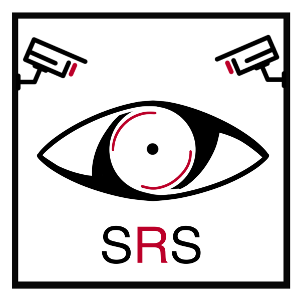

# Système de reconnaissance spaciale (SRS)

## Introduction
Le SRS (Système de Reconnaissance Spatiale) est un projet destiné à localiser précisément les individus dans un environnement 3D et à présenter visuellement leur position en 2D en utilisant des caméras WiFi et des technologies de reconnaissance faciale.

## Navigation

Utilisez ces liens pour naviguer entre les répertoires du projet.

### Documentation
- [**Accueil documentation**](./docs/index.md)  
- [Journal de bord](./docs/jdb.md)  

### Sources
Lien vers les sources des différents composants ainsi que leurs tests.

#### Cameras Wifi
- [Sources Cameras Wifi](./src/cameras_wifi/src/)
- [Tests](./src/cameras_wifi/tests/)

## Normalisation des push

La normalisation des push permet d'augementer la lisibilité dans l'historique des intéractions avec le repertoire du projet.  
| **Syntaxe** | **Domaine de modification**                                    |
|-------------|----------------------------------------------------------------|
| Code        | Code / Fonctionnalités                                         |
| Docs        | Documentation / Lisibilité du projet (ReadMe, etc.)            |
| Struct      | Structure                                                      |
| Mixed       | Plusieurs domaines changés (Description détaillée recommandée) |
| Hotfix      | Modification rapide visant à réparer une erreur ou un bug      |
