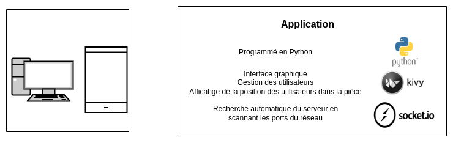
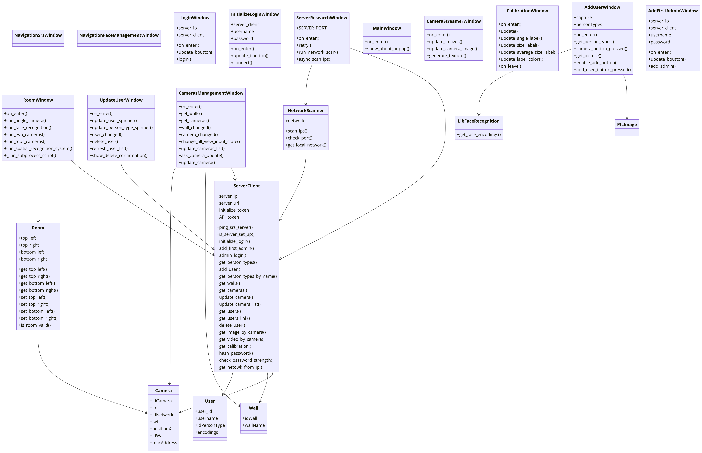

# Composant : Application

L'application sert d'interface au projet SRS. C'est ce composant qui est contact direct avec les utilisateurs finaux. Elle est en communication avec le serveur principale qui sert lui de backend.




## Informations sur l'ordinateur de développement

### Distribution

```
Distributor ID: Ubuntu
Description:    Ubuntu 24.04 LTS
Release:        24.04
Codename:       noble
```

### Hardware

```
product: AD107 [GeForce RTX 4060]
memory      24GiB System memory
processor   AMD Ryzen 5 3600 6-Core Processor
```

## Architecture de l'application

##### Légende

| Couleur | Type de page            | Description                                            |
|---------|-------------------------|--------------------------------------------------------|
| Violet  | Page de connexion       | Sert à s'authentifier pour le système                   |
| Gris    | Initialisation          | Pages uniquement accessible lors de l'initialisation du système |
| Orange  | Page de navigation      | Sert à naviger entre les pages                          |
| Bleu    | Page de gestion         | Sert à configurer le système                            |
| Vert    | Page de fonctionnalité  | Affiche les résultats des configurations, des calculs etc.                |

##### Diagramme


##### Diagramme UML

