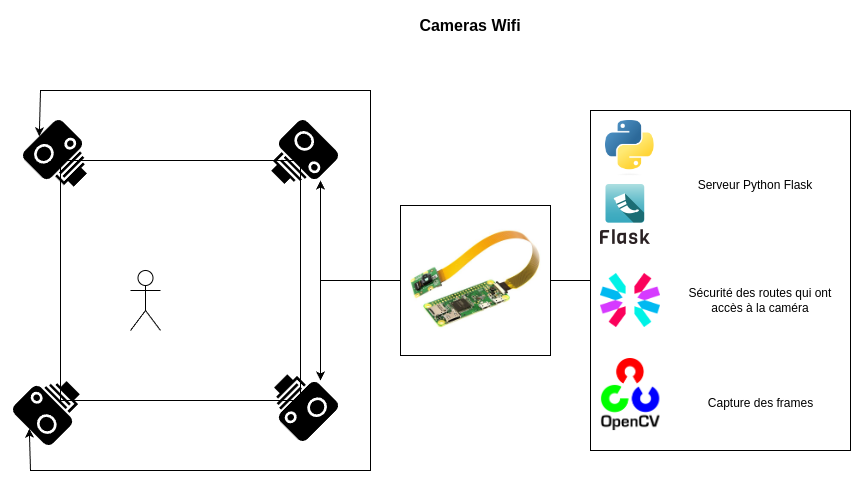
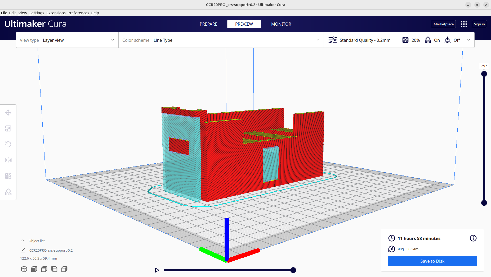
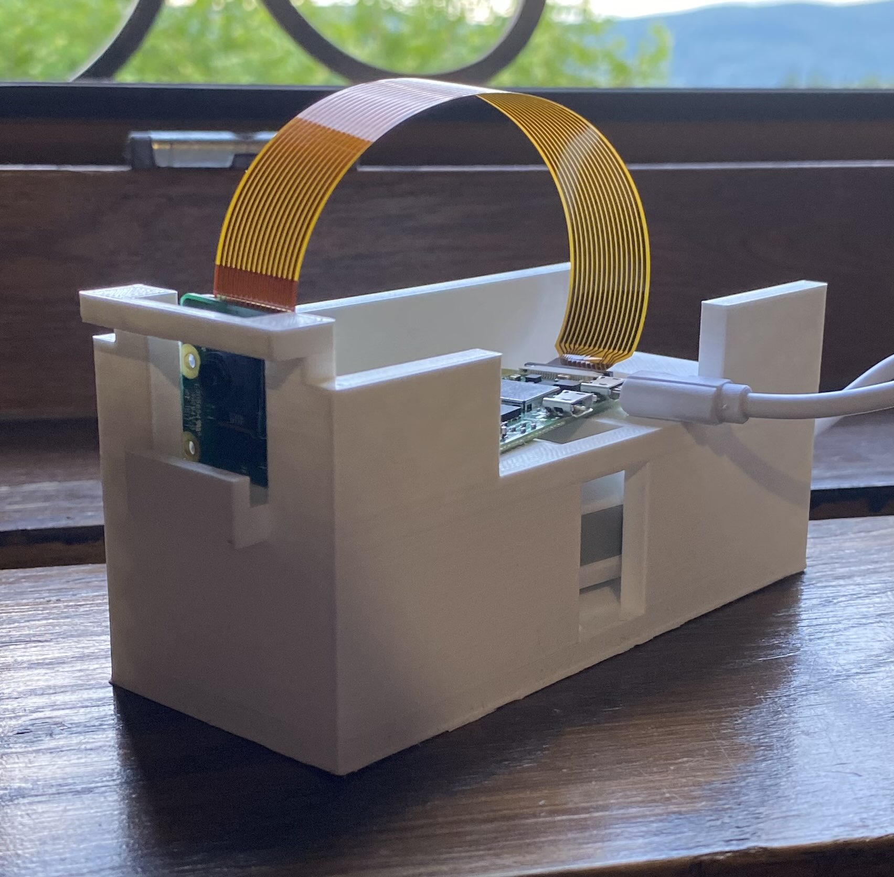
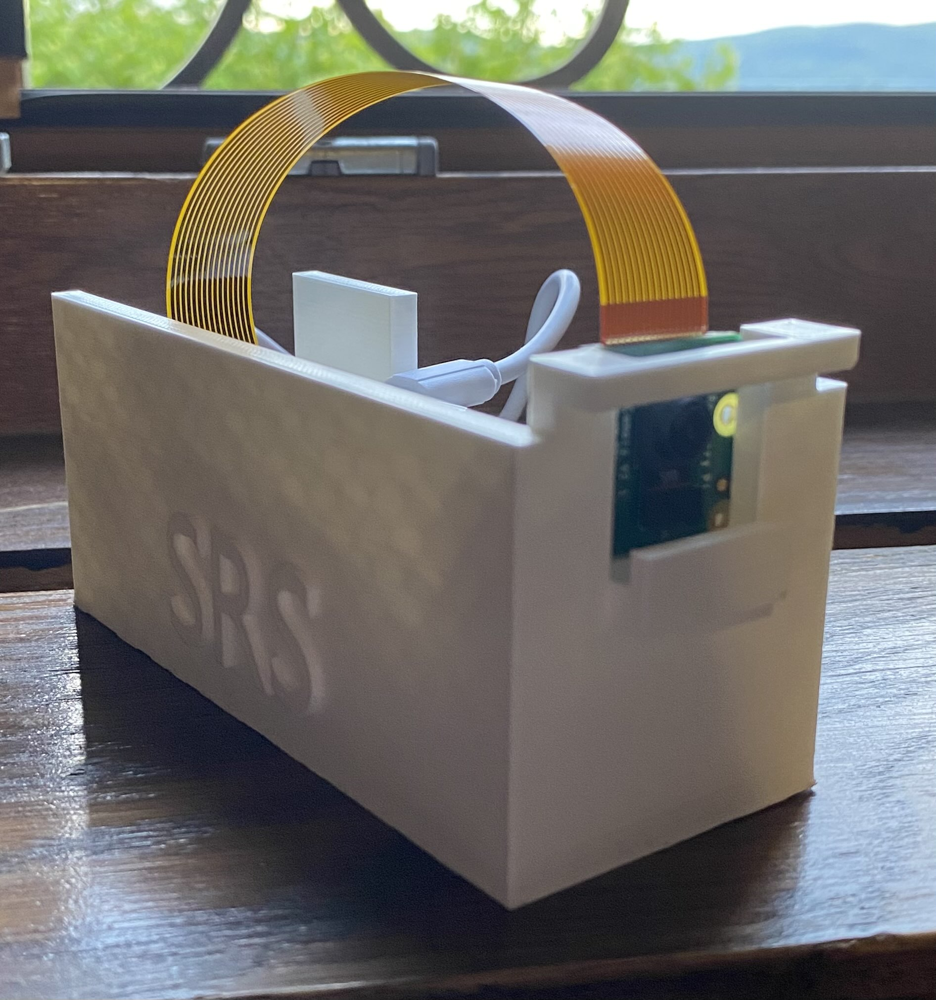
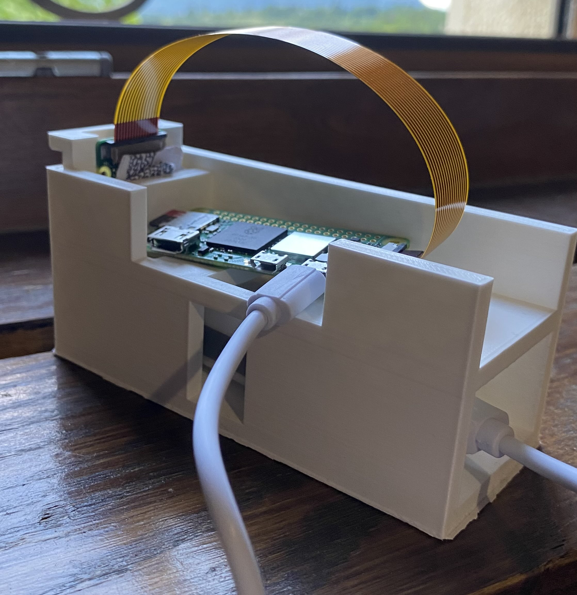
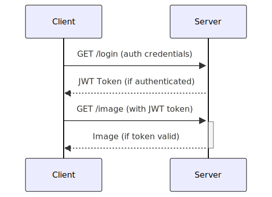

# Composant : Caméras WiFi

Le système vise à mettre en place des caméras WiFi compactes pour la surveillance ou pour d'autres applications nécessitant la capture et la diffusion en temps réel de flux vidéo. Le cœur du système, un Raspberry Pi Zero 2 W, exécute un serveur Python Flask.



## Informations sur l'ordinateur

⚠️ Utilisez uniquement cette version de Raspbian, les versions plus récentes ne possèdent pas la fonctionnalité `Legacy Camera` ⚠️

[Plus d'informations](https://raspberrypi.stackexchange.com/questions/135522/camera-only-working-with-deprecated-legacy-option)

```
PRETTY_NAME="Raspbian GNU/Linux 11 (bullseye)"
NAME="Raspbian GNU/Linux"
VERSION_ID="11"
VERSION="11 (bullseye)"
VERSION_CODENAME=bullseye
ID=raspbian
ID_LIKE=debian
```

## Hardware
Le matériel a été choisi spécifiquement pour qu'il soit en adéquation avec les besoins du projet. Les composants sont volontairement simples d'utilisation afin de minimiser le temps passé sur l'éléctronique.

| Composant                                    | Fonction                    | Prix     | Fournisseur                                            |
|----------------------------------------------|-----------------------------|----------|--------------------------------------------------------|
| Raspberry Pi Zero 2 W                        | Serveur (Python Flask)      | 29.10 CHF | [Digitec](https://www.digitec.ch/fr/s1/product/raspberry-pi-zero-2-w-carte-de-developpement-kit-17346864) |
| Raspberry Pi Camera Module 3 Wide Angle 120° | Module de Caméra            | 45.50 CHF | [Digitec](https://www.digitec.ch/fr/s1/product/raspberry-pi-camera-module-3-wide-angle-120-camera-module-electronique-24041966?ip=raspberry+camera) |
| MediaRange Power Bank 2600 mAh               | Batterie externe            | 13.95 CHF | [Fnac](https://www.fnac.com/mp28798913/MediaRange-Power-Bank-Banque-d-alimentation-2600-mAh-1-A-USB-sur-le-cable-Micro-USB-gris-blanc/w-4) |
| SanDisk ExtremePro microSD A1                | Carte mémoire               | 13.00 CHF | [Digitec](https://www.digitec.ch/fr/s1/product/sandisk-extremepro-microsd-a1-microsdhc-32-go-u3-uhs-i-carte-memoire-6613018) |

**Coût total:** 101.55 CHF

## Support

Le support permet de maintenir les différents composants en place. Il a été réalisé sous le logiciel [Blender](https://www.blender.org/) avec l'aide de [Amir Younes](mailto:amir.yns@eduge.ch), un de mes camarades de classe.

### Impression 3D

| Logiciel   | Imprimante         | Durée d'impression | Utilisation de fil |
|------------|--------------------|--------------------|--------------------|
| Cura       | Creality CR20 Pro  | 8h                | 90g |



### Images
  
  
  

### Temps de fonctionnement

Les calcul ci-présents correspondent au temps de fonctionnement en cas d'utilisation intensive et moyenne. Lors du développement, les données s'approchent plus de l'utilisation moyenne. Il faut donc compter une autonomie entre les deux valeurs.

  


| Condition                        | Consommation (W) | Consommation (A) | Capacité de la batterie (mAh) | Temps de fonctionnement (heures) |
|----------------------------------|------------------|------------------|-------------------------------|-----------------------------------|
| Maximale                         | 3W               | 0.6 A            | 2600 mAh                      |   |
| Moyenne (Serveur Flask)          | 1.5W             | 0.3 A            | 2600 mAh                      |   |

## Dépendances externes

| Nom              | Description                                 | Utilisation | pypi.org          |
|------------------|---------------------------------------------|-------------------|----------------|
| Flask            | Framework Web pour Python                   | Serveur mettant à disposition le Web-Service | [Flask](https://pypi.org/project/Flask/)            |
| JWT              | Implémentation de JSON Web Tokens           | Gestion de la sécurité par génération de clé | [JWT](https://pypi.org/project/PyJWT/)              |
| OpenCV (cv2)     | Bibliothèque de vision par ordinateur       | Capture des frames des cameras | [OpenCV](https://pypi.org/project/opencv-python/)   |

## Installation

### Impression du support

Le support permet de maintenir les composants en place.

#### Détails

- Temps d'impréssion : Environ 8 heures
- Imprimante 3D : Creality CR20PRO
- Carte mémoire requise.

#### Étapes pour l'impression

1. Installation de CURA.
    1. Téléchargez le fichier d'installation depuis [le site d'ultimaker](https://ultimaker.com/de/software/ultimaker-cura/).
    2. Démarrez CURA
    3. Ajoutez votre imprimante, sois par réseau, sois en ajoutant manuellement votre modèle. Puis appuyez sur next.
    4. Continez sans changer les paramètres et terminez l'installation.
2. Ajoutez le fichier `.std` à CURA.
    1. Dans CURA, appuyez sur **Files > Open File(S)**
    2. Naviguez jusqu'au fichier `std`. Son lien dans le projet est `./docs-server/docs/supports/srs-support-0.2.stl`.
3. Démarrer l'impression.
    1. Cliquez sur le support présent dans l'espace 3D.
    2. Appuyez sur `Scale(s)`
    3. Passez la valeur `y` à **50**.
    4. Appuyez sur `Slice`.
    5. Appuyez sur `Save to disk`.
5. Lancez l'impression.
    1. Mettez la **carte mémoire** dans l'imprimante et lancez l'impression.

### Installtion des Raspberry

Ce chapitre explique l'installation logicielle des Rapberry.

1. Installation de Pi Imager
    1. Installer l'application depuis [le site de Raspberry](https://www.raspberrypi.com/software/).

#### Installation de l'OS

1. Insérez la carte mémoire dans le lecteur.
2. Cliquez sur `Choose a device`.
    1. Cliquez sur `Raspberry Zero W 2`
3. Cliquez sur `Choose à OS`.
    1. Séléctionnez `Raspberry Pi OS (other)`
    2. Cliquez sur `Raspberry Pi OS (Legacy), 64 bits`, assurez vous que ce soit la version Bulleseye.
4. Cliquez sur `Choose storage`.
    1. Cliquez sur votre support d'installation.
5. Cliquez sur `Next`.
    1. Sur la fenêtre `Use OS calibration`, cliquez sur `Edit Settings`.
    2. Dans `General Settings`, définissez un nom d'utilisateur et un mot de passe. Puis, ajoutez les données du réseau Wifi.
    3. Dans `Service`, activez `ssh`.

#### Installation de l'environnement


1. Activez la fonctionnalité `legacy camera`
```
sudo raspi-config
Interface Options -> Enable Legacy Camera -> Yes -> Reboot
```

2. Clonez le projet sur le serveur
```
sudo apt install git
git clone https://gitlab.ictge.ch/karel-svbd/srs.git
```

3. Naviguez jusqu'au projet des cameras.
```shell
cd srs/src/cameras_wifi/src/
```

4. Créez un environnement virtuel et activez le.
```shell
sudo apt install python3-venv
python -m venv venv
source venv/bin/activate
```
```

### Lancement automatique et passage en service

Création du service qui se lance automatiquement au démarrage du serveur.

Créez le fichier de service :

```bash
sudo nano /etc/systemd/system/srs.service
```
Copiez et collez le contenu suivant dans l'éditeur nano, remplacez les liens pour correspondre à ceux de votre arborescence :

```ini
[Unit]
Description=Exécuter mon script Python au démarrage
After=network.target

[Service]
User=karelsvbd
WorkingDirectory=/home/karelsvbd
ExecStart=/bin/bash -c 'source /home/karelsvbd/venv/bin/activate && python /home/karelsvbd/app.py'
Restart=always

[Install]
WantedBy=multi-user.target
```

Sauvegardez et quittez l'éditeur (Ctrl+X, puis Y, puis Entrée).

Recharger les services systemd :

```bash
sudo systemctl daemon-reload
```

Activer et démarrer le service :

```bash
sudo systemctl enable srs.service
sudo systemctl start srs.service
```

Vérifiez l'état du service :

```bash
sudo systemctl status srs.service
```

## Authentification

### Connexion

Endpoint: `http://localhost:4298/login`

#### Description

Connectez-vous à l'API et générez un jeton. Passez les identifiants de connexion via l'authentification basique pour recevoir un jeton d'utilisation de l'API.

#### Requête

- Méthode: `GET`
- Authentification: Basique

#### Paramètres

- Nom d'utilisateur: `SRS-Server`
- Mot de passe: `QNaAXEjuNBqdhF6HFjggsDmhLZVeWSzT`

#### Réponse

- Statut: 200 OK
- Corps: JSON contenant un jeton JWT

#### Tests

##### Statut de réponse 200 OK
```js
pm.test("Statut de réponse 200 OK", function () {
    pm.response.to.have.status(200);
});
```

##### Contient un jeton JWT
```js
pm.test("La réponse contient un jeton JWT", function () {
    pm.response.to.have.jsonBody('token');
});
```

##### Erreur d'authentification - Identifiants incorrects
```js
pm.test("Erreur d'authentification - identifiants incorrects", function () {
    pm.sendRequest({
        url: 'http://localhost:4298/login',
        method: 'GET',
        auth: {
            type: 'basic',
            username: 'John Doe',
            password: 'Ceci est un faux mdp'
        }
    }, function (err, res) {
        pm.expect(res).to.have.status(401);
    });
});
```

##### Erreur d'authentification - Mot de passe manquant (Identifiants incorrects)
```js
pm.test("Erreur d'authentification - mot de passe manquant (identifiants incorrects)", function () {
    pm.sendRequest({
        url: 'http://localhost:4298/login',
        method: 'GET',
        auth: {
            type: 'basic',
            username: 'John Doe',
        }
    }, function (err, res) {
        pm.expect(res).to.have.status(401);
    });
});
```

##### Erreur d'authentification - Mot de passe manquant (Identifiants corrects)
```js
pm.test("Erreur d'authentification - mot de passe manquant (identifiants corrects)", function () {
    pm.sendRequest({
        url: 'http://localhost:4298/login',
        method: 'GET',
        auth: {
            type: 'basic',
            username: 'SRS-Server',
        }
    }, function (err, res) {
        pm.expect(res).to.have.status(401);
    });
});
```

##### Erreur d'authentification - Nom d'utilisateur manquant (Identifiants corrects)
```js
pm.test("Erreur d'authentification - username manquant (identifiants corrects)", function () {
    pm.sendRequest({
        url: 'http://localhost:4298/login',
        method: 'GET',
        auth: {
            type: 'basic',
            password: 'QNaAXEjuNBqdhF6HFjggsDmhLZVeWSzT'
        }
    }, function (err, res) {
        pm.expect(res).to.have.status(401);
    });
});
```

##### Erreur d'authentification - Nom d'utilisateur manquant (Identifiants incorrects)
```js
pm.test("Erreur d'authentification - username manquant (identifiants incorrects)", function () {
    pm.sendRequest({
        url: 'http://localhost:4298/login',
        method: 'GET',
        auth: {
            type: 'basic',
            password: 'Ceci est un faux mdp'
        }
    }, function (err, res) {
        pm.expect(res).to.have.status(401);
    });
});
```

##### Erreur d'authentification - Nom d'utilisateur correct - Mot de passe erroné
```js
pm.test("Erreur d'authentification - username correct - mdp erroné", function () {
    pm.sendRequest({
        url: 'http://localhost:4298/login',
        method: 'GET',
        auth: {
            type: 'basic',
            username: 'SRS-Server',
            password: 'Ceci est un faux mdp'
        }
    }, function (err, res) {
        pm.expect(res).to.have.status(401);
    });
});
```

##### Erreur d'authentification - Nom d'utilisateur erroné - Mot de passe correct
```js
pm.test("Erreur d'authentification - username erroné - mdp correct", function () {
    pm.sendRequest({
        url: 'http://localhost:4298/login',
        method: 'GET',
        auth: {
            type: 'basic',
            username: 'Ceci est un faux username',
            password: 'QNaAXEjuNBqdhF6HFjggsDmhLZVeWSzT'
        }
    }, function (err, res) {
        pm.expect(res).to.have.status(401);
    });
});
```

### Implémentation

#### Constantes de l'application
⚠️ Changer ces données si le serveur rentre en production ⚠️  
- *SECRET_KEY* : Sert à la génération et à la lecture des JWT.
- *CLIENT_USERNAME* : Nom d'utilisateur à donner lors de l'authentification.
- *CLIENT_PASSWORD* : Mot de passe à donner lors de l'authentification.
```py
app.config['SECRET_KEY'] = 'dMbgbnTDxK82SE3Bn2XgcMFTqmdLZWn9'
app.config['CLIENT_USERNAME'] = 'SRS-Server'
app.config['CLIENT_PASSWORD'] = 'QNaAXEjuNBqdhF6HFjggsDmhLZVeWSzT'
```

#### Route

Afin d'accéder à la connexion, la route `/login` est appelée.  

1. Récupération des données d'authentification.
2. Vérification si auth est pas null.
3. Vérification que les données de connexion sont correctes.
4. Génération des réponses
    - Si correct : Génération d'un token d'une durée de vie de **24 heures** et retour du JSON.
    - Si erreur : Retour du JSON avec le code d'erreur adéquat.
```py
@app.route('/login')
def login():
    """
    Route permettant à se connecter

    Returns:
        str: JWT généré
    """
    auth = request.authorization

    if auth and auth.password == app.config['CLIENT_PASSWORD'] and auth.username == app.config['CLIENT_USERNAME']:
        token = jwt.encode({'user': auth.username, 'exp': datetime.datetime.utcnow() + datetime.timedelta(hours=24)}, app.config['SECRET_KEY'])
        return jsonify({'token': token})

    return make_response('could not verify', 401, {'WWW-Authenticate' : 'Basic realm="Login required"'})
```

## Récupération d'images

Endpoint: `http://localhost:4298/image`

#### Description

Retourne l'image prise par la camera du serveur au moment de l'appel de la requête. L'image est au format `.jpg`.

#### Requête

- Méthode: `GET`

#### Paramètres

- token: `Token JWT`

#### Réponse

- Statut: 200 OK
- Corps: Image prise de la camera du serveur.

#### Tests

```js
// Vérification du code de résponse
pm.test("Status code is 200", function () {
    pm.response.to.have.status(200);
});

// Vérificaiton de l'image
pm.test("Response is a JPEG image", function() {
    pm.response.to.have.header("Content-Type", "image/jpeg");
});

pm.test("Response body is not empty", function() {
    pm.expect(pm.response.stream).to.not.be.empty;
});

// Savoir si le temps de la requête n'est pas trop long
pm.test("Response time is acceptable", function () {
    pm.expect(pm.response.responseTime).to.be.below(2000);
});
```


#### Résultat Postman


#### Implémentation

Pour prendre une photo, j'utilise le code suivant présent dans la route `/image`.

1. Récupération de l'image de la camera par openCV.
2. Retour de l'image au format `.jpg`

```py
@app.route('/image')
@token_required
def image():
    """
    Route qui retourne une image capturée de la caméra.
    """
    camera = cv2.VideoCapture(0)
    success, frame = camera.read()
    camera.release()
    if success:
        ret, buffer = cv2.imencode('.jpg', frame)
        return Response(buffer.tobytes(), mimetype='image/jpeg')
    else:
        return jsonify({'message': 'Failed to capture image'}), 500
```

## Récupération des vidéos

Endpoint: `http://localhost:4298/video`

### Description
Cet endpoint permet de récupérer le flux vidéo capté par les caméras.

#### Requête

- Méthode: `GET`

#### Paramètres

- token: `Token JWT`

#### Réponse

- Corps: Flux vidéo `.jpg`

### Implémentation
Le code provient de [cette question](https://stackoverflow.com/questions/63688158/opencv-problem-because-of-frame-to-bytes-with-flask-integration) sur stack overflow.

1. Lecture en boucle de la frame de la caméra.
2. Encode l'image en format `.jpg`. La variable buffer contient l'image encodée.
3. Conversion de l'image buffer en bytes.
4. Génération du flux et envoi successif.


```py
def gen_frames():
    camera = cv2.VideoCapture(0)
    while True:
        success, frame = camera.read() 
        if not success:
            break
        else:
            ret, buffer = cv2.imencode('.jpg', frame)
            frame = buffer.tobytes()
            yield (b'--frame\r\n'
                   b'Content-Type: image/jpeg\r\n\r\n' + frame + b'\r\n')
            
@app.route('/video')
@token_required
def video_feed():
    return Response(gen_frames(), mimetype='multipart/x-mixed-replace; boundary=frame')
```

## Sécurité des routes

La sécurité des routes se fait via la fonction décoratrice `token_required(f)`. 

### Fonction token_required
```py
from functools import wraps

def token_required(f):
    """
    Fonction décoratrice permettant de forcer une autre fonction d'être identifié par JWT

    Args:
        f : Fonction à décorer
    
    Returns:
        f : Fonction décorée
    """
    @wraps(f)
    def decorated(*args, **kwargs):
        token = request.args.get('token')
        if not token:
            return jsonify({'message' : 'Token is missing'}), 403
        # Try catch car jwt.decode retourne une erreur en cas de non correspondance
        try:
            data = jwt.decode(token, app.config['SECRET_KEY'], algorithms=["HS256"])
        except jwt.ExpiredSignatureError:
            return jsonify({'message': 'Token has expired'}), 403
        except jwt.InvalidTokenError:
            return jsonify({'message': 'Token is invalid'}), 403
        return f(*args, **kwargs)

    return decorated
```

### Exemple d'utilisation

```py
@app.route('/route_sécurisée', methods=['GET'])
@token_required
def route_sécurisée():
    pass
```

## Séquences

### Authentification et sécurité

L'utilisation des [JWT](https://jwt.io/) permet de s'identifier après une connexion. L'expiration de ce dernier est de **24 heures**.  

1. Authentification avec les identifiants par défault.
2. Récupération du token JWT
3. Appel du endpoint `/image` (ou toutes autre route sécurisée) pour demander une photo du serveur.
4. Récupération de l'image.

### Diagramme de séquence


## Collection (Postman)
Afin d'accèder à la collection ainsi qu'à plus de détails postman veuillez cliquer [ici](../../src/cameras_wifi/tests/SRS-cameras.postman_collection.json).