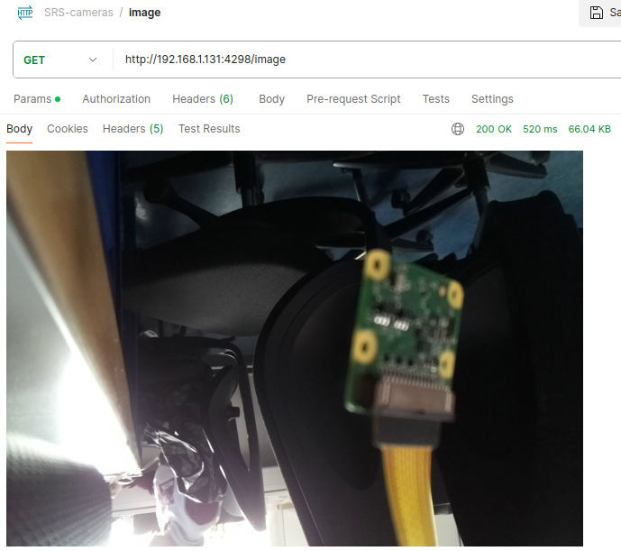

# Composant : Caméras WiFi

Le système vise à mettre en place des caméras WiFi compactes pour la surveillance ou pour d'autres applications nécessitant la capture et la diffusion en temps réel de flux vidéo. Le cœur du système, un Raspberry Pi Zero 2 W, exécute un serveur Python Flask.

## Informations sur l'ordinateur
```
PRETTY_NAME="Raspbian GNU/Linux 11 (bullseye)"
NAME="Raspbian GNU/Linux"
VERSION_ID="11"
VERSION="11 (bullseye)"
VERSION_CODENAME=bullseye
ID=raspbian
ID_LIKE=debian
HOME_URL="http://www.raspbian.org/"
SUPPORT_URL="http://www.raspbian.org/RaspbianForums"
BUG_REPORT_URL="http://www.raspbian.org/RaspbianBugs"
```

## Hardware
Le matériel a été choisi spécifiquement pour qu'il soit en adéquation avec les besoins du projet. Les composants sont volontairement simples d'utilisation afin de minimiser le temps passé sur l'éléctronique.

| Composant                                    | Fonction                    | Prix     | Fournisseur                                            |
|----------------------------------------------|-----------------------------|----------|--------------------------------------------------------|
| Raspberry Pi Zero 2 W                        | Serveur (Python Flask)      | 29.10 CHF | [Digitec](https://www.digitec.ch/fr/s1/product/raspberry-pi-zero-2-w-carte-de-developpement-kit-17346864) |
| Raspberry Pi Camera Module 3 Wide Angle 120° | Module de Caméra            | 45.50 CHF | [Digitec](https://www.digitec.ch/fr/s1/product/raspberry-pi-camera-module-3-wide-angle-120-camera-module-electronique-24041966?ip=raspberry+camera) |
| MediaRange Power Bank 2600 mAh               | Batterie externe            | 13.95 CHF | [Fnac](https://www.fnac.com/mp28798913/MediaRange-Power-Bank-Banque-d-alimentation-2600-mAh-1-A-USB-sur-le-cable-Micro-USB-gris-blanc/w-4) |
| SanDisk ExtremePro microSD A1                | Carte mémoire               | 13.00 CHF | [Digitec](https://www.digitec.ch/fr/s1/product/sandisk-extremepro-microsd-a1-microsdhc-32-go-u3-uhs-i-carte-memoire-6613018) |

**Coût total:** 101.55 CHF

## Dépendances externes

| Nom              | Description                                 | Utilisation | pypi.org          |
|------------------|---------------------------------------------|-------------------|----------------|
| Flask            | Framework Web pour Python                   | Serveur mettant à disposition le Web-Service | [Flask](https://pypi.org/project/Flask/)            |
| JWT              | Implémentation de JSON Web Tokens           | Gestion de la sécurité par génération de clé | [JWT](https://pypi.org/project/PyJWT/)              |
| OpenCV (cv2)     | Bibliothèque de vision par ordinateur       | Capture des frames des cameras | [OpenCV](https://pypi.org/project/opencv-python/)   |
| Face Recognition| Bibliothèque de reconnaissance faciale     | Génération des points du visage quand une personne est détectée | [Face Recognition](https://pypi.org/project/face-recognition/) |

## Installation

Voici la procédure étape par étape afin de bien installer le projet sur votre serveur.

1. Clonez le projet sur le serveur

```
git clone https://gitlab.ictge.ch/karel-svbd/srs.git
```

2. Naviguez jusqu'au projet des cameras.

```shell
cd ./src/cameras_wifi/src/
```

3. Créez un environnement virtuel et activez le.

```shell
python -m venv venv
source ./venv/bin/activate
```

3. Installez les dépendances.

*Note : si vous avez l'impression que certaines étapes prennent du temps c'est normal. Surtout les étapes `Building wheel`. Cela peut vous prendre facilement 2 heures. Si le problème perciste, utilisez les commandes `apt` afin d'installer les modules globalement un par un.*
```shell
pip install -r requirements.txt
```

4. Démarrez le serveur.
```shell
python3 ./app.py
```

## Authentification

### Connexion

Endpoint: `http://localhost:4298/login`

#### Description

Connectez-vous à l'API et générez un jeton. Passez les identifiants de connexion via l'authentification basique pour recevoir un jeton d'utilisation de l'API.

#### Requête

- Méthode: `GET`
- Authentification: Basique

#### Paramètres

- Nom d'utilisateur: `SRS-Server`
- Mot de passe: `QNaAXEjuNBqdhF6HFjggsDmhLZVeWSzT`

#### Réponse

- Statut: 200 OK
- Corps: JSON contenant un jeton JWT

#### Tests

##### Statut de réponse 200 OK
```js
pm.test("Statut de réponse 200 OK", function () {
    pm.response.to.have.status(200);
});
```

##### Contient un jeton JWT
```js
pm.test("La réponse contient un jeton JWT", function () {
    pm.response.to.have.jsonBody('token');
});
```

##### Erreur d'authentification - Identifiants incorrects
```js
pm.test("Erreur d'authentification - identifiants incorrects", function () {
    pm.sendRequest({
        url: 'http://localhost:4298/login',
        method: 'GET',
        auth: {
            type: 'basic',
            username: 'John Doe',
            password: 'Ceci est un faux mdp'
        }
    }, function (err, res) {
        pm.expect(res).to.have.status(401);
    });
});
```

##### Erreur d'authentification - Mot de passe manquant (Identifiants incorrects)
```js
pm.test("Erreur d'authentification - mot de passe manquant (identifiants incorrects)", function () {
    pm.sendRequest({
        url: 'http://localhost:4298/login',
        method: 'GET',
        auth: {
            type: 'basic',
            username: 'John Doe',
        }
    }, function (err, res) {
        pm.expect(res).to.have.status(401);
    });
});
```

##### Erreur d'authentification - Mot de passe manquant (Identifiants corrects)
```js
pm.test("Erreur d'authentification - mot de passe manquant (identifiants corrects)", function () {
    pm.sendRequest({
        url: 'http://localhost:4298/login',
        method: 'GET',
        auth: {
            type: 'basic',
            username: 'SRS-Server',
        }
    }, function (err, res) {
        pm.expect(res).to.have.status(401);
    });
});
```

##### Erreur d'authentification - Nom d'utilisateur manquant (Identifiants corrects)
```js
pm.test("Erreur d'authentification - username manquant (identifiants corrects)", function () {
    pm.sendRequest({
        url: 'http://localhost:4298/login',
        method: 'GET',
        auth: {
            type: 'basic',
            password: 'QNaAXEjuNBqdhF6HFjggsDmhLZVeWSzT'
        }
    }, function (err, res) {
        pm.expect(res).to.have.status(401);
    });
});
```

##### Erreur d'authentification - Nom d'utilisateur manquant (Identifiants incorrects)
```js
pm.test("Erreur d'authentification - username manquant (identifiants incorrects)", function () {
    pm.sendRequest({
        url: 'http://localhost:4298/login',
        method: 'GET',
        auth: {
            type: 'basic',
            password: 'Ceci est un faux mdp'
        }
    }, function (err, res) {
        pm.expect(res).to.have.status(401);
    });
});
```

##### Erreur d'authentification - Nom d'utilisateur correct - Mot de passe erroné
```js
pm.test("Erreur d'authentification - username correct - mdp erroné", function () {
    pm.sendRequest({
        url: 'http://localhost:4298/login',
        method: 'GET',
        auth: {
            type: 'basic',
            username: 'SRS-Server',
            password: 'Ceci est un faux mdp'
        }
    }, function (err, res) {
        pm.expect(res).to.have.status(401);
    });
});
```

##### Erreur d'authentification - Nom d'utilisateur erroné - Mot de passe correct
```js
pm.test("Erreur d'authentification - username erroné - mdp correct", function () {
    pm.sendRequest({
        url: 'http://localhost:4298/login',
        method: 'GET',
        auth: {
            type: 'basic',
            username: 'Ceci est un faux username',
            password: 'QNaAXEjuNBqdhF6HFjggsDmhLZVeWSzT'
        }
    }, function (err, res) {
        pm.expect(res).to.have.status(401);
    });
});
```

### Implémentation

#### Constantes de l'application
⚠️ Changer ces données si le serveur rentre en production ⚠️  
- *SECRET_KEY* : Sert à la génération et à la lecture des JWT.
- *CLIENT_USERNAME* : Nom d'utilisateur à donner lors de l'authentification.
- *CLIENT_PASSWORD* : Mot de passe à donner lors de l'authentification.
```py
app.config['SECRET_KEY'] = 'dMbgbnTDxK82SE3Bn2XgcMFTqmdLZWn9'
app.config['CLIENT_USERNAME'] = 'SRS-Server'
app.config['CLIENT_PASSWORD'] = 'QNaAXEjuNBqdhF6HFjggsDmhLZVeWSzT'
```

#### Route

Afin d'accéder à la connexion, la route `/login` est appelée.  

1. Récupération des données d'authentification.
2. Vérification si auth est pas null.
3. Vérification que les données de connexion sont correctes.
4. Génération des réponses
    - Si correct : Génération d'un token d'une durée de vie de **24 heures** et retour du JSON.
    - Si erreur : Retour du JSON avec le code d'erreur adéquat.
```py
@app.route('/login')
def login():
    """
    Route permettant à se connecter

    Returns:
        str: JWT généré
    """
    auth = request.authorization

    if auth and auth.password == app.config['CLIENT_PASSWORD'] and auth.username == app.config['CLIENT_USERNAME']:
        token = jwt.encode({'user': auth.username, 'exp': datetime.datetime.utcnow() + datetime.timedelta(hours=24)}, app.config['SECRET_KEY'])
        return jsonify({'token': token})

    return make_response('could not verify', 401, {'WWW-Authenticate' : 'Basic realm="Login required"'})
```

## Récupération d'images

### Connexion

Endpoint: `http://localhost:4298/image`

#### Description

Retourne l'image prise par la camera du serveur au moment de l'appel de la requête. L'image est au format `.jpg`

#### Requête

- Méthode: `GET`

#### Paramètres

- token: `Token JWT`

#### Réponse

- Statut: 200 OK
- Corps: Image prise de la camera du serveur.

#### Tests

```js
// Vérification du code de résponse
pm.test("Status code is 200", function () {
    pm.response.to.have.status(200);
});

// Vérificaiton de l'image
pm.test("Response is a JPEG image", function() {
    pm.response.to.have.header("Content-Type", "image/jpeg");
});

pm.test("Response body is not empty", function() {
    pm.expect(pm.response.stream).to.not.be.empty;
});

// Savoir si le temps de la requête n'est pas trop long
pm.test("Response time is acceptable", function () {
    pm.expect(pm.response.responseTime).to.be.below(2000);
});
```

#### Résultat Postman




## Sécurité des routes

La sécurité des routes se fait via la fonction décoratrice `token_required(f)`. 

### Fonction token_required
```py
from functools import wraps

def token_required(f):
    """
    Fonction décoratrice permettant de forcer une autre fonction d'être identifié par JWT

    Args:
        f : Fonction à décorer
    
    Returns:
        f : Fonction décorée
    """
    @wraps(f)
    def decorated(*args, **kwargs):
        token = request.args.get('token')
        if not token:
            return jsonify({'message' : 'Token is missing'}), 403
        # Try catch car jwt.decode retourne une erreur en cas de non correspondance
        try:
            data = jwt.decode(token, app.config['SECRET_KEY'], algorithms=["HS256"])
        except jwt.ExpiredSignatureError:
            return jsonify({'message': 'Token has expired'}), 403
        except jwt.InvalidTokenError:
            return jsonify({'message': 'Token is invalid'}), 403
        return f(*args, **kwargs)

    return decorated
```

### Exemple d'utilisation

```py
@app.route('/route_sécurisée', methods=['GET'])
@token_required
def route_sécurisée():
    pass
```

## Séquences

### Authentification et sécurité

L'utilisation des [JWT](https://jwt.io/) permet de s'identifier après une connexion. L'expiration de ce dernier est de **24 heures**.  

1. Authentification avec les identifiants par défault.
2. Récupération du token JWT
3. Appel du endpoint `/image` pour demander une photo du serveur.
4. Récupération de l'image.

### Diagramme de séquence


## Collection (Postman)
Afin d'accèder à la collection ainsi qu'à plus de détails postman veuillez cliquer [ici](../../src/cameras_wifi/tests/SRS-cameras.postman_collection.json).