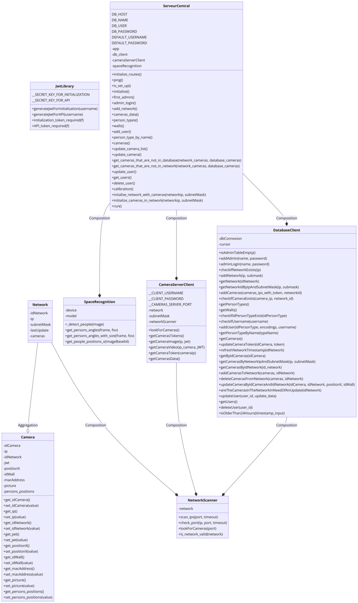

# Composant : Serveur Central
Le serveur sert de logique, de base de données ainsi que de API pour le projet SRS. Il reçoit les données des cameras les interprête et les mets à disposition grâce à des endpoints dédiés.

## Informations sur le serveur
`lsb_release -a `
```
Distributor ID: Ubuntu
Description:    Ubuntu 23.10
Release:        23.10
Codename:       mantic
```

## Dépendances externes

```
ze
aiohttp==3.9.5
aiosignal==1.3.1
attrs==23.2.0
blinker==1.8.2
certifi==2024.2.2
charset-normalizer==3.3.2
click==8.1.7
contourpy==1.2.1
cycler==0.12.1
filelock==3.14.0
Flask==3.0.3
fonttools==4.52.4
frozenlist==1.4.1
fsspec==2024.5.0
gitdb==4.0.11
GitPython==3.1.43
idna==3.7
itsdangerous==2.2.0
Jinja2==3.1.4
kiwisolver==1.4.5
MarkupSafe==2.1.5
matplotlib==3.9.0
mpmath==1.3.0
multidict==6.0.5
mysql-connector-python==8.4.0
networkx==3.3
numpy==1.26.4
nvidia-cublas-cu12==12.1.3.1
nvidia-cuda-cupti-cu12==12.1.105
nvidia-cuda-nvrtc-cu12==12.1.105
nvidia-cuda-runtime-cu12==12.1.105
nvidia-cudnn-cu12==8.9.2.26
nvidia-cufft-cu12==11.0.2.54
nvidia-curand-cu12==10.3.2.106
nvidia-cusolver-cu12==11.4.5.107
nvidia-cusparse-cu12==12.1.0.106
nvidia-nccl-cu12==2.20.5
nvidia-nvjitlink-cu12==12.5.40
nvidia-nvtx-cu12==12.1.105
opencv-python==4.9.0.80
packaging==24.0
pandas==2.2.2
pillow==10.3.0
psutil==5.9.8
py-cpuinfo==9.0.0
PyJWT==2.8.0
pyparsing==3.1.2
python-dateutil==2.9.0.post0
pytz==2024.1
PyYAML==6.0.1
requests==2.32.2
scipy==1.13.1
seaborn==0.13.2
setuptools==70.0.0
six==1.16.0
smmap==5.0.1
sympy==1.12
thop==0.1.1.post2209072238
torch==2.3.0
torchvision==0.18.0
tqdm==4.66.4
typing_extensions==4.12.0
tzdata==2024.1
ultralytics==8.2.25
urllib3==2.2.1
Werkzeug==3.0.3
wheel==0.43.0
yarl==1.9.4
```

## Installation

Voici la procédure étape par étape afin de bien installer le projet sur votre serveur.

1. Clonez le projet sur le serveur

```
git clone https://gitlab.ictge.ch/karel-svbd/srs.git
```

2. Naviguez jusqu'au projet des cameras.

```shell
cd ./src/serveur/src/
```

3. Créez un environnement virtuel et activez le.

```shell
python -m venv venv
source ./venv/bin/activate
```

3. Installez les dépendances.

```shell
pip install -r requirements.txt
```

4. Démarrez le serveur.
```shell
python3 ./app.py
```

## Diagramme de classe

L'image étant trop large pour la génération pdf, veuillez cliquer sur ce lien.



## Initialisation
Les étapes suivantes servent aux clients à configurer le premier administrateur. Pour ce faire ils doivent suivre les étapes suivantes :

### Première connexion

L'utilisateur rentre ses identifiants dans la page de login, si les identifiants sont corrects, un jwt de 15 min est crée et passé à l'application.  


#### Implémentation

- **EndPoint** : `/initialize`

##### Route (app.py)
```py
# Identifiants pour la première initialisation
DEFAULT_USERNAME = "admin"
DEFAULT_PASSWORD = "super"

# Routes liées à l'initialisation
def initialize(self):
    """
    Route d'initialisation du projet, sert à récupérer le JWT pour l'initialisation
    """
    auth = request.authorization
    # Vérification des crendentials de l'authentification
    if auth and auth.password == self.DEFAULT_PASSWORD and auth.username == self.DEFAULT_USERNAME:
        # Vérification si la table administrateur est libre pour des question de sécurité
        if self.db_client.isAdminTableEmpty():
            return jsonify({'message': JwtLibrary.generateJwtForInitialization(auth.username)}), 200
        else:
            return jsonify({'erreur': 'Impossible d\'ajouter l\'admin quand un autre est déjà présent.'}), 402
    else:
        return jsonify({'erreur': 'Identifiants de connexion manquants ou erronés (utilisez basic auth)'}), 403
```

##### Vérification qu'aucun administrateur est présent (database_client.py)
Cette vérification permet d'être certain que c'est bel et bien le premier administrateur a être ajouté.

```py
def isAdminTableEmpty(self):
        """
        Permet de savoir si un admin est déjà présent dans la base ou non

        Returns:
            bool : True = Vide / False = Données présentes
        """
        self.cursor.execute("SELECT * FROM Admin")
        results = self.cursor.fetchall()
    
        if len(results) == 0:
            return True
        else:
            return False
```

##### Génération du JWT (jwt_library.py)

```py
__SECRET_KEY_FOR_INITIALIZATION = 'S[26dF9RmVM/#{GT'

@staticmethod
    def generateJwtForInitialization(username):
        """
        Génère un token d'une courte durée de vie.

        Returns :
            str : Le JWT
        """
        return jwt.encode({'user': username, 'exp': datetime.datetime.utcnow() + datetime.timedelta(minutes=15)}, JwtLibrary.__SECRET_KEY_FOR_INITIALIZATION)
```


### Ajout des identifiants
Une fois l'application en possession du JWT. L'utilisateur se trouve devant la page permettant d'ajouter des utilisateurs. On fois les nouveaux identifiants administrateurs entrés. Les identifiants chiffrés ainsi que le JWT sont passés dans la requête vers le serveur. Après vérification de la conformité des données, les identifiants de connexion sont ajoutés dans la BDD.


#### Implémentation

EndPoint : `/first_admin`

##### Route (app.py)

Cet endpoints requiert que l'utilisateur passe le nom d'utilisateur ainsi que le mot de passe dans les arguments. Après vérification des données, elles sont ajoutée dans la base de données.

```py
@JwtLibrary.initialization_token_required    
    def first_admin(self):
        """
        Route permettant d'ajouter le premier administrateur, requert le token du premier login
        """
        if self.db_client.isAdminTableEmpty():
            username = request.args.get('username')
            password = request.args.get('password')

            if password and username:
                # Ajout des données dans la bdd
                self.db_client.addAdmin(username, password)
                return jsonify({'message': 'L\'admin a été ajouté'}), 201
            else:
                return jsonify({'erreur': 'Mauvais paramètres, utilisez (username, password) pour le nom d\'utilisateur et le mot de passe respectivement.'}), 400
        else:
            return jsonify({'erreur': 'Impossible d\'ajouter l\'admin quand un autre est déjà présent.'}), 402
```

#### Décorateur de fonction (jwt_library.py)

Cette fonction permet de forcer les autres fonction d'être accessible sous condition d'avoir un token correct dans les arguments. 

```py
def initialization_token_required(f):
        """
        Fonction décoratrice permettant de forcer une autre fonction d'être identifié par JWT

        Args:
            f : Fonction à décorer

        Returns:
            f : Fonction décorée
        """
        @wraps(f)
        def decorated(*args, **kwargs):
            
            token = request.args.get('token')
            if not token:
                return jsonify({'message' : 'Token is missing'}), 403
            # Try catch car jwt.decode retourne une erreur en cas de non correspondance
            try:
                data = jwt.decode(token, JwtLibrary.__SECRET_KEY_FOR_INITIALIZATION, algorithms=["HS256"])
            except jwt.ExpiredSignatureError:
                return jsonify({'message': 'Token has expired'}), 403
            except jwt.InvalidTokenError:
                return jsonify({'message': 'Token is invalid'}), 403
            return f(*args, **kwargs)

        return decorated
```

#### Ajout de l'administrateur dans la base de données (database_client.py)

```py
def addAdmin(self, name: str, password: str):
        """
        Ajoute un administrateur à la base de données.

        Args:
            name (str): Le nom de l'administrateur à ajouter.
            password (str): Le mot de passe de l'administrateur à ajouter.
        """
        try:
            self.cursor.execute("INSERT INTO srs.Admin (Name, Password) VALUES (%s, %s);", (name, password))
            self.dbConnexion.commit()
        except Exception as e:
            print(f"Erreur lors de l'insertion dans la base de données: {e}")
```

### Seconde connexion
Cette fois-ci, l'utilisateur doit se connecter avec les identifiants sécurisés. Une fois qu'il a rentré ces derniers, les données sont chiffrés et envoyés vers le serveur. Le serveur fait ensuite une vérification au-prêt de la base de données. Si les identifiants sont corrects, le serveur crée un JWT temporaire de 24 heures permettant de se connecter aux autres fonctionnalités.


#### Implémentation

EndPoint : `/admin_login`

##### Route (app.py)

Cet endpoint vérifie les credentials de connexion, si ces dernier sont corrects, génère un JWT.

```py
def admin_login(self):
        """
        Permet à l'administrateur de se connecter. Retourne un JWT si tout est ok.
        """
        if not self.db_client.isAdminTableEmpty():
            username = request.args.get('username')
            password = request.args.get('password')
            
            if not username or not password:
                return jsonify({'erreur': 'Mauvais paramètres, utilisez (username, password) pour le nom d\'utilisateur et le mot de passe respectivement.'}), 400
            
            # Vérification des données de connexion
            if self.db_client.adminLogin(username, password):
                return jsonify({'token': JwtLibrary.generateJwtForAPI(username)}), 200
            else:
                return jsonify({'erreur': 'Les identifiants de connexion sont erronés'}), 400
        else:
            return jsonify({'erreur': 'Aucun administrateur n\'est présent dans le système.'}), 403
```

##### Vérification des données de connexion de l'administrateur (database_client.py)

Cette fonction vérifie la correspondance dans la base de données des identifiants.

```py
def adminLogin(self, name: str, password: str):
        """
        Connexion d'un administrateur

        Args:
            name (str) : Le nom de l'administrateur à vérifier.
            password (str) : Le mot de passe de l'administrateur à vérifier.
        
        Returns:
            Si l'utilisateur est un admin alors True, sinon False.
        """
        try:
            self.cursor.execute("SELECT * FROM Admin WHERE Name = %s AND Password = %s", (name, password))
            results = self.cursor.fetchall()

            if len(results) == 0:
                return False
            else:
                return True
        except Exception as e:
            print(f"Error during login: {e}")
            return False
```

##### Génération du token pour l'administrateur (jwt_library.py)

Génération d'un token d'une durée de vie de 24 heures utilisable dans le reste des application.

```py
__SECRET_KEY_FOR_API = 'qEcYfxQzC3bS'

@staticmethod
    def generateJwtForAPI(username):
        """
        Génère un token d'une longue durée de vie.

        Returns :
            str : Le JWT
        """
        return jwt.encode({'user': username, 'exp': datetime.datetime.utcnow() + datetime.timedelta(hours=24)}, JwtLibrary.__SECRET_KEY_FOR_API)
```

##### Sécurisation des endpoint d'administration (jwt_library.py)

```py
def API_token_required(f):
        """
        Fonction décoratrice permettant de forcer une autre fonction d'être identifié par JWT

        Args:
            f : Fonction à décorer

        Returns:
            f : Fonction décorée
        """
        @wraps(f)
        def decorated(*args, **kwargs):
            
            token = request.args.get('token')
            if not token:
                return jsonify({'message' : 'Token is missing'}), 403
            # Try catch car jwt.decode retourne une erreur en cas de non correspondance
            try:
                data = jwt.decode(token, JwtLibrary.__SECRET_KEY_FOR_INITIALIZATION, algorithms=["HS256"])
            except jwt.ExpiredSignatureError:
                return jsonify({'message': 'Token has expired'}), 403
            except jwt.InvalidTokenError:
                return jsonify({'message': 'Token is invalid'}), 403
            return f(*args, **kwargs)

        return decorated
```

## Collection (Postman)
Afin d'accèder à la collection ainsi qu'à plus de détails postman veuillez cliquer [ici](../../src/serveur_central/tests/SRS-serveur.postman_collection.json).