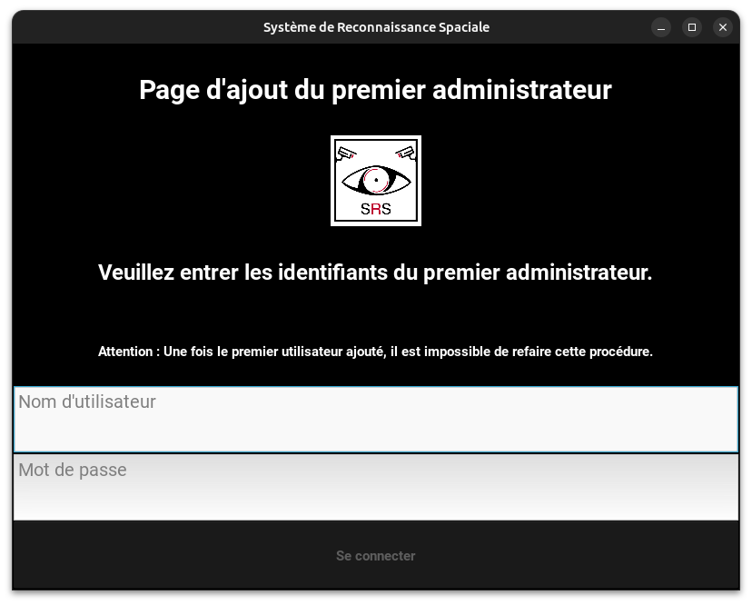
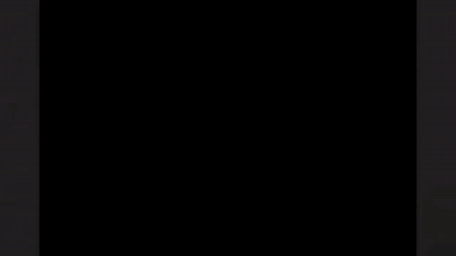

# Documentation : Système de reconnaissance Spatiale
Le SRS (Système de Reconnaissance Spatiale) est un projet destiné à localiser les individus dans un environnement 3D et à présenter visuellement leur position en 2D en utilisant des caméras et des technologies de reconnaissance faciale.

  

## Informations

- **Auteur** : Karel Vilém Svoboda
- **Affiliation** : CFPT Informatique - Projet de diplôme
- **Classe** : T.IS-E2A
- **Suiveurs** : 
    - [Christian Zanardi](mailto:Christian.Zanardi@edu.ge.ch)
    - [Laurent Jayr](mailto:edu-jayrl@eduge.ch)

## Architecture

| Composant        | Langage/Technologie | Utilité dans le Projet                                                                                                         |
|------------------|---------------------|--------------------------------------------------------------------------------------------------------------------------------|
| [**Caméras Wifi**](./composants/camera-wifi.md) | Python              | Capturer des photos et vidéos en temps réel, sécurisées par JWT, et mettre à disposition les données via des endpoints Flask.  |
| [**Serveur Central**](./composants/serveur.md)  | Python              | Traite les images (gris, traitement de frames), détecte les positions des corps et les visages, gère les données utilisateurs. |
| [**Application**](./composants/application.md)    | Python              | Interface utilisateur pour gérer les utilisateurs, afficher les positions, et se connecter au serveur via les ports réseau.    |

### Détails techniques par composant

Pour accèder à la documentation de chaque composant, cliquez sur leurs titres.

#### [1. **Caméras Wifi**](./composants/camera-wifi.md)  
- **Programmation** : Python
- **Sécurité** : Serveurs sécurisés avec JWT
- **Librairies** : OpenCV pour la capture d'images/vidéos, Flask pour les endpoints
- **Fonctionnalités** :
  - Capture en temps réel.
  - Mise à disposition des données des caméras.

#### [2. **Serveur Central**](./composants/serveur.md)
- **Programmation** : Python
- **Sécurité** : JWT pour l'authentification
- **Librairies** : OpenCV, Flask, MariaDB pour la gestion des données, face-recognition pour la reconnaissance faciale, YOLOv5 pour la détection de personnes, Socket.io pour la recherche de ports.
- **Fonctionnalités** :
  - Manipulation et traitement d'images
  - Détecteur de position des corps et reconnaissance faciale
  - Stockage et gestion des données utilisateur
  - Recherche automatique de caméras par scan des ports réseau.

#### [3. **Application**](./composants/application.md)  
- **Programmation** : Python
- **Interface** : Kivy pour l'interface graphique, Socket.io pour la recherche du serveur.
- **Fonctionnalités** :
  - Interface utilisateur graphique
  - Gestion des utilisateurs
  - Affichage des positions des utilisateurs dans les locaux
  - Connexion au serveur par scan des ports réseau


## Rappel du cahier des charges

Cette partie vise à résumer le cahier des charges effectué lors du travail de semestre au cours des deux premiers trimestres de ma seconde année en technicien.

### Diagramme complet du projet


### Cas d'utilisation

Après avoir travaillé dans le domaine de la sécurité, j'ai identifié une application utile pour ce système, notamment dans la gestion de l'accès aux événements privés ou aux manifestations sur invitation. Il est essentiel de connaître la position des employés, des visiteurs et d'identifier les intrus sur le stand d'une marque de luxe. Mon projet vise à automatiser cette solution.

### Problèmes Potentiels

| Problèmes Potentiels    | Solutions                                                                                     |
|-------------------------|-----------------------------------------------------------------------------------------------|
| Puissance de Calcul     | Utilisation d'un serveur puissant pour gérer les flux vidéo.                                  |
| Système de Détection    | Solutions pour la détection en cas de vue obstruée ou de visage partiellement visible.         |
| Approches Algorithmiques| Développement d'algorithmes complexes pour la détection et l'identification en temps réel.     |

### Analyse de l'existant

Recherche de projets similaire afin de trouver des aspects d'inspiration ou/et d'inspiration.

#### Multi Camera People Tracking

Ce projet vise à améliorer les système de surveillance existants en utilisant plusieurs caméras pour suivre et identifier les individus de manière unique.

#### Technologies Utilisées

- **YOLOv4-tiny** : Utilisé pour la détection d'objets afin d'identifier les personnes dans les vidéos.
- **Omni-Scale** : Employé pour la ré-identification des personnes, permettant de distinguer et suivre les mêmes individus à travers différentes caméras.
- **OpenCV** et **PyTorch** : Utilisés pour le traitement vidéo et l'apprentissage profond.

#### Fonctionnalités

1. **Enregistrement Vidéo** : Les caméras de surveillance enregistrent le flux des lieux surveillés.
2. **Analyse Vidéo** : Les flux vidéo sont analysées pour détecter et identifier les personnes.
3. **Étiquetage des Individus** : Chaque personne détectée est étiquetée avec un identifiant unique.
4. **Suivi Continu** : Les informations sont agrégées pour permettre un suivi continu des individus à travers plusieurs caméras.

#### Liens avec SRS
Le projet n'utilise pas la triangulation ni la reconnaissance faciale avec la librairie face_recognition. Cependant, il utilise des modèles comme YoloV4 permettant de faire le tracking, ce qui est similaire à mon projet.

[Dépôt Github](https://github.com/hafidh561/multi-camera-people-tracking)

### Composant 1 : Caméras Wifi

Le système vise à mettre en place des caméras WiFi compactes et personnalisables pour la surveillance ou pour d'autres applications nécessitant la capture et la diffusion en temps réel de flux vidéo. Le cœur du système, un Raspberry Pi Zero 2 W, exécute un serveur Python Flask.


### Composant 2 : Serveur

Le système de serveur central vise à centraliser la surveillance en recevant et en traitant les flux vidéo de caméras WiFi dispersées dans un environnement surveillé. Ses objectifs principaux sont d'assurer une sécurité renforcée grâce à un chiffrement symétrique, de détecter et de reconnaître les personnes dans les flux vidéo, d'offrir une interface en http pour visualiser en temps réel les flux vidéo et les informations sur les personnes détectées et de faciliter l'intégration avec d'autres systèmes via des API.

#### Sécurité
La sécurité de l'API se fera par le système d'utilisateur de la base de données. Quand un utilisateur se connecte, tous les appels à l'API se font avec son nom d'utilisateur et son mot de passe chiffré en SHA256. Ensuite, un JWT est crée pour la durée de la session puis détruit lors de la déconnexion.


#### Composant 3 : Application

L'application est l'interface que possède l'utilisateur final avec le système. Il se connecte automatiquement au serveur et permet d'en manipuler les information en tant que client API. Il permet également d'accèder aux fonctionnalités tel que la reconnaissance spatiale.


## Analyse fonctionnelle

Pour l'analyse fonctionnelle, je me suis placé du point de vue de l'utilisateur. L'objectif est de comprendre les différentes fonctionnalités sans rentrer dans les détails techniques.

### Architecture de l'application

L'application est divisée en deux parties, la partie Kivy Python et la partie OpenCV. La partie Kivy s'occupe de la navigation, des formulaires (connexion, ajout d'utilisateurs) et la partie OpenCV sert à afficher les fonctionnalités liées à la reconnaissance spatiale.

  

### Fonctionnalité 1 : Recherche automatique de serveurs

**Description :** Cette fonctionnalité permet de rechercher automatiquement un serveur SRS actif dans un réseau.

#### User Story

Ce diagramme représente la recherche automatique de serveurs sur un réseau.


1. Cette page démarre automatiquement lorseque l'application est lancée.


2. L'application appelle chaque adresse sur le réseau et essaye de communiquer avec le port prévu pour les serveurs SRS.
3. Interprétation du résultat.
  - Si aucun serveur n'est trouvé, un message d'erreur est affiché et un bouton permet à l'utilisateur d'effectuer une nouvelle recherche.  


  - Si un serveur est trouvé, l'utilisateur est redirigé vers la page de connexion.

  

### Fonctionnalité 2 : Initialisation / Connexion au système


**Description :** Cette fonctionnalité permet d'initialiser le serveur.

#### User Story

Ce diagramme représente un administrateur qui se connecte ou qui met en place le premier administrateur.


1. La page de recherche détermine si le serveur est initialisé. 


##### Route Verte - Le serveur est initialisé : Connexion
2. L'utilisateur est renvoyé vers la page de connexion. 


3. Si ses identifiants de connexion correspondent à ceux présents dans le système, il est redirigé vers le reste de l'application.

##### Route Bleue - Le serveur est initialisé : Intialisation
2. L'utilisateur est renvoyé vers la page de connexion avec les identifiants par défault (présents dans le manuel ou dans la documentation).  

  

3. Si les identifiants sont corrects, il est redirigié vers la page lui permettant d'ajouter les premier identifiants d'administrateurs.  



4. Si les identifiants du premier administrateurs sont acceptés, il est redirigé vers la page de connexion d'administrateur.  


5. Si ses identifiants de connexion correspondent à ceux présents dans le système, il est redirigé vers le reste de l'application.


### Fonctionnalité 3 : Ajout d'utilisateurs

**Description :** Cette fonctionnalité concerne l'ajout des utilisateurs dans la base de données. Permetttant de stocker les nom, le type et les encodages faciaux des utilisateurs.


### Fonctionnalité 5 : Connectivité et Interaction Application-Serveur

**Composantes impliquées :** Serveur Central, Application

**Description :** Cette fonctionnalité vise à assurer la connectivité automatique de l'application au serveur lors du démarrage, ainsi que la détection et la connexion aux caméras Wifi présentes sur le réseau.

### Fonctionnalité 6 : Affichage des données sur l'interface utilisateur

**Composantes impliquées :** Application

**Description :** Cette fonctionnalité concerne l'affichage correct des données, notamment les positions détectées, sur l'interface utilisateur de l'application.


## Analyse organique

Implémentation technique de l'analyse fonctionnelle.

### Base de données


### Initialisation / Connexion

Cette séquence permet d'initialiser le serveur si aucun administrateur n'est présent dans le système. S'il l'est, la page de connexion s'affiche, sinon, les autres étapes de l'initialisation s'activent.


<p align="center">
  
</p>


#### Vérification si le serveur est initialisé

Le serveur vérifie dans sa base de données si la table Admins est vide ou pas. Si c'est le cas, cela veut dire que le serveur n'est pas initialisé.


##### Application : ServerResearchWindow

```py
def async_scan_ips(self, port):
    ip_serveur = self.networkScanner.scan_ips(port)
    self.app = App.get_running_app()
    if ip_serveur:
        self.app.set_server_ip(ip_serveur)
        self.app.set_server_client(ServerClient(ip_serveur))
        serverClient = ServerClient(ip_serveur)
        if serverClient.is_server_set_up():
            self.manager.current = "login"
        else:
            self.manager.current = "initializeLogin"
    else:
        self.ids.state_label.text = "Erreur: Aucun serveur SRS trouvé sur votre réseau."
        self.ids.state_label.color = (1, 0, 0, 1) 
        self.ids.retry_button.disabled = False
```

##### Application : ServerClient

```py
def is_server_set_up(self):
    if not self.server_ip:
        return False
    
    response = requests.get(f"{self.server_url}/is_set_up"
    if response.status_code == 200:
        return True
    else:
        return False
```

##### Serveur : App

```py
def is_set_up(self):
    if self.db_client.isAdminTableEmpty():
        return jsonify({'erreur': 'Le serveur n\'est pas configuré'}), 400
    else:
        return jsonify({'message': 'Le serveur est configuré'}), 200
```

##### Serveur : DatabaseClient

```py
def isAdminTableEmpty(self):
    """
    Permet de savoir si un admin est déjà présent dans la base ou no
    Returns:
        bool : True = Vide / False = Données présentes
    """
    self.cursor.execute("SELECT * FROM Admin")
    results = self.cursor.fetchall()

    if len(results) == 0:
        return True
    else:
        return False
```

#### Première connexion
Cette connexion se fait avec des identifiants génériques (admin, super). Une fois les identifiants vérifiés par le serveur, un JWT est retourné servant uniquement pour les routes d'initialisation.


##### Application : InitializeLoginWindow

```py
def connect(self):
    username = self.ids.username_textInput.text
    password = self.ids.password_textInput.text
    if username is None or password is None:
        return False

    result, response = self.server_client.initialize_login(username, password)

    print(result)
    if result:
        self.manager.current = "addFirstAdmin"
    else:
        self.ids.status_label.text = response
        self.ids.status_label.color = (1, 0, 0, 1) 
```

##### Application : ServerClient

```py
def initialize_login(self, username, password):
    if not self.server_ip:
        return False
    
    endpoint_url = f"{self.server_url}/initialize"
    auth = (username, password)
    
    response = requests.get(endpoint_url, auth=auth)
    if response.status_code == 200:
        self.initialize_token = response.json().get("token")
        return True, "Initialisation réussie"
    elif response.status_code == 403:
        return False, "Identifiants de connexion erronés."
    elif response.status_code == 402:
        return False, "Impossible d'ajouter l'admin quand un autre est déjà présent."
    else:
        print(f"Erreur inattendue: {response.status_code}")
        return False, "Erreur inattendue"
```

##### Serveur : App

```py
DEFAULT_USERNAME = "admin"
DEFAULT_PASSWORD = "super"

def initialize(self):
    """
    Route d'initialisation du projet, sert à récupérer le JWT pour l'initialisation
    """
    auth = request.authorization
    # Vérification des crendentials de l'authentification
    if auth and auth.password == self.DEFAULT_PASSWORD and auth.username == self.DEFAULT_USERNAME:
        # Vérification si la table administrateur est libre pour des question de sécurité
        if self.db_client.isAdminTableEmpty():
            return jsonify({'token': JwtLibrary.generateJwtForInitialization(auth.username)}), 200
        else:
            return jsonify({'erreur': 'Impossible d\'ajouter l\'admin quand un autre est déjà présent.'}), 402
    else:
        return jsonify({'erreur': 'Identifiants de connexion manquants ou erronés (utilisez basic auth)'}), 403
```

#### Ajout d'administrateur

En utilisant le JWT généré lors de l'étape précedente, on ajoute le premier administrateur à la base.


##### Application : AddFirstAdminWindow

```py
def add_admin(self):
    username = self.ids.username_textInput.text
    password = self.ids.password_textInput.text
    
    result, response = self.server_client.add_first_admin(username, password)
    if result:
        self.manager.current = "login"
    else:
        self.ids.status_label.text = response
        self.ids.status_label.color = (1, 0, 0, 1) 
```

##### Application : ServerClient

```py
def add_first_admin(self, admin_name: str, clear_password: str):
    if not self.server_ip:
        return False, "ip du serveur manquante"
    
    is_strong, message = ServerClient.check_password_strength(clear_password)
    if not is_strong:
        return False, message
    hashed_password = ServerClient.hash_password(clear_password)
    endpoint_url = f"{self.server_url}/first_admin"
    params = {
        "username": admin_name,
        "password": hashed_password,
        "token": self.initialize_token
    }
    response = requests.post(endpoint_url, params=params)
    if response.status_code == 201:
        return True, "Admin ajouté avec succès."
    else:
        return False, response.json()
```

##### Serveur : App

```py
@JwtLibrary.initialization_token_required    
def first_admin(self):
    """
    Route permettant d'ajouter le premier administrateur, requert le token du premier login
    """
    if self.db_client.isAdminTableEmpty():
        username = request.args.get('username')
        password = request.args.get('password')        
        if password and username:
            # Ajout des données dans la bdd
            self.db_client.addAdmin(username, password)
            return jsonify({'message': 'L\'admin a été ajouté'}), 201
        else:
            return jsonify({'erreur': 'Mauvais paramètres, utilisez (username, password) pour le nom d\'utilisateur et le mot de passe respectivement.'}), 400
    else:
        return jsonify({'erreur': 'Impossible d\'ajouter l\'admin quand un autre est déjà présent.'}), 402
```

##### Serveur : DatabaseClient

```py
def addAdmin(self, name: str, password: str):
    """
    Ajoute un administrateur à la base de données.
    Args:
        name (str): Le nom de l'administrateur à ajouter.
        password (str): Le mot de passe de l'administrateur à ajouter.
    """
    try:
        self.cursor.execute("INSERT INTO srs.Admin (Name, Password) VALUES (%s, %s);", (name, password))
        self.dbConnexion.commit()
    except Exception as e:
        print(f"Erreur lors de l'insertion dans la base de données: {e}")
```

#### Connexion d'administrateur

L'utilisateur entre les identifiants, si ces derniers correspondent à ceux présentes dans la base, un JWT est retourner lui permettant d'accèder aux autres fonctionnalités.


##### Application : LoginWindow
```py
def login(self):
    username = self.ids.username_textInput.text
    password = self.ids.password_textInput.text
    if username is None or password is None:
        return False

    result, response = self.server_client.admin_login(username, password)

    if result
        self.manager.current = "main"
    else:
        self.ids.status_label.text = response
        self.ids.status_label.color = (1, 0, 0, 1) 
```

##### Application : ServerClient

```py
def admin_login(self, admin_name : str, clear_password : str):
    if not self.server_ip:
        return False, "IP du serveur manquante"
    hashed_password = ServerClient.hash_password(clear_password)
    endpoint_url = f"{self.server_url}/admin_login"
    auth = (admin_name, hashed_password)
    response = requests.post(endpoint_url, auth=auth)
    if response.status_code == 200:
        self.API_token = response.json().get("token")
        print(self.API_token)
        return True, "Authentification réussie"
    elif response.status_code == 403:
        return False, "Aucun administrateur n'est présent dans le système."
    elif response.status_code == 400:
        return False, "Les identifiants de connexion sont erronés."
    else:
        return False, "Erreur inattendue lors de la tentative de connexion."
```

##### Serveur : App
```py
def admin_login(self):
    """
    Permet à l'administrateur de se connecter. Retourne un JWT si tout est ok.
    """
    if self.db_client.isAdminTableEmpty():
        return jsonify({'erreur': 'Aucun administrateur n\'est présent dans le système.'}), 403
    
    auth = request.authorization
    # Vérification des données de connexion
    if self.db_client.adminLogin(auth.username, auth.password):
        return jsonify({'token': JwtLibrary.generateJwtForAPI(auth.username)}), 200
    else:
        return jsonify({'erreur': 'Les identifiants de connexion sont erronés'}), 400
```

##### Serveur : DatabaseClient
```py
def adminLogin(self, name: str, password: str):
    """
    Connexion d'un administrateur
    Args:
        name (str) : Le nom de l'administrateur à vérifier.
        password (str) : Le mot de passe de l'administrateur à vérifier.
    
    Returns:
        Si l'utilisateur est un admin alors True, sinon False.
    """
    try:
        self.cursor.execute("SELECT * FROM Admin WHERE Name = %s AND Password = %s", (name, password))
        
        results = self.cursor.fetchall()
        if len(results) == 0:
            return False
        else:
            return True
    except Exception as e:
        print(f"Error during login: {e}")
        return False
```

### Ajout d'utilisateur

La page d'ajout d'utilisateur permet d'ajouter les données d'un individus dans le système.
1. Nom
2. Type de personne (Employé, dangereux, etc.)
3. Données faciales

<p align="center">
  
</p>

#### Récupération du type de personnes

Cette séquence permet de récupérer les types de personnes présentes dans la base de données afin de l'affiche dans le spinner du formulaire d'ajout de personnes.


##### Application : AddUserWindow

Récupération des types de personne, passage de la liste dans le spinner.

```py
def get_person_types(self):
    result, response = self.server_client.get_person_types()
    if result:
        for data in response:
            self.personTypes.append(data[1])
            self.ids.function_spinner.values = self.personTypes
        return True, response
    else:
        return False, response
```

##### Application : ServerClient

Appelle le endpoint puis passe les données en liste si trouvés, sinon, renvoi d'un message d'erreur.

```py
def get_person_types(self):
    if not self.server_ip:
        return False
    
    params = {
        "token": self.API_token
    }
    
    endpoint_url = f"{self.server_url}/person_types"
    response = requests.get(endpoint_url, params=params)
    if response.status_code == 200:
        return True, response.json()
    else:
        return False, response
```

##### Serveur : App

Route sécurisée renvoyant la liste des type de personnes en json.

```py
@JwtLibrary.API_token_required
def person_types(self):
    return jsonify(self.db_client.getPersonTypes()), 200
```

##### Serveur : DatabaseClient

Récupération de la liste complète des type de personnes dans la base.


```py
def getPersonTypes(self):
    try:
        self.cursor.execute("SELECT * FROM PersonTypes")
        return self.cursor.fetchall()
    except Exception as e:
        print(f"Error: {e}")
```

#### Ajout des données de l'utilisateur
1. Récupération des type de personne par id
2. Encodage des données faciale de l'utilisateur.
3. Envoi des données de l'utilisateur


##### Application : AddUserWindow

Cette fonction est appellée après la pression du bouton d'ajout d'utilisateur.

```py
def add_user_button_pressed(self):
    result_function, id_function = self.server_client.get_person_types_by_name(self.ids.function_spinner.text)
    result_encodings, face_encodings = LibFaceRecognition.get_face_encodings(self.get_picture())
    username = self.ids.username_textInput.text
    
    if result_function and result_encodings:
        self.server_client.add_user(username, id_function, face_encodings)
```

##### Application : LibFaceRecognition

Cette fonction permet de récupérer les données faciale dans une iamge, s'il y a plus de un visage présent, alors elle retourne faux car elle ne peut pas déterminer lequel choisir. Si aucun visage n'est détecté, retourne faux également.

```py
@staticmethod
def get_face_encodings(image):
    """
    Récupère les données faciales de la personne dans l'image
    """
    face_locations = face_recognition.face_locations(image)
    face_encodings = face_recognition.face_encodings(image, face_locations)
    if len(face_encodings) < 1:
        return False, "Aucun visage détecté."
    elif len(face_encodings) > 1:
        return False, "Trop de visages détectés, veuillez vous isoler."

    return True, face_encodings
```

##### Application : ServerClient

Cette fonction est utilisée pour récupérer le type de personne par nom.

```py
def get_person_types_by_name(self, typeName : str):
    if not self.server_ip:
        return False
    
    params = {
        "token": self.API_token,
        "typeName": typeName
    }
    
    endpoint_url = f"{self.server_url}/person_type_by_name"
    response = requests.get(endpoint_url, params=params)
    if response.status_code == 200:
        return True, response.json()['message']['idPersonType']
    else:
        return False, response
```

Cette fonction ajoute une personne dans le système, les données sont passé dans le body afin de pouvoir transporter plus de contenu. Le token lui reste en paramêtre.

```py
def add_user(self, username, idPersonType, encodings):
    if not self.server_ip:
        return False, "ip du serveur manquante"
    endpoint_url = f"{self.server_url}/add_user"
    encodings_list = [encoding.tolist() for encoding in encodings]
    data = {
        "username": username,
        "idPersonType": idPersonType,
        "encodings": encodings_list,
    }
    # Encoder les données en JSON
    data_json = json.dumps(data)
    url_with_token = f"{endpoint_url}?token={self.API_token}"
    response = requests.post(url_with_token, data=data_json)
    if response.status_code == 200:
        return True, response.json()
    else:
        return False, response.json()
```

##### Serveur : App

Récupération du type de personne par nom.

```py
@JwtLibrary.API_token_required
def person_type_by_name(self):
    typeName = request.args.get('typeName')
    result, response = self.db_client.getPersonTypeByName(typeName)
    if result:
        return jsonify({'message' : response}), 200
    else:
        return jsonify({'erreur' : response}), 400
```

Récupération des données pour l'ajout de l'utilisateurs.

```py
@JwtLibrary.API_token_required
def add_user(self):
    try:
        data_json = request.data.decode('utf-8')
        data = json.loads(data_json)
        idPersonType = data.get('idPersonType')
        encodings = data.get('encodings')
        username = data.get('username')
        result, response = self.db_client.addUser(idPersonType, json.dumps(encodings), username)
        if result:
            return jsonify({'message' : response}), 200
        else:
            return jsonify({'erreur' : response}), 400
    except Exception as e:
        # Afficher l'erreur précise
        print(f"Erreur lors de l'ajout de l'utilisateur : {e}")
        # Retourner une réponse avec un code de statut 500 (Erreur interne du serveur)
        return jsonify({'erreur' : str(e)}), 500
```

##### Serveur : DatabaseClient

Récupère le type de personne par le nom, retourne faux si aucune corresponce n'est trouvée.

```py
def getPersonTypeByName(self, typeName: str):
    try:
        self.cursor.execute("SELECT idPersonType FROM PersonTypes WHERE typeName = %s", (typeName,))
        result = self.cursor.fetchone()
        if result is None:
            return False, "Aucune correspondance trouvée"
        else:
            # Extracting the relevant data from the result
            idPersonType = result[0]
            # Returning a JSON serializable object
            return True, {'idPersonType': idPersonType}
    except Exception as e:
        print(f"Error: {e}")
        return False, str(e)
```


Ajoute la personne dans la base, vérifie également si la personne n'existe pas déjà et vérifie si le type de personne existe.

```py
def addUser(self, idPersonType, encodings, username):
    
    try:
        
        if not self.checkIfIdPersonTypeExist(idPersonType):
            return False, f"Impossible d'ajouter l'utilisateur : Le type de personne n'existe pas."
        
        if self.checkIfUsername(username):
            return False, f"Impossible d'ajouter l'utilisateur : Un utilisateur avec le même nom existe déjà dans la base"
        
        self.cursor.execute("INSERT INTO srs.Users (idPersonType, encodings, username) VALUES(%s, %s, %s);", (int(idPersonType), encodings, username))
        
        self.dbConnexion.commit()
        return True, "L'utilisateur a été ajouté avec succès."
    except Exception as e:
        print(f"Error: {e}")
        return False, f"Impossible d'ajouter l'utilisateur : {e}"
```

### Système de reconnaissance spatiale 

L'objectif de la reconnaissance spatiale est de déterminer la position ainsi que l'identité des personnes dans un espace 3D et le représenter sur une carte 2D.


#### Récupération des arguments (srs-proto : srs-face_recognition.py)

Pour commencer, je récupère le lien vers les caméras, la taille du mur ainsi que le lien vers l'api des utilisateurs passés en paramètre.

```py
parser = argparse.ArgumentParser(description="Object Detection and Triangulation with multiple cameras")
parser.add_argument('--camera_url1', type=str, required=True, help='URL of the first camera')
parser.add_argument('--camera_url2', type=str, required=True, help='URL of the second camera')
parser.add_argument('--camera_url3', type=str, required=True, help='URL of the third camera')
parser.add_argument('--camera_url4', type=str, required=True, help='URL of the fourth camera')
parser.add_argument('--wall_size', type=str, required=True, help='Size of the walls')
parser.add_argument('--api_link', type=str, required=True, help='Link to the users API')
parser.add_argument('--headless', action='store_true', help='Run in headless mode without GUI')
args = parser.parse_args()

# Configuration
CAMERA_URLS = [
    args.camera_url1,
    args.camera_url2,
    args.camera_url3,
    args.camera_url4
]

wall_size = float(args.wall_size)
api_link = args.api_link
```

#### Constantes (srs-proto : srs-face_recognition.py)

1. `CAMERA_FOV` : est l'angle de vue des caméras, utilisé pour déterminer l'angle de l'utilisateur.
2. `ROOM_WIDTH` : Largeur de la pièce
3. `ROOM_HEIGHT` : Hauteur de la pièce
4. `ASSOCIATE_COLOR` : Couleur des associés sur la carte
5. `DANGER_COLOR` = Couleur des personnes dangereuses sur la carte
6. `CLIENT_COLOR` = Couleur des clients sur la carte
7. `UNKNOWN_COLOR` = Couleur pour les personnes non reconnues

⚠️ Les dimensions de la pièce ne sont pas prise en compte dans les calculs de position mais uniquement dans l'affichage de la pièce par OpenCV. ⚠️

```py
CAMERA_FOV = 62.2  # Angle de vue de la caméra en degrés
ROOM_WIDTH = wall_size  # Largeur de la pièce en mètres
ROOM_HEIGHT = wall_size  # Hauteur de la pièce en mètres

ASSOCIATE_COLOR = (255, 0, 0)
DANGER_COLOR = (0, 0, 255)
CLIENT_COLOR = (0, 255, 0)
UNKNOWN_COLOR = (255,255,255)
```

#### Modèle (srs-proto : srs-face_recognition.py)

Le modèle est passé sur le GPU pour des questions de vitesse d'exécution. Le modèle Yolov5 est chargé ici depuis le dossier correspondant au lien relatif.

```py
# Charger le modèle YOLOv5 pré-entrainé et déplacer le modèle sur le GPU pour des quesiton de vitesse d'execution
device = torch.device('cuda' if torch.cuda.is_available() else 'cpu')
model = torch.hub.load('ultralytics/yolov5', 'yolov5s', pretrained=True).to(device)
```

#### Création des captures sur les différentes caméras (srs-proto : srs-face_recognition.py)

Avec les urls passés dans les paramètre, j'essaye d'appeler l'endoint des caméras wifi afin d'avoir les vidéos en temps réel.

```py
# Initialisation des captures vidéo
cap1 = cv2.VideoCapture(CAMERA_URLS[0])
cap2 = cv2.VideoCapture(CAMERA_URLS[1])
cap3 = cv2.VideoCapture(CAMERA_URLS[2])
cap4 = cv2.VideoCapture(CAMERA_URLS[3])

# Vérification si les captures vidéo sont ouvertes correctement
if not cap1.isOpened():
    print("Erreur : Impossible de lire le flux vidéo de la caméra 1")
    exit()
if not cap2.isOpened():
    print("Erreur : Impossible de lire le flux vidéo de la caméra 2")
    exit()
if not cap3.isOpened():
    print("Erreur : Impossible de lire le flux vidéo de la caméra 3")
    exit()
if not cap4.isOpened():
    print("Erreur : Impossible de lire le flux vidéo de la caméra 4")
    exit()
```

#### Récupération des données des utilisateurs (srs-proto : srs-face_recognition.py)

En utilisant le lien vers l'api passée en paramètre, on fait une tentative d'appel vers le endpoint.

- Réussite : Retourne une liste contenant les nom, les encodage ainsi que l'id de type de personne de tous les utilisateurs de la base.
- Echec : Print d'un message d'erreur

```py
def get_users_api(api_link):
    response = requests.get(api_link)
    user_list = []

    if response.status_code == 200:

        for user in response.json():
            user_list.append([user['username'], user['encodings'], user['idPersonType']])

        return True, user_list
    else:
        print({'erreur':'Récupération des données des utilisateurs impossible.'})
        exit()
```

#### Analyse des données (srs-proto : srs-face_recognition.py)

Cette partie permet de récuprer les données présentes dans la base et les rendre utilisable dans mon application.

- `known_face_encodings` : Liste contenant les encodages des utilisateurs
- `known_face_names` : Liste contenant les noms des utilisateurs

1. Ajout du nom dans la liste
2. Conversion des encodages en base64 vers du utf-8
3. Vérification de la longeur des encodages afin de vérifier la véracité des données

- En cas d'échec : La personne n'est pas ajoutée et un message d'erreur est imprimé.

```py
# Listes pour stocker les encodages de visages et les noms
known_face_encodings = []
known_face_names = []

for user_data in users_data:
    known_face_names.append(user_data[0])
    encoding_base64 = user_data[1]
    encoding_json = base64.b64decode(encoding_base64).decode('utf-8')
    encoding = json.loads(encoding_json)
    if len(encoding) == 128:
        known_face_encodings.append(encoding)
    else:
        print(f"Encodage incorrect pour {user_data[0]}: {encoding}")
```

#### Reconnaissance de personnes (srs-proto : srs-face_recognition.py)

Cette fonction permet de détecter la position des personnes dans la frame et exécuter la reconnaissance faciale avec ces dites positions.

Premièrement, le modèle de YoloV5, recherche la position des objets dans la frame, ensuite, on fait en sorte de garder uniquement les personnes.


On recherche l'angle relatif au centre de l'angle de vue de la camera, par exemple, si l'objet est légérement à gauche, l'angle sera de `-10°` mais s'il est légérement à droite alors `10°`.


1. Calcul du centre X
- $\text{center\_x} = \frac{x1 + x2}{2}$
2. Calcul du centre de l'image
- $\frac{\text{frame.shape}[1]}{2}$
3. Position realative par rapport au centre
- $\text{center\_x} - \frac{\text{frame.shape}[1]}{2}$
4. Normalisation par rapport à la taille de l'image
- $\frac{\text{center\_x} - \frac{\text{frame.shape}[1]}{2}}{\text{frame.shape}[1]}$
5. Multiplication par la fov afin de trouver l'angle
- $\frac{\text{center\_x} - \frac{\text{frame.shape}[1]}{2}}{\text{frame.shape}[1]} \times \text{fov}$

Ensuite, avec les contenaires trouvés par YoloV5, on envoie les position à analyser à la reconnaissance faciale. Le nom est ensuite ajouté à la liste.

```py
def process_frame(frame, model, fov):
    """
    Modifie la frame, détermine les angles et retourne les noms dans la frame.
    
    Args:
        frame: Une image capturée à partir d'un flux vidéo.
        model: Le modèle de détection d'objets, par exemple YOLO, pour détecter les personnes dans l'image.
        fov: Champ de vision (field of view) de la caméra en degrés.
        
    Returns:
        frame: L'image modifiée avec les annotations des personnes détectées.
        angles: Une liste des angles des personnes par rapport au centre de l'image.
        names: Une liste des noms des personnes détectées dans l'image.
    """
    frame_rgb = cv2.cvtColor(frame, cv2.COLOR_BGR2RGB)
    results = model(frame_rgb)
    angles = []
    names = []
    for det in results.xyxy[0].cpu().numpy():
        x1, y1, x2, y2, conf, cls = det # Extraction des coordonnées des objets
        if cls == 0: # Garde uniquement les personnes
            center_x = (x1 + x2) / 2
            angle = (center_x - frame.shape[1] / 2) / frame.shape[1] * fov
            angles.append(angle)
            cv2.rectangle(frame, (int(x1), int(y1)), (int(x2), int(y2)), (0, 255, 0), 2)
            name = recognize_faces(frame, (x1, y1, x2, y2))
            names.append(name)
            cv2.putText(frame, f"Angle: {angle:.2f}", (int(x1), int(y1) - 10), cv2.FONT_HERSHEY_SIMPLEX, 0.5, (0, 255, 0), 2)
            cv2.putText(frame, name, (int(x1), int(y2) + 20), cv2.FONT_HERSHEY_SIMPLEX, 0.5, (0, 255, 0), 2)
    return frame, angles, names
```

#### Reconnaissance faciale (srs-proto : srs-face_recognition.py)

La reconnaissance faciale se fait avec la librairie [face-recognition](https://pypi.org/project/face-recognition/). Pour résumer, on compare les données présente dans la région délimité par la reconnaissance de personne avec celles présentes dans la base de données.

1. Récupération de la position à analyser dans l'image.
2. Recherche de la position des visages
    - Si aucun n'est découvert, le code renvoit `None`.
3. Avec la position des visage, la fonction des encodages
    - Si n'est pas fonctionnel, la fonction renvoit `None`.
4. Boucle avec toutes les visages découvert dans la frame
5. Comparaison avec les encodages trouvés dans la base de données
    - Si aucun visage n'est trouvé, retourne `Unknown`
    - Si une correspondance est trouvée, la personne est recherché dans la liste avec le `best_match_index` qui retourne son index dans la liste.
6. Retour du résultat.

```py
def recognize_faces(image, bbox, tolerance=0.6):
    top, left, bottom, right = int(bbox[1]), int(bbox[0]), int(bbox[3]), int(bbox[2])
    face_image = image[top:bottom, left:right]
    
    # Convertir l'image au format RGB
    face_image_rgb = cv2.cvtColor(face_image, cv2.COLOR_BGR2RGB)
    
    # Trouver les visages et encodages de visages dans l'image
    face_locations = face_recognition.face_locations(face_image_rgb)
    if not face_locations:
        return "None"
    
    face_encodings = face_recognition.face_encodings(face_image_rgb, face_locations)
    if not face_encodings:
        return "None"
    
    for face_encoding in face_encodings:
        matches = face_recognition.compare_faces(known_face_encodings, face_encoding, tolerance)
        name = "Unknown"
        
        if np.any(matches):  # Utiliser np.any() pour vérifier s'il y a au moins une correspondance
            # Trouver les distances
            face_distances = face_recognition.face_distance(known_face_encodings, face_encoding)
            best_match_index = np.argmin(face_distances)
            
            # Assurez-vous que best_match_index est dans les limites de matches et matches n'est pas vide
            if matches and best_match_index < len(matches) and matches[best_match_index]:
                name = known_face_names[best_match_index]
        
        return name
    return "None"
```

#### Tri des noms (srs-proto : srs-face_recognition.py)

Cette fonction permet de sortir le nom avec le plus d'occurence dans une liste. Cela permet de déterminer le nom d'une personne si son visage est capté par plusieurs caméras.

En évitant les noms **None** et **Unknown**, cela permet de ne pas prendre en considération les non détéctions.

Si aucune personne n'est reconnue, la fonction retourne - `Personne non reconnue`.

```py
def get_name_per_index(name_list):
    """
    Met à jour les noms dans la liste avec un compteur d'index et retourne le nom avec la plus grande occurrence.

    Args:
        name_list: Liste des noms de personnes détectées.

    Returns:
        Le nom avec le plus grand nombre de correspondances. Si aucun nom n'est reconnu, retourne "Personne non reconnue".
    """
    name_counter = {}
    updated_name_list = []  
    
    for name in name_list:
        if name != "None" and name != "Unknown":
            if name in name_counter:
                name_counter[name] += 1
            else:
                name_counter[name] = 1

            updated_name_list.append(f"{name}_{name_counter[name]}")
    # Trouver le nom avec la plus grande correspondance
    if(len(name_counter) > 0):
        return max(name_counter, key=name_counter.get)
    return "Personne non reconnue"
```

#### Récupération de la couleur du type de personne par nom Tri des noms (srs-proto : srs-face_recognition.py)

Retourne la couleur associée à une personne en fonction du type de personne passée en paramètre.

On parcours les utilisateurs et si une occurence est trouvée avec celui passé en paramètre. Si la personne est identifiée, le type de personne associé à son nom est passé dans un `match` et la couleur correspondante à son type de personne est retournée.

Si la personne n'est pas trouvée, la couleur de l'utilisateur inconnu est retournée.

```py
def get_person_type_color_by_name(name):
    """
    Retourne la couleur associée à une personne en fonction de son nom et de son type.

    Args:
        name: Le nom de la personne pour laquelle la couleur doit être trouvée.

    Returns:
        La couleur associée à la personne. Si le nom n'est pas trouvé, retourne UNKNOWN_COLOR.
    """
    for user in users_data:
        if user[0] == name:
            match user[2]:
                case 1:
                    return ASSOCIATE_COLOR
                case 2:
                    return DANGER_COLOR
                case 3:
                    return CLIENT_COLOR
    return UNKNOWN_COLOR
```

#### Process (srs-proto : srs-face_recognition.py)

Cette boucle infinie s'exécute et affiche le résultat à l'utilisateur.

1. Récupération des frames
2. Retournement des frames (pour des quesitons de support, le flux est à l'envert verticalement)
3. Appel de la fonction `process_frame` qui récupère les angles, l'indentidé des personnes ainsi que la frame modifiée avec les informations.
4. La condition vérifie que le nombre de personnes détéctés par les caméras est identique afin de garantir la précision du système.
5. Affichage des résultats de la triangulation.

```py
map_width, map_height = 600, 600

while True:
    # Lire les frames des caméras
    ret1, frame1 = cap1.read()
    ret2, frame2 = cap2.read()
    ret3, frame3 = cap3.read()
    ret4, frame4 = cap4.read()

    # Si une des captures échoue, on sort de la boucle
    if not ret1 or not ret2 or not ret3 or not ret4:
        print("Erreur : Impossible de lire une frame des flux vidéo")
        break

    # Inverser les frames verticalement et horizontalement
    frame1 = cv2.flip(cv2.flip(frame1, 0), 1)
    frame2 = cv2.flip(cv2.flip(frame2, 0), 1)
    frame3 = cv2.flip(cv2.flip(frame3, 0), 1)
    frame4 = cv2.flip(cv2.flip(frame4, 0), 1)

    # Traiter les frames pour détecter les personnes et calculer les angles
    frame1_processed, angles_cam1, names_cam1 = process_frame(frame1, model, CAMERA_FOV)
    frame2_processed, angles_cam2, names_cam2 = process_frame(frame2, model, CAMERA_FOV)
    frame3_processed, angles_cam3, names_cam3 = process_frame(frame3, model, CAMERA_FOV)
    frame4_processed, angles_cam4, names_cam4 = process_frame(frame4, model, CAMERA_FOV)

    if not args.headless:
        # Afficher les frames dans des fenêtres séparées
        cv2.imshow('Camera 1', frame1_processed)
        cv2.imshow('Camera 2', frame2_processed)
        cv2.imshow('Camera 3', frame3_processed)
        cv2.imshow('Camera 4', frame4_processed)

    if len(angles_cam1) == len(angles_cam2) == len(angles_cam3) == len(angles_cam4):
        result, response = Triangulation.get_objects_positions(wall_size, angles_cam1, angles_cam2, angles_cam3, angles_cam4, tolerence=0.5)

        # Créer une carte vide
        map_frame = np.zeros((map_height, map_width, 3), dtype=np.uint8)
        
        if result:  
            if args.headless:
                print("-----")
                for point in response.points:
                    print(point.value)
            else:
                i = 0
                if len(response.points) == len(angles_cam1) and len(response.points) == len(angles_cam2) and len(response.points) == len(angles_cam3) and len(response.points) == len(angles_cam4):
                    for point in response.points:
                        i += 1
                        # Redimensionner les positions pour correspondre à la carte
                        map_x = int((point.value[0] / ROOM_WIDTH) * map_width)
                        map_y = int((point.value[1] / ROOM_HEIGHT) * map_height)
                        # Limiter les coordonnées à l'intérieur de la carte
                        map_x = np.clip(map_x, 0, map_width - 1)
                        map_y = np.clip(map_y, 0, map_height - 1)
                        # Dessiner un point à la position calculée
                        found_name = get_name_per_index([names_cam1[i-1], names_cam2[i-1], names_cam3[i-1], names_cam4[i-1]])
                        cv2.circle(map_frame, (map_x, map_y), 5, get_person_type_color_by_name(found_name), -1)
                        cv2.putText(map_frame, f"{found_name} = X: {point.value[0]:.2f}, Y: {point.value[1]:.2f}", 
                                    (10, i * 30), cv2.FONT_HERSHEY_SIMPLEX, 0.6, (255, 255, 255), 2)
                    cv2.imshow('Map', map_frame)

    # Appuyer sur 'q' pour quitter les fenêtres
    if cv2.waitKey(1) & 0xFF == ord('q'):
        break
```

#### Récupération de la position d'un objet (triangulation.py : get_objet_position)

Cette fonction permet de déterminer la position d'une personne en utilisant l'angle de personne capté sur seux caméras pointant vers le milieu de la pièce, ces caméras ne doivent pas être à l'opposé l'une de l'autre.

Le point vert représente la personne.

Pour commencer, on va recherche à trouver les deux angles. 

Pour la camera de gauche, l'angle se calcule en effectuant une différence entre 45° et la l'angle relatif à la camera.

Pour la camera de droite, l'angle se calcule en effectuant une addition avec 45° et la l'angle relatif à la camera.

Cette différence existe à cause du positionnement des caméras. Plus l'objet se situe vers la droite, plus l'angle relatif à la camera augmente, c'est l'inverse pour la caméra de droite.

$\alpha = \frac{90^\circ}{2} - \text{object\_angle\_from\_left}$

$\beta = \frac{90^\circ}{2} + \text{object\_angle\_from\_right}$


Afin d'empêcher d'avoir des bugs, les angles ne doivent pas accéder 90° et ne doivent pas être inférieur à 0°. Vu la position, des caméras, cela ne devrait pas se produire.

$\text{Si } \beta > 90^\circ \text{ ou } \alpha > 90^\circ, \text{ alors } \text{erreur : "Impossible de calculer la triangulation pour un angle supérieur à 90°"}$

$\text{Si } \beta < 0^\circ \text{ ou } \alpha < 0^\circ, \text{ alors } \text{erreur : "Impossible de calculer la triangulation pour un angle inférieur à 0°"}$

##### Recherche de la position

On va à présent rechercher la postion de l'utilisateur en utilisant la trigonomètrie. Pour commencer, définition les variables que l'on possède.

$\alpha=\text{angle depuis la camera gauche}$

$\beta=\text{angle depuis la camera droite}$

$c=\text{distance entre les caméras}$


On commence par calculer l'angle gamma. 

Selon le [théorème de la somme des angles d'un triangle](https://fr.wikipedia.org/wiki/Somme_des_angles_d%27un_triangle), alors :

$\alpha + \beta + \gamma = 180^\circ$

donc :

$\gamma = 180^\circ - \alpha - \beta$

On calcule ensuite la distance entre la camera de gauche et l'objet, (représentée par $b$ dans le schéma).

Pour ce faire, on utilise la [loi du sinus](https://fr.wikipedia.org/wiki/Loi_des_sinus). Par conséquent :

$\frac{a}{\sin(\alpha)} = \frac{b}{\sin(\beta)} = \frac{c}{\sin(\gamma)}$

donc :

$b = \frac{\text{c}}{\sin(\gamma)} \cdot \sin(\beta)$

On applique cela à nos variables :

$\text{distance\_camera\_object} = \frac{\text{wall\_length}}{\sin(\gamma)} \cdot \sin(\beta)$

À présent que nous avons la distance entre la camera et l'objet, nous avons un triangle rectangle ce qui va nous permettre de connaitre la position y.


Pour trouver la position y, on utilise l'angle alpha et la distance entre la camera gauche et la personne pour appliquer le [rapport trigonométrique pour le sinus](https://www.alloprof.qc.ca/fr/eleves/bv/mathematiques/les-identites-trigonometriques-m1357).

$\sin(\alpha) = \frac{\text{opposé}}{\text{hypoténuse}}$

Nous recherchons l'opposé, donc :

$\text{opposé} = \sin(\alpha) \times \text{hypoténuse}$

En appliquant nos variables :

$\text{position\_y} = \text{distance\_camera\_object} \cdot \sin(\alpha)$

Pour terminer, en appliquand le [théorème de Pythagore](https://fr.wikipedia.org/wiki/Th%C3%A9or%C3%A8me_de_Pythagore), on peut trouver la position x.

$a = \sqrt{c^2 - b^2}$

donc :

$\text{position\_x} = \sqrt{\text{distance\_camera\_object}^2 - \text{position\_y}^2}$

##### Invertion des résultats

Le paramètre reverse sert si les caméras sont placés à l'autre bout de la pièce et qu'on recherche la position de la personne comme si elles était captés depuis l'autre bout. Cela est utile quand on recherche à trouver une correspondance entre les position captés par les caméras du haut et les caméras du bas.


En faisant la différence entre le mur et les position, nous pouvons convertir notre position comme si la personne était vue de l'autre côté.

$\text{position\_x} = \text{wall\_length} - \text{position\_x}$

$\text{position\_y} = \text{wall\_length} - \text{position\_y}$

##### Implémentation

```py
@staticmethod
def get_object_position(wall_length, object_angle_from_left, object_angle_from_right, debug=False, reverse=False):
    """
    Calcule la position d'un objet par rapport à une caméra en utilisant la triangulation.
    
    Args:
        wall_length: La longueur du mur sur lequel se trouve la caméra.
        object_angle_from_left: L'angle de l'objet par rapport à la caméra gauche.
        object_angle_from_right: L'angle de l'objet par rapport à la caméra droite.
        debug: Affiche les informations de débogage si True (par défaut False).
        reverse: Inverse les coordonnées de la position si True (par défaut False).
    
    Returns:
        Un tuple contenant un booléen indiquant le succès du calcul et les coordonnées [position_x, position_y] de l'objet,
        ou un message d'erreur si les angles sont invalides.
    """
    # Conversion des angles en radians
    alpha = 90 / 2 - object_angle_from_left
    beta = 90 / 2 + object_angle_from_right
    if beta > 90 or alpha > 90:
        return False, "Impossible de calculer la triangulation pour un angle supérieur à 90°"
    
    if beta < 0 or alpha < 0:
        return False, "Impossible de calculer la triangulation pour un angle inférieur à 90°"
    
    # Calcul de gamma
    gamma = 180 - alpha - beta
    # Calcul de la distance entre la caméra et l'objet
    distance_camera_object = wall_length / math.sin(math.radians(gamma)) * (math.sin(math.radians(beta)))
    # Calcul de la position Y
    position_y = distance_camera_object * math.sin(math.radians(alpha))

        # Calcul de la position X
        position_x = math.sqrt(distance_camera_object**2 - position_y**2)

        if reverse:
            position_x = wall_length - position_x
            position_y = wall_length - position_y

        if debug:
            print("alpha : " + str(alpha))
            print("beta : " + str(beta))
            print("gamma : " + str(gamma))
            print("cam_left -> object : " + str(distance_camera_object))
            print("position x : " + str(position_x))
            print("position y : " + str(position_y))

        return True, [position_x, position_y]
```

#### Récupération de la position de plusieurs objets (triangulation.py : get_objets_positions)

Cette fonctionnalité permet de récupérer la position de plusieurs objets dans un espace en utilisant quatres caméras.

##### Problèmatique avec deux caméras

Pour déterminer la position d'une personne dans un espace avec deux caméras, on utilise le point d'indersection entre les deux angles captés par les caméras.

Le problème c'est que quand il y a plus d'une personne, le nombre d'interséction possible est de $x^2$ pour $x$ étant le nombre de personnes détectées.

Dans cet exemple, deux personnes sont détectés (point vert et rouge), par conséquent, deux autres points sont présents mais sont incorrects (points noirs).

En ajoutant un second set de camera avec lequel on effectue également la triangulation, cela permet de confirmer la position des personnes.

Dans ce schema, la première pièce représente les positions captés par les caméras du sud, sur le second, on voit les positions captés par les caméras du nord. Sur la dernière pièce rassemble tous les points. 

On peut voir que les points réels sont captés par les deux set de caméra. Ce qui permet de les discerner.


##### Solution

Pour trouver la position des personnes, nous suivons les étapes suivantes :


1. On crée une liste de tous les points possibles pour les caméras du sud et du nord, en utilisant le paramètre `reverse` pour ajuster les points selon la vue des caméras du sud. 
    - Les positions sont stockées dans des objets `TwoCameraPoint`, qui contiennent la position ainsi que les angles gauche et droit.

2. On boucle ensuite sur les points trouvés par les caméras du sud et ceux du nord.
3. Si les points sont proches, ils sont ajoutés à une liste unique.
    - Le système de tolérance détermine si les points sont proches. Ce système est utile car les positions calculées par les caméras peuvent varier légèrement entre le nord et le sud, en raison de la calibration ou de l'angle capturé par Yolov5.
    - Si la position de la personne est dans la tolérance, une instance de `FourPointList` est créée et ajoutée à une liste dans l'objet `UniquePointList`. On vérifie ensuite si un objet `FourPointList` dans la liste a un angle identique. Si c'est le cas, alors la personne est déjà ajoutée et n'est pas rajoutée à la liste.


**Système de tolérence**

| Couleur   | Signification                                             |
|-----------|-----------------------------------------------------------|
| Rouge     | Position captée par les caméras du nord                   |
| Vert      | Position captée par les caméras du sud                    |
| Gris      | Position finale (Moyenne de la position entre les deux points) |


##### Implémentation

```py
@staticmethod
def get_objects_positions(wall_length, objects_angles_from_bot_left, objects_angles_from_bot_right, object_angles_from_top_left, object_angles_from_top_right, tolerence=0.5):
    all_possible_points_bot = []
    for left_object_bot in objects_angles_from_bot_left:
        for right_object_bot in objects_angles_from_bot_right:
            result, pointXY = Triangulation.get_object_position(wall_length, left_object_bot, right_object_bot)
            if result:
                all_possible_points_bot.append(TwoCameraPoint(left_object_bot, right_object_bot, pointXY))
    all_possible_points_top = []
    for left_object_top in object_angles_from_top_left:
        for right_object_top in object_angles_from_top_right:
            result, pointXY = Triangulation.get_object_position(wall_length, left_object_top, right_object_top, reverse=True)
            if result:
               all_possible_points_top.append(TwoCameraPoint(left_object_top, right_object_top, pointXY))
    
    unique_point_list = UniquePointList()
    for possible_point_bot in all_possible_points_bot:
        for possible_point_top in all_possible_points_top:
            if(abs(possible_point_bot.value[0] - possible_point_top.value[0] < tolerence) and abs(possible_point_bot.value[1] - possible_point_top.value[1] < tolerence)):
                unique_point_list.add_point(FourCameraPoint(possible_point_bot, possible_point_top, [(possible_point_bot.value[0] + possible_point_top.value[0]) / 2, (possible_point_bot.value[1] + possible_point_top.value[1]) / 2]))
    return True, unique_point_list
```

```py
class TwoCameraPoint:
    def __init__(self, angle_gauche, angle_droit, value):
        self._angle_gauche = angle_gauche
        self._angle_droit = angle_droit
        self._value = value

    @property
    def angle_gauche(self):
        return self._angle_gauche

    @property
    def angle_droit(self):
        return self._angle_droit

    @property
    def value(self):
        return self._value
```

```py
from two_camera_point import TwoCameraPoint

class FourCameraPoint:
    def __init__(self, point_bot: TwoCameraPoint, point_top: TwoCameraPoint, value):
        self._point_bot = point_bot
        self._point_top = point_top
        self._value = value

    @property
    def point_bot(self):
        return self._point_bot

    @property
    def point_top(self):
        return self._point_top
    
    @property
    def value(self):
        return self._value
    
    def compare_points(self, fourCameraPoint):

        if self.point_bot.angle_gauche == fourCameraPoint.point_bot.angle_gauche or self.point_bot.angle_droit == fourCameraPoint.point_bot.angle_droit:
            return True
        
        if self.point_top.angle_gauche == fourCameraPoint.point_top.angle_gauche or self.point_top.angle_droit == fourCameraPoint.point_top.angle_droit:
            return True
        
        return False
```

```py
from four_camera_point import FourCameraPoint

class UniquePointList:
    def __init__(self):
        self._points = []

    def add_point(self, fourCameraPoint : FourCameraPoint):
        for point in self._points:
            if fourCameraPoint.compare_points(point):
                return False
        
        self._points.append(fourCameraPoint)
        return True
    
    @property
    def points(self):
        return self._points

    def __repr__(self):
        return f"UniquePointList(points={self.points})"
```

### Calibration

L'objectif de la calibration est d'avoir le bon positionnement des caméras afin de rendre la reconnaissance spatiale plus précise.

#### Explication du modèle

Pour la calibration de l'angle, les quatres caméras sont pointés vers le milieu de la pièce. L'objectif est que chaque camera capte la personne au milieu avec un angle de 0° relatif (45° réel).

Pour la calibration de la distance, l'objetif est d'avoir la hauteur de la bbox (bounding box) de l'utilisateur similaire sur chaque camera. Cela permettra de savoir que toutes les caméras sont à une distance similaire de la personne. 


##### Récupération des données des caméras (Serveur central : database_client.py)

Récupération des données des caméras depuis la base.

```py
def getCamerasByIdNetwork(self, id_network):
    try:
        self.cursor.execute("SELECT * FROM Cameras WHERE idNetwork = %s", (id_network,))
        results = self.cursor.fetchall()
        if results:
            return True, results
        else:
            return False, None
    except Exception as e:
        print(f"Error: {e}")
        return False
```

##### Route (Serveur central : app.py)

La route est sécurisée par la fonction décoratrice `@JwtLibrary.API_token_required`.

1. Récupération de la liste des caméras
2. Parsing des données en instances d'objet `camera`
3. Tentative de récupération des images depuis chaque camera
4. Calcul de l'angle et des tailles

```py
@JwtLibrary.API_token_required
def calibration(self):
    idNetwork = request.args.get('idNetwork')
    if not idNetwork:
        return jsonify({'error': 'Network ID is required'}), 400
    response = []
    result, response = self.db_client.getCamerasByIdNetwork(idNetwork)
    if not result:
        return jsonify({'error': 'Camera not found'}), 404
    cameras_angles = []
    for data in response:
        camera = Camera(data[0], data[1], data[2], data[3], data[4], data[5], data[6], None, None)
        resultImg, responseImg = CameraServerClient.getCameraImage(camera.ip, camera.jwt)
        if resultImg:
            angles_and_sizes = self.spaceRecognition.get_persons_angles_with_size(responseImg, 62.2)
            cameras_angles.append({
                'camera_ip': camera.ip,
                'angles_and_sizes': [{'angle': float(angle), 'size_y': float(size_y)} for angle, size_y in angles_and_sizes]
            })
    return jsonify(cameras_angles), 200
```

##### Récupération de l'angle des personnes dans l'image avec la taille des personnes (Serveur Central : space_recognition.py)

1. Retourne une la liste des position et des tailles des personnes dans les frame des caméras.
    - Pour les tailles, on calcule la différence entre le point **y2** et **y1**.


```py
def get_persons_angles_with_size(self, frame, fov):
    frame_rgb = cv2.cvtColor(frame, cv2.COLOR_BGR2RGB)
    results = self.model(frame_rgb)
    angles_and_sizes = []
    for det in results.xyxy[0].cpu().numpy():
        x1, y1, x2, y2, conf, cls = det
        if cls == 0:
            center_x = (x1 + x2) / 2
            angle = (center_x - frame.shape[1] / 2) / frame.shape[1] * fov
            size_y = y2 - y1
            angles_and_sizes.append((angle, size_y))
    return angles_and_sizes
```

##### Récupération des images capturés par les caméras (Serveur central : camera_server_client.py)

```py
@staticmethod
def getCameraImage(ip, jwt):
    url = f"http://{ip}:{CameraServerClient.__CAMERAS_SERVER_PORT}/image"
    params = {'token': jwt}
    response = requests.get(url, params=params)
    if response.status_code == 200:
        image_data = np.frombuffer(response.content, np.uint8)
        image = cv2.imdecode(image_data, cv2.IMREAD_COLOR)
        if image is not None:
            return True, image
        else:
            print("Failed to decode image")
            return False, None
    else:
        print(f"Failed to get image from camera: {response.status_code}")
        return False, None
```