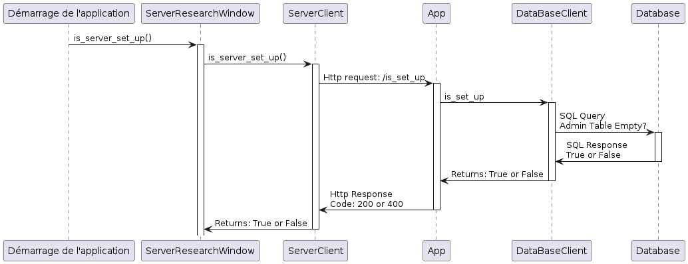
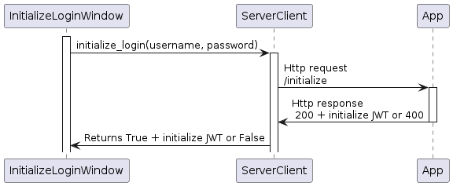
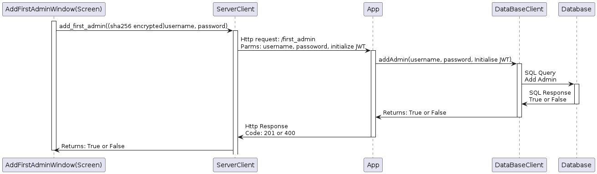

# Composant : Application

L'application sert d'interface au projet SRS. C'est ce composant qui est contact direct avec les utilisateurs finaux. Elle est en communication avec le serveur principale qui sert lui de backend.


## Informations sur l'ordinateur de développement
`lsb_release -a `
```
Distributor ID: Ubuntu
Description:    Ubuntu 23.10
Release:        23.10
Codename:       mantic
```

## Dépendances externes

⚠️ à ajouter ⚠️

## Architecture de l'application

##### Légende
| Couleur | Type de page            | Description                                            |
|---------|-------------------------|--------------------------------------------------------|
| Violet  | Page de connexion       | Sert à s'authentifier pour le système                   |
| Gris    | Initialisation          | Pages uniquement accessible lors de l'initialisation du système |
| Orange  | Page de navigation      | Sert à naviger entre les pages                          |
| Bleu    | Page de gestion         | Sert à configurer le système                            |
| Vert    | Page de fonctionnalité  | Affiche les résultats des configurations, des calculs etc.                |

##### Diagramme


## Analyse organique

### Initialisation

Cette séquence permet d'initialiser le serveur si aucun administrateur n'est présent dans le système. S'il l'est, la page de connexion s'affiche, sinon, les autres étapes de l'initialisation s'activent.


<p align="center">
  
</p>

#### Séquences

##### Vérification si le serveur est initialisé

Le serveur vérifie dans sa base de données si la table Admins est vide ou pas. Si c'est le cas, cela veut dire que le serveur n'est pas initialisé.



##### Première connexion
Cette connexion se fait avec des identifiants génériques (admin, super). Une fois les identifiants vérifiés par le serveur, un JWT est retourné servant uniquement pour les routes d'initialisation.



##### Ajout d'administrateur

En utilisant le JWT généré lors de l'étape précedente, on ajoute le premier administrateur à la base.



##### Connexion d'aministrateur

L'utilisateur entre les identifiants, si ces derniers correspondent à ceux présentes dans la base, un JWT est retourner lui permettant d'accèder aux autres fonctionnalités.


