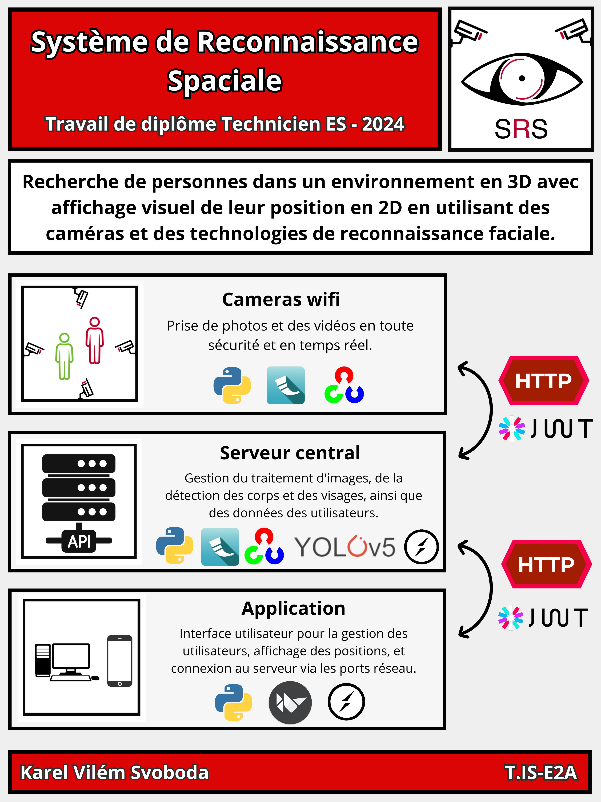
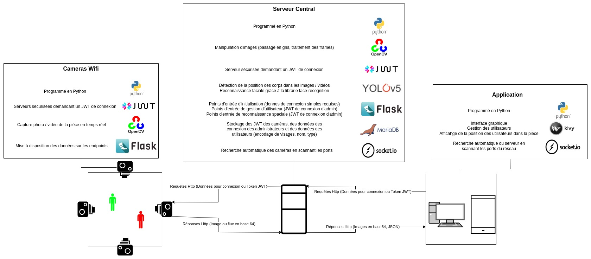
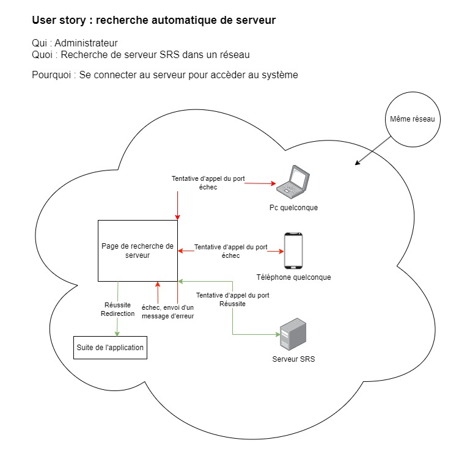
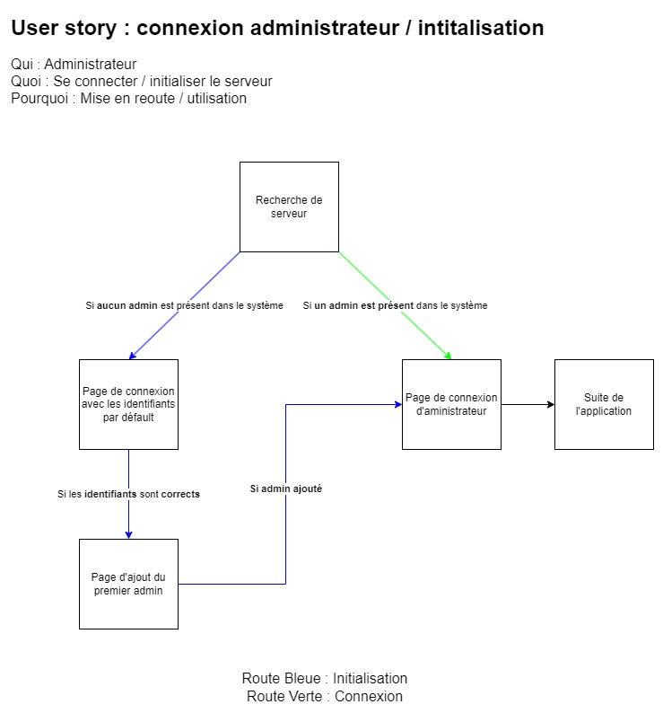
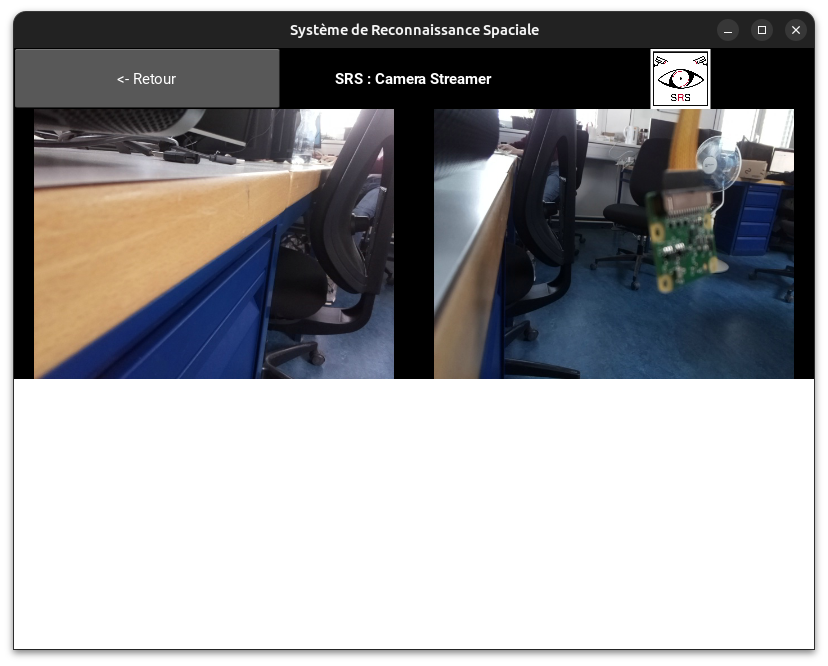

# Documentation : Système de reconnaissance Spaciale
Le SRS (Système de Reconnaissance Spatiale) est un projet destiné à localiser les individus dans un environnement 3D et à présenter visuellement leur position en 2D en utilisant des caméras et des technologies de reconnaissance faciale.

## Poster

  

## Informations

- **Auteur** : Karel Vilém Svoboda
- **Affiliation** : CFPT Informatique - Projet de diplôme
- **Classe** : T.IS-E2A
- **Suiveurs** : 
    - [Christian Zanardi](mailto:Christian.Zanardi@edu.ge.ch)
    - [Laurent Jayr](mailto:edu-jayrl@eduge.ch)

## Architecture

| Composant        | Langage/Technologie | Utilité dans le Projet                                                                                                         |
|------------------|---------------------|--------------------------------------------------------------------------------------------------------------------------------|
| [**Caméras Wifi**](./composants/camera-wifi.md) | Python              | Capturer des photos et vidéos en temps réel, sécurisées par JWT, et mettre à disposition les données via des endpoints Flask.  |
| [**Serveur Central**](./composants/serveur.md)  | Python              | Traite les images (gris, traitement de frames), détecte les positions des corps et les visages, gère les données utilisateurs. |
| [**Application**](./composants/application.md)    | Python              | Interface utilisateur pour gérer les utilisateurs, afficher les positions, et se connecter au serveur via les ports réseau.    |

### Détails techniques par composant

Pour accèder à la documentation de chaque composant, cliquez sur leurs titres.

#### [1. **Caméras Wifi**](./composants/camera-wifi.md)  
- **Programmation** : Python
- **Sécurité** : Serveurs sécurisés avec JWT
- **Librairies** : OpenCV pour la capture d'images/vidéos, Flask pour les endpoints
- **Fonctionnalités** :
  - Capture en temps réel.
  - Mise à disposition des données des caméras.

#### [2. **Serveur Central**](./composants/serveur.md)
- **Programmation** : Python
- **Sécurité** : JWT pour l'authentification
- **Librairies** : OpenCV, Flask, MariaDB pour la gestion des données, face-recognition pour la reconnaissance faciale, YOLOv5 pour la détection de personnes, Socket.io pour la recherche de ports.
- **Fonctionnalités** :
  - Manipulation et traitement d'images
  - Détecteur de position des corps et reconnaissance faciale
  - Stockage et gestion des données utilisateur
  - Recherche automatique de caméras par scan des ports réseau.

#### [3. **Application**](./composants/application.md)  
- **Programmation** : Python
- **Interface** : Kivy pour l'interface graphique, Socket.io pour la recherche du serveur.
- **Fonctionnalités** :
  - Interface utilisateur graphique
  - Gestion des utilisateurs
  - Affichage des positions des utilisateurs dans les locaux
  - Connexion au serveur par scan des ports réseau

### Diagramme du projet

## Analyse fonctionnelle

### Fonctionnalité 1 : Recherche automatique de serveurs

**Composantes impliquées :** Serveur Central, Application

**Description :** Cette fonctionnalité permet de rechercher automatiquement un serveur SRS actif dans un réseau.

#### User Story

Ce diagramme représente la recherche automatique de serveurs sur un réseau.

1. Cette page démarre automatiquement lorseque l'application est lancée.
2. L'application appelle chaque adresse sur le réseau et essaye de communiquer avec le port prévu pour les serveurs SRS.
3. 
  - Si aucun serveur n'est trouvé, un message d'erreur est affiché et un bouton permet à l'utilisateur d'effectuer une nouvelle recherche.  
  - Si un serveur est trouvé, l'utilisateur est redirigé vers la page de connexion.

#### Implémentation

##### Application : Recherche de serveur

### Fonctionnalité 2 : Initialisation / Connexion au système

**Composantes impliquées :** Serveur Central, Application

**Description :** Cette fonctionnalité permet d'initialiser le serveur.

#### User Story

Ce diagramme représente un administrateur qui se connecte ou qui met en place le premier administrateur.

1. La page de recherche détermine si le serveur est initialisé.

##### Route Verte - Le serveur est initialisé : Connexion
2. L'utilisateur est renvoyé vers la page de connexion.
3. Si ses identifiants de connexion correspondent à ceux présents dans le système, il est redirigé vers le reste de l'application.

##### Route Bleue - Le serveur est initialisé : Intialisation
2. L'utilisateur est renvoyé vers la page de connexion avec les identifiants par défault (présents dans le manuel ou dans la documentation).
3. Si les identifiants sont corrects, il est redirigié vers la page lui permettant d'ajouter les premier identifiants d'administrateurs.
4. Si les identifiants du premier administrateurs sont acceptés, il est redirigé vers la page de connexion d'administrateur.
5. Si ses identifiants de connexion correspondent à ceux présents dans le système, il est redirigé vers le reste de l'application.

#### Implémentation

Si aucun administrateur est présent dans le système, l'utilisateur est 

##### Application : Initialisation

### Fonctionnalité 2 : Capture et traitement d'images

**Composantes impliquées :** Caméras Wifi, Serveur Central

**Description :** Cette fonctionnalité concerne la capture en temps réel d'images par les caméras Wifi, le traitement de ces images par le Serveur Central, notamment la détection de corps et de visages, et le stockage des images traitées.

#### Implémentation

##### Application : Page de stream

En naviguant sur la page de stream, on peut appercevoir la vue en temps réel des caméras. Le flux est récupéré automatiquement.

#### Reconnaissance Spaciale

⚠️ à ajouter ⚠️

### Fonctionnalité 3 : Sécurité et Authentification

**Composantes impliquées :** Caméras Wifi, Serveur Central et Application

**Description :** Cette fonctionnalité concerne la sécurité des endpoints Flask utilisés par les caméras Wifi, notamment l'authentification sécurisée du serveur central via JWT (JSON Web Tokens) sur les cameras wifi ainsi que de l'application sur le serveur central.

#### Implémentation

### Fonctionnalité 4 : Gestion des utilisateurs

**Composantes impliquées :** Serveur Central, Application

**Description :** Cette fonctionnalité concerne la gestion des utilisateurs dans la base de données du Serveur Central, y compris l'ajout, la modification et l'initialisation de l'administrateur. Elle implique également une interface utilisateur dans l'application pour permettre ces opérations.

### Fonctionnalité 5 : Connectivité et Interaction Application-Serveur

**Composantes impliquées :** Serveur Central, Application

**Description :** Cette fonctionnalité vise à assurer la connectivité automatique de l'application au serveur lors du démarrage, ainsi que la détection et la connexion aux caméras Wifi présentes sur le réseau.

### Fonctionnalité 6 : Affichage des données sur l'interface utilisateur

**Composantes impliquées :** Application

**Description :** Cette fonctionnalité concerne l'affichage correct des données, notamment les positions détectées, sur l'interface utilisateur de l'application.

## Analyse organique
L'analyse organique dans un projet informatique se concentre sur la manière dont les différents composants du système interagissent et coopèrent pour répondre aux besoins fonctionnels identifiés lors de l'analyse fonctionnelle.