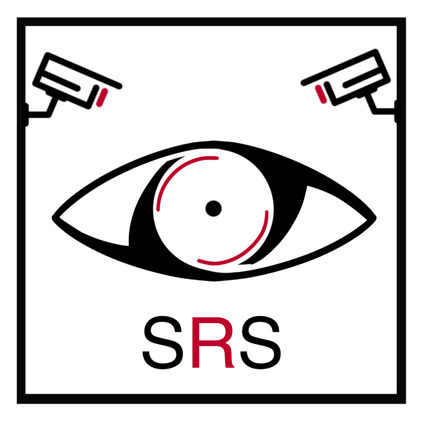

# Documentation : Système de reconnaissance Spaciale
Le SRS (Système de Reconnaissance Spatiale) est un projet destiné à localiser les individus dans un environnement 3D et à présenter visuellement leur position en 2D en utilisant des caméras et des technologies de reconnaissance faciale.

  

## Informations

- **Auteur** : Karel Vilém Svoboda
- **Affiliation** : CFPT Informatique - Projet de diplôme
- **Classe** : T.IS-E2A
- **Suiveurs** : 
    - [Christian Zanardi](mailto:Christian.Zanardi@edu.ge.ch)
    - [Laurent Jayr](mailto:edu-jayrl@eduge.ch)

## Architecture

| Composant        | Langage/Technologie | Utilité dans le Projet                                                                                                         |
|------------------|---------------------|--------------------------------------------------------------------------------------------------------------------------------|
| [**Caméras Wifi**](./composants/camera-wifi.md) | Python              | Capturer des photos et vidéos en temps réel, sécurisées par JWT, et mettre à disposition les données via des endpoints Flask.  |
| [**Serveur Central**](./composants/serveur.md)  | Python              | Traite les images (gris, traitement de frames), détecte les positions des corps et les visages, gère les données utilisateurs. |
| [**Application**](./composants/application.md)    | Python              | Interface utilisateur pour gérer les utilisateurs, afficher les positions, et se connecter au serveur via les ports réseau.    |

### Détails Techniques par Composant

Pour accèder à la documentation de chaque composant, cliquez sur leurs titres.

#### [1. **Caméras Wifi**](./composants/camera-wifi.md)  
- **Programmation** : Python
- **Sécurité** : Serveurs sécurisés avec JWT
- **Librairies** : OpenCV pour la capture d'images/vidéos, Flask pour les endpoints
- **Fonctionnalités** :
  - Capture en temps réel
  - Mise à disposition des données

#### [2. **Serveur Central**](./composants/serveur.md)
- **Programmation** : Python
- **Sécurité** : JWT pour l'authentification
- **Librairies** : OpenCV, Flask, MariaDB pour la gestion des données, face-recognition pour la reconnaissance faciale, YOLOv5 pour la détection de personnes, Socket.io pour la recherche de ports.
- **Fonctionnalités** :
  - Manipulation et traitement d'images
  - Détecteur de position des corps et reconnaissance faciale
  - Stockage et gestion des données utilisateur
  - Recherche automatique de caméras par scan des ports réseau.

#### [3. **Application**](./composants/application.md)  
- **Programmation** : Python
- **Interface** : Kivy pour l'interface graphique, Socket.io pour la recherche du serveur.
- **Fonctionnalités** :
  - Interface utilisateur graphique
  - Gestion des utilisateurs
  - Affichage des positions des utilisateurs dans les locaux
  - Connexion au serveur par scan des ports réseau

### Diagramme du projet
