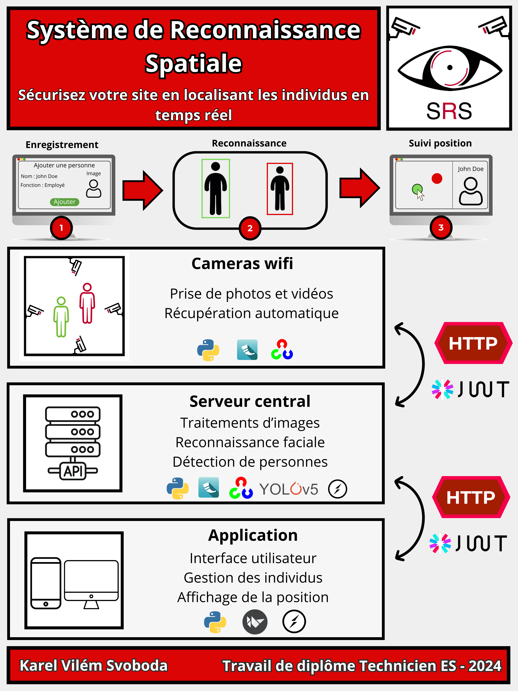
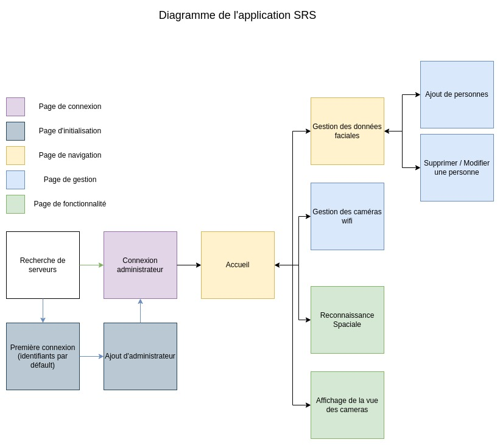
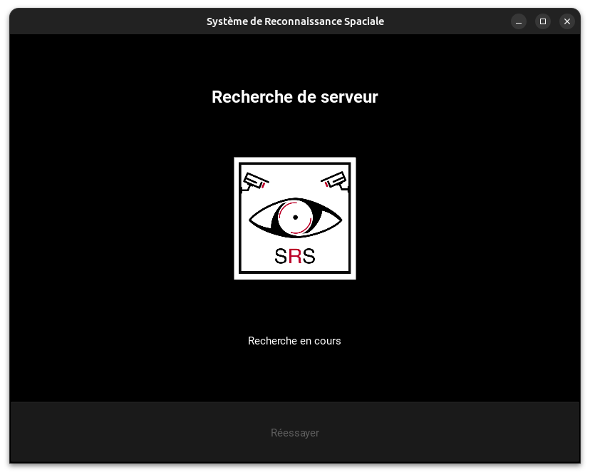
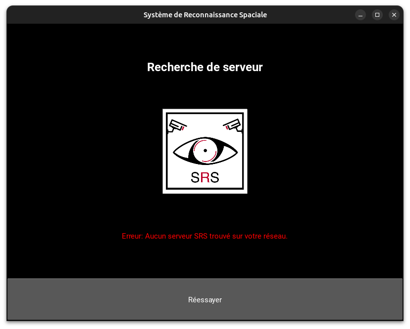
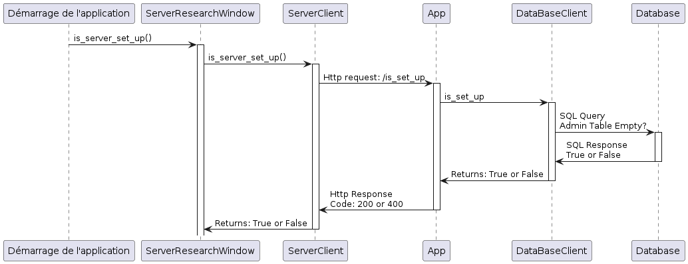
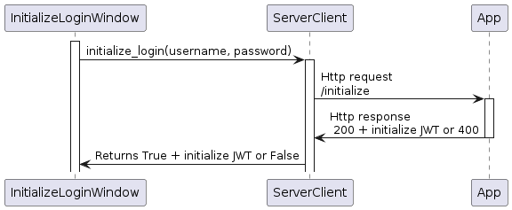
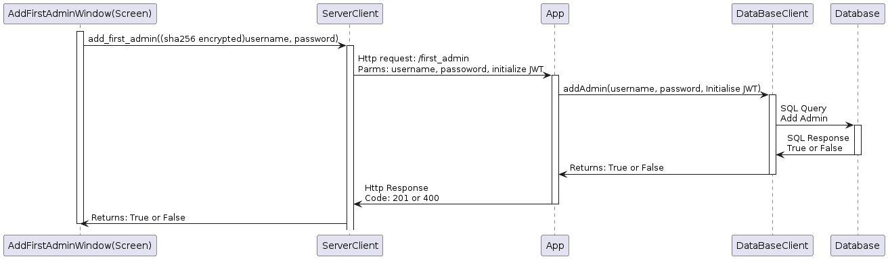

# Documentation : Système de reconnaissance Spatiale
Le SRS (Système de Reconnaissance Spatiale) est un projet destiné à localiser les individus dans un environnement 3D et à présenter visuellement leur position en 2D en utilisant des caméras et des technologies de reconnaissance faciale.

## Poster

  

## Informations

- **Auteur** : Karel Vilém Svoboda
- **Affiliation** : CFPT Informatique - Projet de diplôme
- **Classe** : T.IS-E2A
- **Suiveurs** : 
    - [Christian Zanardi](mailto:Christian.Zanardi@edu.ge.ch)
    - [Laurent Jayr](mailto:edu-jayrl@eduge.ch)

## Architecture

| Composant        | Langage/Technologie | Utilité dans le Projet                                                                                                         |
|------------------|---------------------|--------------------------------------------------------------------------------------------------------------------------------|
| [**Caméras Wifi**](./composants/camera-wifi.md) | Python              | Capturer des photos et vidéos en temps réel, sécurisées par JWT, et mettre à disposition les données via des endpoints Flask.  |
| [**Serveur Central**](./composants/serveur.md)  | Python              | Traite les images (gris, traitement de frames), détecte les positions des corps et les visages, gère les données utilisateurs. |
| [**Application**](./composants/application.md)    | Python              | Interface utilisateur pour gérer les utilisateurs, afficher les positions, et se connecter au serveur via les ports réseau.    |

### Détails techniques par composant

Pour accèder à la documentation de chaque composant, cliquez sur leurs titres.

#### [1. **Caméras Wifi**](./composants/camera-wifi.md)  
- **Programmation** : Python
- **Sécurité** : Serveurs sécurisés avec JWT
- **Librairies** : OpenCV pour la capture d'images/vidéos, Flask pour les endpoints
- **Fonctionnalités** :
  - Capture en temps réel.
  - Mise à disposition des données des caméras.

#### [2. **Serveur Central**](./composants/serveur.md)
- **Programmation** : Python
- **Sécurité** : JWT pour l'authentification
- **Librairies** : OpenCV, Flask, MariaDB pour la gestion des données, face-recognition pour la reconnaissance faciale, YOLOv5 pour la détection de personnes, Socket.io pour la recherche de ports.
- **Fonctionnalités** :
  - Manipulation et traitement d'images
  - Détecteur de position des corps et reconnaissance faciale
  - Stockage et gestion des données utilisateur
  - Recherche automatique de caméras par scan des ports réseau.

#### [3. **Application**](./composants/application.md)  
- **Programmation** : Python
- **Interface** : Kivy pour l'interface graphique, Socket.io pour la recherche du serveur.
- **Fonctionnalités** :
  - Interface utilisateur graphique
  - Gestion des utilisateurs
  - Affichage des positions des utilisateurs dans les locaux
  - Connexion au serveur par scan des ports réseau


### Diagramme du projet


## Analyse fonctionnelle

### Architecture de l'application


### Fonctionnalité 1 : Recherche automatique de serveurs

**Composantes impliquées :** Serveur Central, Application

**Description :** Cette fonctionnalité permet de rechercher automatiquement un serveur SRS actif dans un réseau.

#### User Story

Ce diagramme représente la recherche automatique de serveurs sur un réseau.


1. Cette page démarre automatiquement lorseque l'application est lancée.
  - 
2. L'application appelle chaque adresse sur le réseau et essaye de communiquer avec le port prévu pour les serveurs SRS.
3. Interprétation du résultat.
  - Si aucun serveur n'est trouvé, un message d'erreur est affiché et un bouton permet à l'utilisateur d'effectuer une nouvelle recherche.  
  - 
  - Si un serveur est trouvé, l'utilisateur est redirigé vers la page de connexion.
    - 

### Fonctionnalité 2 : Initialisation / Connexion au système

**Composantes impliquées :** Serveur Central, Application

**Description :** Cette fonctionnalité permet d'initialiser le serveur.

#### User Story

Ce diagramme représente un administrateur qui se connecte ou qui met en place le premier administrateur.


1. La page de recherche détermine si le serveur est initialisé.
  - 

##### Route Verte - Le serveur est initialisé : Connexion
2. L'utilisateur est renvoyé vers la page de connexion.
  - 
3. Si ses identifiants de connexion correspondent à ceux présents dans le système, il est redirigé vers le reste de l'application.

##### Route Bleue - Le serveur est initialisé : Intialisation
2. L'utilisateur est renvoyé vers la page de connexion avec les identifiants par défault (présents dans le manuel ou dans la documentation).
  - [](./ressources/images/intialize.png)
3. Si les identifiants sont corrects, il est redirigié vers la page lui permettant d'ajouter les premier identifiants d'administrateurs.
  - 
4. Si les identifiants du premier administrateurs sont acceptés, il est redirigé vers la page de connexion d'administrateur.
  - 
5. Si ses identifiants de connexion correspondent à ceux présents dans le système, il est redirigé vers le reste de l'application.


### Fonctionnalité 2 : Capture et traitement d'images

**Composantes impliquées :** Caméras Wifi, Serveur Central

**Description :** Cette fonctionnalité concerne la capture en temps réel d'images par les caméras Wifi, le traitement de ces images par le Serveur Central, notamment la détection de corps et de visages, et le stockage des images traitées.

#### Implémentation

##### Application : Page de stream

En naviguant sur la page de stream, on peut appercevoir la vue en temps réel des caméras. Le flux est récupéré automatiquement.


#### Reconnaissance Spaciale

⚠️ à ajouter ⚠️

### Fonctionnalité 3 : Sécurité et Authentification

**Composantes impliquées :** Caméras Wifi, Serveur Central et Application

**Description :** Cette fonctionnalité concerne la sécurité des endpoints Flask utilisés par les caméras Wifi, notamment l'authentification sécurisée du serveur central via JWT (JSON Web Tokens) sur les cameras wifi ainsi que de l'application sur le serveur central.

#### Implémentation

### Fonctionnalité 4 : Gestion des utilisateurs

**Composantes impliquées :** Serveur Central, Application

**Description :** Cette fonctionnalité concerne la gestion des utilisateurs dans la base de données du Serveur Central, y compris l'ajout, la modification et l'initialisation de l'administrateur. Elle implique également une interface utilisateur dans l'application pour permettre ces opérations.

### Fonctionnalité 5 : Connectivité et Interaction Application-Serveur

**Composantes impliquées :** Serveur Central, Application

**Description :** Cette fonctionnalité vise à assurer la connectivité automatique de l'application au serveur lors du démarrage, ainsi que la détection et la connexion aux caméras Wifi présentes sur le réseau.

### Fonctionnalité 6 : Affichage des données sur l'interface utilisateur

**Composantes impliquées :** Application

**Description :** Cette fonctionnalité concerne l'affichage correct des données, notamment les positions détectées, sur l'interface utilisateur de l'application.


## Analyse organique

Implémentation technique de l'analyse fonctionnelle. 

### Initialisation / Connexion

Cette séquence permet d'initialiser le serveur si aucun administrateur n'est présent dans le système. S'il l'est, la page de connexion s'affiche, sinon, les autres étapes de l'initialisation s'activent.


<p align="center">
  
</p>


#### Vérification si le serveur est initialisé

Le serveur vérifie dans sa base de données si la table Admins est vide ou pas. Si c'est le cas, cela veut dire que le serveur n'est pas initialisé.



##### Application : ServerResearchWindow

```py
def async_scan_ips(self, port):
    ip_serveur = self.networkScanner.scan_ips(port)
    self.app = App.get_running_app()
    if ip_serveur:
        self.app.set_server_ip(ip_serveur)
        self.app.set_server_client(ServerClient(ip_serveur))
        serverClient = ServerClient(ip_serveur)
        if serverClient.is_server_set_up():
            self.manager.current = "login"
        else:
            self.manager.current = "initializeLogin"
    else:
        self.ids.state_label.text = "Erreur: Aucun serveur SRS trouvé sur votre réseau."
        self.ids.state_label.color = (1, 0, 0, 1) 
        self.ids.retry_button.disabled = False
```

##### Application : ServerClient

```py
def is_server_set_up(self):
    if not self.server_ip:
        return False
    
    response = requests.get(f"{self.server_url}/is_set_up"
    if response.status_code == 200:
        return True
    else:
        return False
```

##### Serveur : App

```py
def is_set_up(self):
    if self.db_client.isAdminTableEmpty():
        return jsonify({'erreur': 'Le serveur n\'est pas configuré'}), 400
    else:
        return jsonify({'message': 'Le serveur est configuré'}), 200
```

##### Serveur : DatabaseClient

```py
def isAdminTableEmpty(self):
    """
    Permet de savoir si un admin est déjà présent dans la base ou no
    Returns:
        bool : True = Vide / False = Données présentes
    """
    self.cursor.execute("SELECT * FROM Admin")
    results = self.cursor.fetchall()

    if len(results) == 0:
        return True
    else:
        return False
```

#### Première connexion
Cette connexion se fait avec des identifiants génériques (admin, super). Une fois les identifiants vérifiés par le serveur, un JWT est retourné servant uniquement pour les routes d'initialisation.



##### Application : InitializeLoginWindow

```py
def connect(self):
    username = self.ids.username_textInput.text
    password = self.ids.password_textInput.text
    if username is None or password is None:
        return False

    result, response = self.server_client.initialize_login(username, password)

    print(result)
    if result:
        self.manager.current = "addFirstAdmin"
    else:
        self.ids.status_label.text = response
        self.ids.status_label.color = (1, 0, 0, 1) 
```

##### Application : ServerClient

```py
def initialize_login(self, username, password):
    if not self.server_ip:
        return False
    
    endpoint_url = f"{self.server_url}/initialize"
    auth = (username, password)
    
    response = requests.get(endpoint_url, auth=auth)
    if response.status_code == 200:
        self.initialize_token = response.json().get("token")
        return True, "Initialisation réussie"
    elif response.status_code == 403:
        return False, "Identifiants de connexion erronés."
    elif response.status_code == 402:
        return False, "Impossible d'ajouter l'admin quand un autre est déjà présent."
    else:
        print(f"Erreur inattendue: {response.status_code}")
        return False, "Erreur inattendue"
```

##### Serveur : App

```py
DEFAULT_USERNAME = "admin"
DEFAULT_PASSWORD = "super"

def initialize(self):
    """
    Route d'initialisation du projet, sert à récupérer le JWT pour l'initialisation
    """
    auth = request.authorization
    # Vérification des crendentials de l'authentification
    if auth and auth.password == self.DEFAULT_PASSWORD and auth.username == self.DEFAULT_USERNAME:
        # Vérification si la table administrateur est libre pour des question de sécurité
        if self.db_client.isAdminTableEmpty():
            return jsonify({'token': JwtLibrary.generateJwtForInitialization(auth.username)}), 200
        else:
            return jsonify({'erreur': 'Impossible d\'ajouter l\'admin quand un autre est déjà présent.'}), 402
    else:
        return jsonify({'erreur': 'Identifiants de connexion manquants ou erronés (utilisez basic auth)'}), 403
```

#### Ajout d'administrateur

En utilisant le JWT généré lors de l'étape précedente, on ajoute le premier administrateur à la base.



##### Application : AddFirstAdminWindow

```py
def add_admin(self):
    username = self.ids.username_textInput.text
    password = self.ids.password_textInput.text
    
    result, response = self.server_client.add_first_admin(username, password)
    if result:
        self.manager.current = "login"
    else:
        self.ids.status_label.text = response
        self.ids.status_label.color = (1, 0, 0, 1) 
```

##### Application : ServerClient

```py
def add_first_admin(self, admin_name: str, clear_password: str):
    if not self.server_ip:
        return False, "ip du serveur manquante"
    
    is_strong, message = ServerClient.check_password_strength(clear_password)
    if not is_strong:
        return False, message
    hashed_password = ServerClient.hash_password(clear_password)
    endpoint_url = f"{self.server_url}/first_admin"
    params = {
        "username": admin_name,
        "password": hashed_password,
        "token": self.initialize_token
    }
    response = requests.post(endpoint_url, params=params)
    if response.status_code == 201:
        return True, "Admin ajouté avec succès."
    else:
        return False, response.json()
```

##### Serveur : App

```py
@JwtLibrary.initialization_token_required    
def first_admin(self):
    """
    Route permettant d'ajouter le premier administrateur, requert le token du premier login
    """
    if self.db_client.isAdminTableEmpty():
        username = request.args.get('username')
        password = request.args.get('password')        
        if password and username:
            # Ajout des données dans la bdd
            self.db_client.addAdmin(username, password)
            return jsonify({'message': 'L\'admin a été ajouté'}), 201
        else:
            return jsonify({'erreur': 'Mauvais paramètres, utilisez (username, password) pour le nom d\'utilisateur et le mot de passe respectivement.'}), 400
    else:
        return jsonify({'erreur': 'Impossible d\'ajouter l\'admin quand un autre est déjà présent.'}), 402
```

##### Serveur : DatabaseClient

```py
def addAdmin(self, name: str, password: str):
    """
    Ajoute un administrateur à la base de données.
    Args:
        name (str): Le nom de l'administrateur à ajouter.
        password (str): Le mot de passe de l'administrateur à ajouter.
    """
    try:
        self.cursor.execute("INSERT INTO srs.Admin (Name, Password) VALUES (%s, %s);", (name, password))
        self.dbConnexion.commit()
    except Exception as e:
        print(f"Erreur lors de l'insertion dans la base de données: {e}")
```

#### Connexion d'administrateur

L'utilisateur entre les identifiants, si ces derniers correspondent à ceux présentes dans la base, un JWT est retourner lui permettant d'accèder aux autres fonctionnalités.


##### Application : LoginWindow
```py
def login(self):
    username = self.ids.username_textInput.text
    password = self.ids.password_textInput.text
    if username is None or password is None:
        return False

    result, response = self.server_client.admin_login(username, password)

    if result
        self.manager.current = "main"
    else:
        self.ids.status_label.text = response
        self.ids.status_label.color = (1, 0, 0, 1) 
```

##### Application : ServerClient

```py
def admin_login(self, admin_name : str, clear_password : str):
    if not self.server_ip:
        return False, "IP du serveur manquante"
    hashed_password = ServerClient.hash_password(clear_password)
    endpoint_url = f"{self.server_url}/admin_login"
    auth = (admin_name, hashed_password)
    response = requests.post(endpoint_url, auth=auth)
    if response.status_code == 200:
        self.API_token = response.json().get("token")
        print(self.API_token)
        return True, "Authentification réussie"
    elif response.status_code == 403:
        return False, "Aucun administrateur n'est présent dans le système."
    elif response.status_code == 400:
        return False, "Les identifiants de connexion sont erronés."
    else:
        return False, "Erreur inattendue lors de la tentative de connexion."
```

##### Serveur : App
```py
def admin_login(self):
    """
    Permet à l'administrateur de se connecter. Retourne un JWT si tout est ok.
    """
    if self.db_client.isAdminTableEmpty():
        return jsonify({'erreur': 'Aucun administrateur n\'est présent dans le système.'}), 403
    
    auth = request.authorization
    # Vérification des données de connexion
    if self.db_client.adminLogin(auth.username, auth.password):
        return jsonify({'token': JwtLibrary.generateJwtForAPI(auth.username)}), 200
    else:
        return jsonify({'erreur': 'Les identifiants de connexion sont erronés'}), 400
```

##### Serveur : DatabaseClient
```py
def adminLogin(self, name: str, password: str):
    """
    Connexion d'un administrateur
    Args:
        name (str) : Le nom de l'administrateur à vérifier.
        password (str) : Le mot de passe de l'administrateur à vérifier.
    
    Returns:
        Si l'utilisateur est un admin alors True, sinon False.
    """
    try:
        self.cursor.execute("SELECT * FROM Admin WHERE Name = %s AND Password = %s", (name, password))
        
        results = self.cursor.fetchall()
        if len(results) == 0:
            return False
        else:
            return True
    except Exception as e:
        print(f"Error during login: {e}")
        return False
```

### Ajout d'utilisateur

La page d'ajout d'utilisateur permet d'ajouter les données d'un individus dans le système.
1. Nom
2. Type de personne (Employé, dangereux, etc.)
3. Données faciales

#### Récupération du type de personnes

<p align="center">
  
</p>
