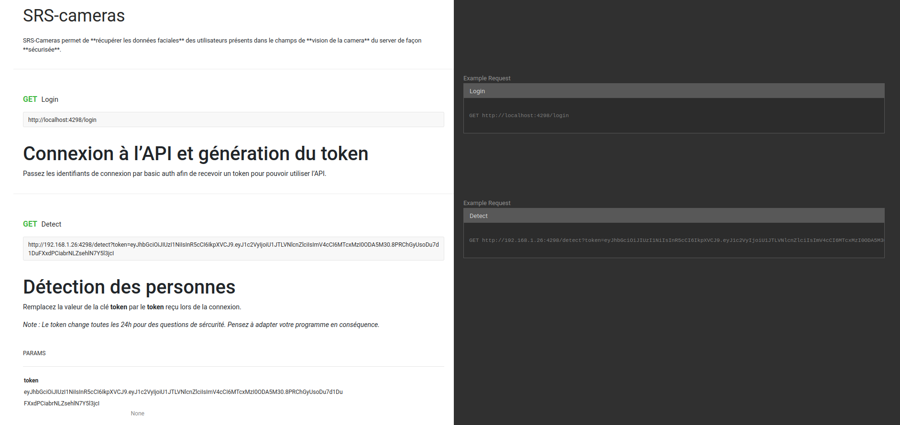

# Journal de bord - SRS

Bienvenue dans mon journal de bord, le compagnon essentiel de mon projet de diplôme. À travers ces pages, je partage mes réflexions quotidiennes, mes défis et mes progrès dans le développement de mon projet. Suivez mon parcours alors que je trace ma route vers la réussite, jour après jour.

## Structure
La structure des journées du journal de bords suit le schema suivant :  
- Résumé de la veille
- Déroulement des activités de la journée, questionnements etc.
- Résumé du travail de la journée
- Bilan personnel

## Prélude

### Architecture du projet

Avant de commencer le projet de diplôme je voulais mettre en place l'environnement de développement ainsi que l'architecture du projet.
Ayant trois composant à développer au cours de ce travail, je ne savais pas comment procéder au niveau du versionning et stockage du projet. J'avais deux options :

1. Créer un projet par composant.
2. Avoir un seul projet avec des sous répertoire pour les composants.

Afin de trancher j'ai envoyé un mail à Monsieur Zanardi, il m'a conseillé de faire un seul répertoire afin de simplifier la correction ainsi que l'architecture de mon travail.

Afin de partir sur de bonnes bases j'ai demandé à ChatGPT l'architecture adéquate pour mon projet. J'ai trouvé que la réponse qu'il m'a donné était parfaite, l'ajout des tests directement dans les répertoire des composant ajout à la lisibilité et la crédibilité du projet.

- [Prompt ChatGPT](https://chat.openai.com/share/bfaa8008-c450-467b-9824-221a9e0afc67)

## 27.03.2024

Aujourd'hui j'ai décidé de dédier ma journée à la planification de mon projet et à mettre en place mon environnement de développement.

### MkDocs
J'ai voulu commencer par reprendre la documentation que j'avais commencé sur mkdocs chez moi. J'ai cependant rencontré une erreur que je n'arrivais pas à résoudre. 

#### Prompt
```sh
mkdocs serve
ERROR    -  Config value 'theme': Unrecognised theme name: 'material'. The available installed themes are: mkdocs, readthedocs
ERROR    -  Config value 'plugins': The "with-pdf" plugin is not installed
Aborted with 2 Configuration Errors!

```

En faisant un pip list j'ai bel et bien retrouvé les deux pachets. Il semblerait qu'il aie un problème avec ma commance **mkdocs serve**. J'ai décidé de poursuivre en markdown simple puis d'intégrer mkdocs pour les rendus.

#### Prompt
```sh
(env) svoboda@ubuntu-karelsvbd:~/gitlab/srs/docs/srs$ pip list
Package                    Version
-------------------------- -----------
[...]
mkdocs-material            9.5.15
mkdocs-material-extensions 1.3.1
mkdocs-with-pdf            0.9.3
[...]

```

### planification

Pour avoir une planification précise et efficace j'ai décidé de me baser sur un système de jalons en utilisant les **diagrammes de Gantt**.

Afin d'optimiser mon temps j'ai demandé à un modèle d'IA entrainé dans les diagrammes de gantt. J'ai utilisé les test ainsi que les différentes fonctionnalités prévues dans mes composants comme prompt. L'IA m'a donné un résultat satisfaisant pour les tâche cependant, pour les jalons et tâche *maîte* elle n'a pas réussi à me donner un résultat convaincant.  
[Prompt Gantt Chart GPT](https://chat.openai.com/share/f782bdf4-607b-4a6e-885a-709bcd14bebd)

#### Résultat de l'IA


#### Ajustements personnels
J'ai ajouté les *super* tâches et les jalons. Chaque jalon correspont à une version du projet.
- v0.1 : Cameras Wifi  
- v0.2 : Serveur Central  
- v0.3 : Application multiplateforme  
- v1.0 : Projet Achevé et testé  

Pour chacun des jalon, je vais effectuer une release du gitlab.

#### Planning prévisionnel final


### Caméras wifi
Ayant terminé la planification, je vais à présent me concacrer au travail avec mes cameras wifi. Je vais commencer par les démarrer et essayer d'y accèder par ssh.

Lors du POC du trimestre précédent j'ai développé un serveur de camera en python flask qui permettait de récupérer en temps réel le flux video de ces dernières. Je vais directement mettre la documentation dans le rapport. Le problème avec mon projet c'est l'optimisation. Il serait meilleur en théorie, de mettre le système de détection facile directement sur les camera wifi afin de simplifier le traitement sur le serveur.  
Je vais donc utiliser le temps supplémentaire que j'ai à disposition aujourd'hui pour essayer de faire fonctionner cette partie.  
J'ai commencé par faire un code simple de **détection faciale** sur le raspberry.
Ce code **fonctionne** mais me paraît un peu lent.
```py
import cv2

haarcascade_filepath = 'haarcascade_frontalface_default.xml'

face_cascade = cv2.CascadeClassifier(haarcascade_filepath)
cap = cv2.VideoCapture(0)

ret, img = cap.read()

if ret:
    faces = face_cascade.detectMultiScale(img, 1.1, 4)
    print(f"{len(faces)} visage(s)")

    cap.release()
else:
    print("Erreur lors de la capture de l'image.")

```
Ensuite, j'ajoute la fonctionnalité de de récuération des données de la position des visages.

```py
app = Flask(__name__)

def detect_faces(image_path):
    face_cascade = cv2.CascadeClassifier('haarcascade_frontalface_default.xml')
    image = cv2.imread(image_path)
    gray = cv2.cvtColor(image, cv2.COLOR_BGR2GRAY)
    faces = face_cascade.detectMultiScale(gray, 1.1, 4)
    return faces


@app.route('/faces', methods=['GET'])
def get_faces():
    image_path = 'capture.jpg' 
    camera = cv2.VideoCapture(0)
    ret, frame = camera.read()
    cv2.imwrite(image_path, frame)
    camera.release()

    faces = detect_faces(image_path)

    data = []
    for (x, y, w, h) in faces:
        face_data = {
            'x': int(x),
            'y': int(y),
            'width': int(w),
            'height': int(h)
        }
        data.append(face_data)

    return jsonify({
        'nb_faces': len(faces),
        'faces_data': data
    })

if __name__ == '__main__':
    app.run(host='0.0.0.0', port=5000)
```


À présent que vais rajouter la récupération des données des viages. Pour ce faire, je vais utiliser la librairie [face_recognition](https://pypi.org/project/face-recognition/) et récupérer les *face encoding*.

#### Problème lors de l'installation
J'ai eu un sourcis lors de l'instalation de la librairie. 
```sh
Collecting face-recognition-models>=0.3.0
  Downloading https://www.piwheels.org/simple/face-recognition-models/face_recognition_models-0.3.0-py2.py3-none-any.whl (100.6 MB)
     |████████████████████████████████| 100.6 MB 446 kB/s eta 0:00:01Killed
```
Après avoir consulté la seconde résponse de [cette question](https://stackoverflow.com/questions/30550235/pip-install-killed). J'ai augmenté le swap size. Cela a fonctionné.

#### Implémentation des encodings

J'ai commencé par implémenter mon code que j'ai effectué lors du POC qui me donnes les données d'une image en utilisant la librairie **face_recognition**.

```py
def get_face_encodings(image):
    face_locations = face_recognition.face_locations(image)
    face_encodings = face_recognition.face_encodings(image, face_locations)
    return face_encodings
```

Ensuite, j'ajoute les données à la liste pour le retour en JSON

```py
faces, image = detect_faces(image_path)
    face_encodings = get_face_encodings(image)

    data = []
    for ((x, y, w, h), encoding) in zip(faces, face_encodings):
        face_data = {
            'x': int(x),
            'y': int(y),
            'width': int(w),
            'height': int(h),
            'encoding': encoding.tolist()
        }
        data.append(face_data)
```

#### Définition d'un port spécifique

Afin de simplifier le scan du serveur quand il sera à la recherche de camera, il me faut un numéro de port qui est unique à mon projet. J'ai choisi le nombre **4298** de façon aléatoire. Après vérification sur le site [speedguide.net](https://www.speedguide.net/port.php?port=4298) ce port est prit par d'autres application mais cela n'est pas si important dans le cadre de mon projet de diplôme car le projet ne rentrera pas en production.

#### Sécurisation API

Afin de sécuriser les cameras j'ai décidé d'effectuer un JWT (json web token). Le seul problème c'est que je ne sais pas comment faire. Par conséquent, je vais regarder un [tutoriel youtube](https://www.youtube.com/watch?v=J5bIPtEbS0Q) et adapter mon travail pour mon projet.

##### Code crée grâce à la vidéo

```py

from flask import Flask, jsonify, request, make_response
import jwt
import datetime

app = Flask(__name__)

app.config['SECRET_KEY'] = 'thisisthesecretkey'
 
@app.route('/unprotected')
def unprotected():
    return ''

@app.route('/protected')
def protected():
    return ''

@app.route('/login')
def login():
    auth = request.authorization

    if auth and auth.password == 'password':
        token = jwt.encode({'user': auth.username, 'exp' : datetime.datetime.utcnow() + datetime.timedelta(minutes=30)}, app.config['SECRET_KEY'])
        return jsonify({'token': token})

    return make_response('could not verify', 401, {'WWW-Authenticate' : 'Basic realm="Login required"'})

if __name__ == '__main__':
    app.run(host='0.0.0.0', port=5000, debug=True)
```

#### Problème avec JWT

J'avais cette erreur :
```sh
token = jwt.encode({'user': auth.username, 'exp' : datetime.datetime.utcnow() + datetime.timedelta(minutes=30)}, app.config['SECRET_KEY'])
AttributeError: module 'jwt' has no attribute 'encode'
```
Le problème vennait de la libraire JWT qui était en confit avec PyJWT.

Grace à cette question sur [Stack Overflow](https://stackoverflow.com/questions/33198428/jwt-module-object-has-no-attribute-encode). J'ai pu résoudre le problème.

## Conclusion
Aujourd'hui je pense avoir bien avancé, pour un jour prévu initialement à la planification j'ai quand même bien pu travailler avec mes cameras. Demain, je compte continuer sur cette lancée en implémentant mon système de sécurité puis les tests postman.

## 28.03.2024

#### Bilan de la veille
Hier je me suis concentré sur d'abord la **planification** puis sur le développment du **serveur flask** pour les **cameras wifi**. Je me suis arrêté lors de la mise en place de la sécrurité avec les **JWT**.  

#### Planification du jour
Chez moi je me suis rendu compte que pour que mon système soit fonctionnel, je dois absolument pouvoir détecter des **profils** et des **arrières de têtes** en plus des faces afin de pouvoir trouver dans l'espace où se situe la personne. Je vais commencer par ajouter cette fonctionnalité puis je vais continuer mon travail sur les **JWT**.

### Detection de profils
J'ai commencé par ajouter la Haar cascade des profils :
```py
profile_cascade = cv2.CascadeClassifier('haarcascade_profileface.xml')
```
Puis la détection :
```py
profiles = profile_cascade.detectMultiScale(gray, 1.1, 4)
```

Une fois cela fait je détecte la position et la taille du profil :
```py
profiles_data = []
    for (x, y, w, h) in profiles:
        profile_info = {
            'x': int(x),
            'y': int(y),
            'width': int(w),
            'height': int(h)
        }
        profiles_data.append(profile_info)
```

Et j'ajoute ces données dans la réponse json.

```py
return jsonify({
        'nb_faces': len(faces),
        'faces_data': faces_data,
        'nb_profiles': len(profiles),
        'profiles_data': profiles_data
    })
```

### Détection des arrières de tête
Après avoir fait des recherches, je n'ai pas trouvé de cascade pour des arrière de crâne. J'ai donc demandé à ChatGPT. Il m'a confirmé qu'il était **complexe** de faire de la reconnaissance d'arrière de crâne. Cela est dût au **manque de caractèristiques propres**. Mais c'était possible en entrainnant directement un modèle comme le **CNN**. Cependant, je préfère uniquement utiliser les **algorithmes de Haar** pour l'instant pour des question **d'optimisation de temps**.  
[Prompt ChatGPT](https://chat.openai.com/share/d28196ba-28f8-40c1-931e-4defa925785b)

### Suite du travail sur les JWT
J'ai continué à suivre le [tutoriel youtube](https://www.youtube.com/watch?v=J5bIPtEbS0Q). Grâce à ce dernier, je suis à présent capable de sécuriser les routes par système de wrap de fonctions.  
Fonction qui permet de vérifier les tokens :

```py
def token_required(f):
    @wraps(f)
    def decorated(*args, **kwargs):
        token = request.args.get('token')

        if not token:
            return jsonify({'message' : 'Token is missing'}), 403

        try:
            data = jwt.decode(token, app.config['SECRET_KEY'], algorithms=["HS256"])
        except jwt.ExpiredSignatureError:
            return jsonify({'message': 'Token has expired'}), 403
        except jwt.InvalidTokenError:
            return jsonify({'message': 'Token is invalid'}), 403
        
        return f(*args, **kwargs)
        
    return decorated
```

Il suffit ensuite que je décore les fonctions qui se doivent d'être protégées.
```py
# Route en accès libre
@app.route('/unprotected')
def unprotected():
    return jsonify({'message': 'Anyone can see this'})

# Route protégée par le token
@app.route('/protected')
@token_required
def protected():
    return jsonify({'message': 'Only available for valid tokens'})

```

Je vais à présent implémenter ce système dans mon API.

#### Implémentation dans l'API
Je commence par défir les constantes de l'application.  
⚠️ Je me permet de les mettre dans mon journal de bord mais il est impératif que dans un projet qui pourrait rentrer en production il ne faut pas le faire.

```py
# Définition de la clé secrète qui sert au chiffrement
app.config['SECRET_KEY'] = 'dMbgbnTDxK82SE3Bn2XgcMFTqmdLZWn9'
# Identifiants de connexion du serveur central
app.config['CLIENT_USERNAME'] = 'SRS-Server'
app.config['CLIENT_PASSWORD'] = 'QNaAXEjuNBqdhF6HFjggsDmhLZVeWSzT'
```

La suite de l'implémentation était simple, il suffisait d'ajouter la fonction de login et à décorer la fonction detect pour la sécuriser.

### Optimisation du code
Je me suis rendu compte que le code était lent. Il lui prend environ 3 secondes pour faire l'analyse.  
Premièrement j'ai supprimé la creation d'image intermédaire et passe directement la frame.

```py
# Code précédent
image_path = 'capture.jpg' 
camera = cv2.VideoCapture(0)
ret, frame = camera.read()
cv2.imwrite(image_path, frame)
camera.release()

# Code optimisé
camera = cv2.VideoCapture(0)
ret, frame = camera.read()
camera.release()
```

#### Multiprocessing
Ensuite j'ai trouvé interessant d'optimiser la génération des encoding dans le cas où il y a plusieurs visages. Pour ce faire, je vais profiter de l'architecure du raspberry pico et faire du multiprocessing.  
C'est abosulment crutial pour le traitement de plusieurs visages en même temps.  
J'avais déjà de l'expérience avec du **multithreading** mais pas spécialement en **multiprocessing** en python. Par conséquent j'ai suivi la [documentation officielle](https://docs.python.org/3/library/multiprocessing.html).  
J'ai commencé par la création de la **queue** qui me permettra de **récupérer les valeurs de mes process**. Je crée ensuite le **process** avec comme **argument mon worker** et comme **arguments du worker** j'ai passé la **frame donc l'image et la référence de la queue**. Ensuite je **démarre le processus** et récupère les **résultats du worker**.

```py
if ret:
        result_queue = Queue()
        process = Process(target=detect_worker, args=(frame, result_queue))
        process.start()
        process.join()

        faces, profiles, faces_encodings = result_queue.get()
```


J'ai ensuite crée le worker qui est la fonction qui sera exécutée en **parallèle**. La fonction reprend la **détection faciale** et la **génération des encodings**. Les résultats sont ensuite **ajoutée** dans la **queue du process princial**.
```py
def detect_worker(image, result_queue):
    faces, profiles, _ = detect_faces_and_profiles(image)
    faces_encodings = get_face_encodings(image)

    result_data = (faces, profiles, faces_encodings)
    result_queue.put(result_data)
```

### Tests Postman

Postman me permet d'avoir un client pour mon API. Les tests se lancent de façon automatique lors des requêtes.

#### Endpoint /login
Pour tester le endpoint **/login** je mets les identifiants de connexion dans la case **Authorization** :


Ensuite j'écris les tests :

```js
pm.test("Statut de réponse 200 OK", function () {
    pm.response.to.have.status(200);
});

pm.test("La réponse contient un jeton JWT", function () {
    pm.response.to.have.jsonBody('token');
});
```

#### Endpoint /detect

Le problème avec ce endpoint c'est qu'il me faut impérativement le JWT qui m'est fournit lors de l'appel du login. Les tests sont par conséquent dépendants de la validité du token.

```js
pm.test("Statut de réponse 200 OK", function () {
    pm.response.to.have.status(200);
});

pm.test("La réponse contient les données attendues", function () {
    var jsonData = pm.response.json();

    pm.expect(jsonData.nb_faces).to.be.above(-1);
    pm.expect(jsonData.nb_profiles).to.be.above(-1);
    pm.expect(jsonData.faces_data).to.be.an("array");
    pm.expect(jsonData.profiles_data).to.be.an("array");
});

```

#### Problème avec les tests
J'ai pas réussi à faire les tests que je voulais. Pour le login, j'aimerais avoir un login fonctionnel et un autre sans identifiants etc. J'aimerais tester chaque cas pour éviter les failles sauf que j'y arrive pas avec les exemples de postman, selon moi il faudrait créer une requête pour chaque cas mais j'ai demandé confirmation à mes suiveurs par mail.  
**Question :**

**Réponse :**

##### Solution
Je vais essayer de mettre les varialbes d'authentification dans la séquence de test, je ne sais pas le faire cependant.  
J'ai pas trouvé en cherchant dans la [documentation officielle](https://learning.postman.com/docs/sending-requests/authorization/specifying-authorization-details/) j'ai du demander à chatGPT et en effet on peut faire des requêtes personnalisés dans les tests, cela va également m'aider lors du moment où je vais développer mon propre client pour mon API.  
[Prompt ChatGPT](https://chat.openai.com/share/82b7a446-9f7f-4dfe-9310-22668b566353)  
De plus, à présent que je sais que l'on peut faire des requête depuis les tests, je peux essayer de récupérer dynamiquement le token lors du test du endpoint **/detect**.  

J'ai fais un tests pour les scenarios suivants (code attentu : 401) :
1. identifiants incorrects
2. mot de passe manquant (identifiants incorrects)
2. mot de passe manquant (identifiants corrects)
3. username manquant (identifiants incorrects)
3. username manquant (identifiants corrects)
4. username correct - mdp erroné
5. username erroné - mdp correct

Je ne pense pas qu'il y aie plus d'erreurs possibles de la part de l'utilisateur. Les tests fonctionnent.

### Conclusion
J'ai bien pu travailler aujourd'hui j'ai pu mettre en application des concepts interessants comme les tests postman et le multiprocessing pour la première fois. La prochaine fois je vais me concentrer sur la documentation de l'api.

## 15.04.2024

Pour commencer après les vacances j'ai décidé de commencé par consulter mon planning.  
Selon ce dernier, j'était sensé rendre la version 0.1 de mon projet la semaine dernière. Malheureusement, étant particulièrement occupé lors de ces vacances je n'ai pas pu travailler assez efficacement pour atteindre cet objectif. Par conséquent, l'objectif principal du jour sera en premier lieu, terminer les tests postman puis, faire la documentation de l'API afin d'effectuer une release de la verion 0.1.   
*Note: Je préfère continuer selon mon planning malgrès le fait que les vacances n'y soit pas prises en compte car j'estime que mon travail sur les cameras est déjà suffisament avancé pour me le permettre.*

#### Planning prévisionnel final


### Erreur avec les tests postman

La dernière fois que j'ai travaillé sur le projet j'avais presque terminé les tests postman à un détail pret. Le test ci-dessous n'était pas fonctionnel. 

```js
pm.test("Réponse correcte - ", function () {
    pm.sendRequest({
        url: 'http://localhost:4298/login',
        method: 'GET',
        auth: {
            type: 'basic',
            username: 'SRS-Server',
            password: 'QNaAXEjuNBqdhF6HFjggsDmhLZVeWSzT'
        }
    }, function (err, res) {
        pm.expect(res).to.have.status(200);
    });
});
```

L'erreur en question :


En effet je n'arrive pas à faire la connexion de façon dynamique. Cependant, vu l'impact faible sur la documentation du projet j'ai décidé de ne pas plus m'attarder dessus.

### Génération de la documentation postman

Ayant déjà effectué une partie de ma documenation sur postman, j'ai essayé de générer une documentation à partir de ce dernier. Le problème c'est le manque d'outil, j'ai essayé avec [ce projet](https://github.com/karthiks3000/postman-doc-gen?tab=readme-ov-file) ayant été développé par un indépendant. Le soucis c'est qu'il n'affiche pas les test et n'affiche pas correctement le markdown. J'ai donc décidé de demander à chat gpt de me générer la documentation depuis le json. Cela me permet de m'épargner une tâche chronophage car la documentation je l'ai déjà écrite, il s'agit uniquement d'un changement de format.  

[Prompt ChatGPT](https://chat.openai.com/share/1e9e9b94-864e-4d10-aafc-5770a059fe24)



Cependant, ce projet m'a permis d'apprendre une chose qui aiderait à la mise en place de mon projet. En effet en lisant l'instlation j'ai vu cette ligne.


Cela peut paraître basique mais je vais pouvoir m'en servir pour simplifier la mise en place des mes serveurs. Pour la génération automatique, j'utilise la commande *pipreqs*. J'ai trouvé cette commande grâce à [cette quesiton](https://stackoverflow.com/questions/31684375/automatically-create-file-requirements-txt) sur stack overflow.

La commande m'a généré le code suivant :

```
face_recognition==1.3.0
Flask==3.0.3
PyJWT==2.8.0
PyJWT==2.8.0
```

Ce qui est faux, premièrement il manque openCV et PyJWT est présent deux fois. Je sens que le problème vient du fait que je n'utilise pas un environnement virtuel. En effet, j'ai eu quelques problèmes lors de la configuration de ce dernier. Je vais essayer de le mettre en place une nouvelle fois et pendant l'installation des dépendance je vais travailler sur la documentation.  

Mise à part ce problème de dépendance, j'ai terminé la documentation ainsi que le code. J'ai envoyé un mail à$ mes accompaganteurs afin de me faire un retour. À présent, je vais commencer le développement de mon serveur central.

### Début du travail sur le serveur central

Pour commencer, je dois effectuer une recherche automatique pour trouver les adresses ip avec mon port ouvert. Pour ce faire, je vais utiliser le code que j'ai eu l'occasion  de réaliser lors de mon POC.

Voici le code en question. Après execution, je me suis rendu compte qu'il n'était pas asyncrone :

```py
class NetworkScanner:
    def __init__(self, network):
        self.network = ipaddress.IPv4Network(network)

    def scan_worker(self, port, result_queue,  timeout=0.01):
        for ip in self.network.hosts():
            print(str(ip))
            if self.check_port(ip, port, timeout):
                result_queue.put(ip)


    def scan_port(self, port, timeout=1, max_threads=100):
        """
        Scan tous les adresses du réseau.

        Args:
            port (int): Port à scanner
            timeout (float): Le temps maximum en secondes à attendre pour une réponse.
            max_threads (int): Nombre maximum d'excutions sur les ip en même temps.

        Returns:
            Liste Ports (Array): Retrourne le tableau des adresses ip avec le port ouvert
            
        """
        open_ips = []
        print("Recherche en cours!")

        result_queue = Queue()
        process = Process(target=self.scan_worker, args=(port, result_queue))
        process.start()
        process.join()

        return result_queue.get()

    def check_port(self, ip, port, timeout):
        """
        Vérifie si un port spécifié sur une adresse IP donnée est ouvert.

        Args:
            ip (str): L'adresse IP à tester.
            port (int): Le numéro de port à vérifier.
            timeout (float): Le temps maximum en secondes à attendre pour une réponse.

        Returns:
            bool: Renvoie True si le port est ouvert, sinon False.
        """
        try:
            # Vérification de l'ouverture du port
            with socket.socket(socket.AF_INET, socket.SOCK_STREAM) as s:
                s.settimeout(timeout)
                s.connect((str(ip), port))
                return True
        except (socket.timeout, socket.error):
            return False
```

Pour remédier à cela je me suis rendu sur la [page de la documentation officielle](https://docs.python.org/3/library/multiprocessing.html) pour essayer de trouver une alternative.
Malheureusement, je ne pense pas encore avoir le niveau en python pour gérer ce genre de problème. Cependant j'ai trouvé une autre solution. J'ai simplement réduit le timeout. Après plusieurs test, je n'ai pas constaté d'erreur. J'ai donc simplifié le code.

```py
class NetworkScanner:
    def __init__(self, network):
        self.network = ipaddress.IPv4Network(network)

    def scan_ips(self, port,  timeout=0.01):
        ip_with_port_open = []
        for ip in self.network.hosts():
            print(str(ip))
            if self.check_port(ip, port, timeout):
                ip_with_port_open.append(ip)

        return ip_with_port_open

    def check_port(self, ip, port, timeout):
        """
        Vérifie si un port spécifié sur une adresse IP donnée est ouvert.

        Args:
            ip (str): L'adresse IP à tester.
            port (int): Le numéro de port à vérifier.
            timeout (float): Le temps maximum en secondes à attendre pour une réponse.

        Returns:
            bool: Renvoie True si le port est ouvert, sinon False.
        """
        try:
            # Vérification de l'ouverture du port
            with socket.socket(socket.AF_INET, socket.SOCK_STREAM) as s:
                s.settimeout(timeout)
                s.connect((str(ip), port))
                return True
        except (socket.timeout, socket.error):
            return False

```
#### Application multiplateforme après ou pendant le développement du serveur central ?

En réféchissant quoi faire ensuite, je me suis posé la question s'il ne serait pas meilleur de développer l'application multiplateforme en même temps que le serveur central. Cela me permettrait d'avoir un client et avancer plus vite. De plus, quand j'ai développé des API par le passé, j'ai constaté que quand je développait mon client, il me manquait souvent des fonctionnalités et des endpoint notamment quand je faisait des crud. Pour l'instant je vais me concentrer sur le serveur mais je vais poser la question à mes suiveurs dès que possible.

#### Architecture du serveur central

Pour le développement de mon serveur central il faut que je réfléchisse comment il va fonctionner ainsi que son intéraction avec l'utilisateur. Je sais qu'en premier lieu, je dois faire un système de connexion qui pour les utilisateurs. Je pense qu'il serait interessant de commencer par une connexion par défault avec un nom d'utilisateur basique comme *admin* et un mot de passe comme *mdp*. Une fois l'utilisateur connecté, il ne peut rien faire sauf ajouter un nouvel utilisateur et un mot de passe qui eux seront sécurisé et permettront de communiquer avec ce système. 

##### Première connexion

L'utilisateur rentre ses identifiants dans la page de login, si les identifiants sont corrects, un jwt de 15 min est crée et passé à l'application.  


##### Ajout des identifiants
Une fois l'application en possession du JWT. L'utilisateur se trouve devant la page permettant d'ajouter des utilisateurs. On fois les nouveaux identifiants administrateurs entrés. Les identifiants chiffrés ainsi que le JWT sont passés dans la requête vers le serveur. Après vérification de la conformité des données, les identifiants de connexion sont ajoutés dans la BDD. Si tout s'est bien passé, l'utilisateur reçoit un message sur l'application et est redirigé vers la page de connexion.


##### Seconde connexion
Cette fois-ci, l'utilisateur doit se connecter avec les identifiants sécurisés. Une fois qu'il a rentré ces derniers, les données sont chiffrés et envoyés vers le serveur. Le serveur fait ensuite une vérification au-prêt de la base de données. Si les identifiants sont corrects, le serveur crée un JWT temporaire de 24 heures permettant de se connecter aux autres fonctionnalités. Du côté de l'utilisateur, il est redirigé vers la page d'acceuil de l'application.


#### Gestion de la première connexion

Afin de créer cet endpoint, il faut en premier lieu que je sache s'il s'agit bel et bien de la première connexion. Pour ce faire, j'ai décidé de vérifier si la base de données est bel et bien vide. J'ai donc crée une classe `DatabaseClient` qui me servira de client de base de données.

```py
class DatabaseClient:
    pass
```

Je crée une première route `initalize` qui servira à la première connexion.

```py
def initialize(self):
        self.db_client = DatabaseClient(self.DB_HOST, self.DB_NAME, self.DB_USER, self.DB_PASSWORD)

        self.app.add_url_rule('/initialize', 'initialize', self.intialize, methods=['GET'])

    def initialize(self):
        if self.db_client.isAdminTableEmpty():
            pass
        else:
            return jsonify({'erreur': 'Impossible d\'ajouter l\'admin quand un autre est déjà présent.'}), 402
```

Et je vérifie que la table est vide.

```py
def isAdminTableEmpty(self):
        self.cursor.execute("SELECT * FROM Admin")
        results = self.cursor.fetchall()
    
        if len(results) == 0:
            return True
        else:
            return False
```

J'ai ensuite créer une classe jwt_library qui me servira de bibliothèque pour les fonctionnalités liés aux JWT.

```py
class JwtLibrary:
    @staticmethod
    def GenerateJwtForInitialization(username):
        SECRET_KEY = 'S[26dF9RmVM/#{GT'
        token = jwt.encode({'user': username, 'exp': datetime.datetime.utcnow() + datetime.timedelta(minutes=15)}, SECRET_KEY)

        return token
```

Et pour terminer, j'implémente cette fonction dans ma route.

```py
def initialize(self):
        auth = request.authorization
        if auth and auth.password == self.DEFAULT_PASSWORD and auth.username == self.DEFAULT_USERNAME:
            if self.db_client.isAdminTableEmpty():
                return jsonify({'message': JwtLibrary.GenerateJwtForInitialization(auth.username)}), 200
            else:
                return jsonify({'erreur': 'Impossible d\'ajouter l\'admin quand un autre est déjà présent.'}), 402
        else:
            return jsonify({'erreur': 'Identifiants de connexion manquants ou erronés'}), 403
```

Il ne me reste plus qu'à tester avec postman.


Avec cela, j'ai terminé la génération des JWT de 15 min pour les initializations.

### Conclusion
Je pense avoir bien avancé aujourd'hui, non seulement j'ai terminé les serveur des cameras wifi mais j'ai également débuté le travail sur le serveur central. Demain je vais me concentrer sur la doc des partie que j'ai développé puis je vais continuer le développement du serveur central en commançant par le endpoint login.

## 16.04.2024
Pour débuter la journée je vais commencer par documenter la création des token JWT pour l'initialization du serveur. Ensuite, je vais continuer à travailler sur la procédure d'ajout du premier utilisateur.

Après réflexion, je vais uniquement débuter la structure de ma documentation car je préfère mettre en place le système d'initialisation au complet et m'assurer que ce dernier fonctionne avant de me lancer dans la doc.

#### Suite de l'initialisation
À présent, il me faut implémenter la seconde partie, l'ajout d'intifiants. Après réflexion, je ne peux pas faire en sorte que le serveur force des critères de mot de passe car cela voudrait dire que ces derniers passerait en clair depuis le client. Je vais donc implémenter cette partie dans l'application direcement. 

Je commance par implémenter la route qui permettra d'ajouter le premier admin. Je l'ai appleé `/first_admin` et mit en méthode POST.


Pour la gestion et la vérification du token JWT, j'utilise encore une fois la fonction décoratrice et l'ajoute dans ma classe jwt_library.

##### Vérification du mot de passe
Comme précisé avant, je ne peux pas vérifier la force des mots de passes (nombre de charatères, diversité etc.) cependant, je me demande s'il y a pas une façon de vérifier si un string, le mot de passe, est crypté ou non. J'ai trouvé une question correspondante sur Stack Overflow. Je vais essayer d'implémenter le code fournit.

[Question Stack Overflow](https://stackoverflow.com/questions/7000885/python-is-there-a-good-way-to-check-if-text-is-encrypted)

Après avoir effectuer plusieurs tests sur Postman avec des methodes de chiffrement différentes, je n'ai pas réussi à faire fonctionner la fonction. Par conséquent, je décide de ne pas l'implémenter.

##### Implémetantion du second token JWT
Je commance par créer une autre clé secrète pour ajouter de la sécurité ainsi qu'une seconde fonction de génération et un décorateur. Je donne une expiration de 24 heures au token.

```py
__SECRET_KEY_FOR_API = 'qEcYfxQzC3bS'

@staticmethod
    def generateJwtForAPI(username):
        token = jwt.encode({'user': username, 'exp': datetime.datetime.utcnow() + datetime.timedelta(hours=24)}, JwtLibrary.__SECRET_KEY_FOR_API)

        return token

def API_token_required(f):
        """
        Fonction décoratrice permettant de forcer une autre fonction d'être identifié par JWT

        Args:
            f : Fonction à décorer

        Returns:
            f : Fonction décorée
        """
        @wraps(f)
        def decorated(*args, **kwargs):
            
            token = request.args.get('token')
            if not token:
                return jsonify({'message' : 'Token is missing'}), 403
            # Try catch car jwt.decode retourne une erreur en cas de non correspondance
            try:
                data = jwt.decode(token, JwtLibrary.__SECRET_KEY_FOR_INITIALIZATION, algorithms=["HS256"])
            except jwt.ExpiredSignatureError:
                return jsonify({'message': 'Token has expired'}), 403
            except jwt.InvalidTokenError:
                return jsonify({'message': 'Token is invalid'}), 403
            return f(*args, **kwargs)

        return decorated
        
```

Les nouvelles fonctionnalités ajoutée, je peux à présent implémenter la connexion.

### Connexion administrateur

Pour la connexion de l'administrateur je crée la route `admin_login`. Si l'utilisateur transmet le bon mot de passe et le bon nom d'utilisateur, un JWT est créé.

```py
def admin_login(self):
        if not self.db_client.isAdminTableEmpty():
            username = request.args.get('username')
            password = request.args.get('password')
            
            if not username or not password:
                return jsonify({'erreur': 'Mauvais paramètres, utilisez (username, password) pour le nom d\'utilisateur et le mot de passe respectivement.'}), 400
            
            if self.db_client.adminLogin(username, password):
                return jsonify({'token': JwtLibrary.generateJwtForAPI(username)}), 200
            else:
                return jsonify({'erreur': 'Les identifiants de connexion sont erronés'}), 400
        else:
            return jsonify({'erreur': 'Aucun administrateur n\'est présent dans le système.'}), 403
```


À présent que j'ai terminer l'initialisation, je vais la documenter.

### Recherche automatique des cameras
Ayant terminé l'initialisation, je peux me concentrer sur la recherche automatique des cameras ainsi que l'appel automatique de leurs endpoint. Il me faut trouver une façon pour stocker les adresses ip quand le serveur trouve les cameras. Je pensais de stocker les réseaux dans une table dédiées avec un *timestamp* indiquant le dernier scan effectué ainsi que les cameras reliés dans une autre table. Chaque fois que le endpoint est appelé. une vérification au niveau du timestamp est effectuée et si ce timestamp est dépassé de disons... 10 minutes, une nouvelle recherche est effectuée permettant de mettre de à jour la bade de données des cameras. La même chose se produit s'il y a une erreur de communication avec une des cameras. Pour résumer donc :

À chaque appel, l'utilisateur envoie son réseau.

#### Si la base de données est vide (Pas de correspondance au niveau du network)

1. Recherche dans la table network une correspondance.
2. Recherche des cameras sur le réseau.
3. Ajout des ip des cameras dans la base de données.
4. Appel des endpoint des camera.
5. Interprétation des données.   

*Note : Si aucune camera n'est trouvée alors l'opération est intérompue et l'API retourne le message correspondant.*  


##### Implémentation
Je commence par créer une nouvelle classe `camera_server_client.py` qui me servira à intéragir avec les apis des cameras. Je crée ensuite les constantes avec les identifiants de connexion ainsi que le port.

```py
class CameraServerClient():
    __CLIENT_USERNAME = 'SRS-Server'
    __CLIENT_PASSWORD = 'QNaAXEjuNBqdhF6HFjggsDmhLZVeWSzT'
    __CAMERAS_SERVER_PORT = 4298
```

J'ajoute une fonction qui me permet de scanner les cameras sur le réseau.

```py
def lookForCameras(self):
        self.camerasIPs = self.networkScanner.scan_ips(self.__CAMERAS_SERVER_PORT)
        return self.camerasIPs
```

Ensuite, une fonction me permettant d'appeler automatiquement les endpoint permettant d'obtenir les Tokens de toutes les cameras.

```py
def getCamerasTokens(self):
        if len(self.camerasIPs) == 0:
            return None

        tokens = []
        for cameraip in self.camerasIPs:
            camera_url = "http://{ip}:{port}".format(ip = cameraip, port = self.__CAMERAS_SERVER_PORT)
            print(camera_url)
            auth = (self.__CLIENT_USERNAME, self.__CLIENT_PASSWORD)
            response = requests.get(f"{camera_url}/login", auth=auth)

            if response.status_code == 200:
                tokens.append(response.json().get('token'))
            else:
                print("Échec de l'obtention du token JWT pour l'ip : {ip}:".format(ip=cameraip), response.status_code)
            
        return tokens
```

### Maj de la base de données

J'ai bien avancé sur la logique de mon application cependant, afin de pouvoir continuer je dois réfléchir sur la structure de la ma base de données afin en premier lieu, l'adapter à l'utilisation des JWT des camera en ajoutant un champs à leur table.

#### Ajustement de la position des cameras par l'utilisateur
Afin de pouvoir effectuer les calcul de la position des utilisateurs je dois connaitre la position des cameras. Pour ce faire, je dois ajouter les champs **position** qui indiquera la position relative par rapport au mur et **orientation** qui déterminera l'orientation de la camera. Cependant, je veux faire en sorte que les camera puisse se situer dans le réeau sans forcément avoir de position indiquées afin de laisser la possibiliter à l'utilisateur de les ajuster.

#### Ajout de réseau
J'ai crée le endpoint `/add_network` permettant d'ajouter un réseau à la base de données. J'ai fais en sorte d'éviter les erreurs et les duplications.

##### Route
```py
@JwtLibrary.API_token_required
    def add_network(self):
        ip = request.args.get('ip')
        subnetMask = request.args.get('subnetMask')

        if not ip or not subnetMask:
            return jsonify({'erreur': 'Mauvais paramètres, utilisez (ip, subnetMask) pour l\ip du réseau et le masque de sous-réseau respectivement.'}), 400
        
        if not NetworkScanner.is_network_valid("{n}/{sub}".format(n = ip, sub = subnetMask)):
            return jsonify({'erreur': 'Le réseau fournit n\'est pas valide ou n\'est pas accessible'}), 400
        
        if not self.db_client.addNetwork(ip, subnetMask):
            return jsonify({'erreur': 'Le réseau fournit est est déjà dans la base de données'}), 400
        
        return jsonify({'tkt': 'ok'}), 200
```

##### Vérification de la conformité du réseau

Afin de m'assurer que le réseau passé par l'utilisateur est confirme et existe bel et bien j'ai créé la fonction `is_network_valid` fans la classe `network_scanner`.  
Je commence par vérifier la confirmité du format.
```py
        try:
            ipaddress.IPv4Network(network)
        except ValueError:
            return False
```
Puis je vérifie l'existance du réseau grâce à un ping sur le routeur
```py
        try:
            # Ping du routeur
            timeout = 0.1
            result = subprocess.run(['ping', '-c', '1', '-W', str(timeout), router_ip], stdout=subprocess.PIPE, stderr=subprocess.PIPE, timeout=timeout)
            return result.returncode == 0
        except subprocess.TimeoutExpired:
            return False
```

Une fois toutes ces confition remplies, le réseau est ajouté dans la base de données.

### Conclusion
J'ai réussi à continuer sur ma lancée des jours précédents, cependant, je sens que je suis un peu brouillon dans ma façon de penser. Il faut que je plannifie plus mes actions dans le futur.  
Demain je vais me conctrer sur l'ajout des cameras de façon dynamique dans la base de données.

## 17.04.2024
Comme précisé hier, aujourd'hui je vais commencer par ajouter les cameras de façon dynamique dans la base de données. Ensuite, je vais procéder à l'installation de la seconde camera.

### Ajout dynamique des cameras dans la base de données
Pour ce faire, je vais continuer à développer mon endpont `cameras_data` qui ne serais pas réelement utilisé dans le projet final, il me permet juste de développer les fonctionnalités que je vais implémenter une fois l'architecture de mon projet terminée.  
Je récupère les tokens dans un dictionnaire dans la fonction `getCamerasTokens`.
```py
tokens_for_ip = {}
        for cameraip in self.camerasIPs:
        [...]
        if response.status_code == 200:
                tokens_for_ip[camera_url] = response.json().get('token').
```


J'ajoute ensuite trois fonctions dans ma classe `DatabaseClient`.
1. `getNetworkIdByIpAndSubnetMask` qui me permettra de récupérer l'id du réseau en utilisant l'adresse IP et le masque de sous réseau.
2. `addCameras` qui ajoutera les cameras dans la base et utilisera la fonction au dessus pour trouver le réseau relié. Pour l'ajout de camera, uniquement cette fonction sera appelée par la route.
3. `checkIfCameraExists` qui vérifira si une camera est déjà présente dans la base en se basant sur son ip et le réseau.

J'ai implémenté les fonctions et le résultat fonctionne. L'ajout dynamique des cameras dans la base est terminée.


### Ajout d'une seconde camera

Afin de vérifier que mon système fonctionne, il faut que je créer une seconde camera. Cependant, le temps d'installtion de opencv est conséquent. J'en profite pour réfléchir à l'architecture de l'application.

### Discussion avec Monsieur Zanardi
1. Il m'a confirmé qu'il serait meilleur de développer l'application multiplateforme en parallèle de l'API afin de terminer un maximum de fonctionnalités avant la fin du projet.
2. Il m'a consillé d'ajouter la date d'expiration avec les JWT dans la base de données avec les cameras, comme ça on peut appeler automatiquement le endpoint pour les regénérer en cas de besoin.
3. Il m'a consiller de créer un diagramme général de mon projet et de spécifier dans la document de quel partie il s'agissait.
4. Trouver un outil afin de générer un disgramme de classes.

### Début du développment de l'application multiplateforme
L'application sera développée en Kivy python. Pour l'implémentation, j'ai decidé de faire deux user story afin de m'aider dans l'organisation de mon développement.

#### Initialisation


##### Page 1 : Recherche de serveur

Cette page va servir d'indication visual à l'utilisateur que le système est à la recherche d'un serveur. Une fois le serveur trouvé, il sera automatiquement redirigé.

###### Implémentation graphique


```
<ServerResearchWindow>
    name: "Research"
    
    GridLayout:
        cols: 1
        
        Label:
            text: "Recherche de serveur"
            font_size: '24sp' 
            bold: True
        Image:
            source: 'Ressources/logo.png'
        Label:
            text: "Veuillez patienter"
```

###### Implémentation

Je commence par créer la classe `NetworkScanner`. Je vais reprendre le code que j'ai utilisé dans mon serveur. Cependant j'ajoute une fonction statique me permettant de récupérer le réseau local de l'utilisateur.

```py
@staticmethod
    def get_local_network():
        ip = socket.gethostbyname(socket.gethostname())
        return '.'.join(ip.split('.')[:-1]) + '.0/24'
```

J'ajoute la recherche en asyncrone du réseau.

```py
def on_enter(self):
    Clock.schedule_once(self.run_network_scan)

def run_network_scan(self, dt):
    self.networkScanner = NetworkScanner()
    Clock.schedule_once(lambda dt: self.async_scan_ips(self.SERVER_PORT), 0)

def async_scan_ips(self, port):
    ip_serveur = self.networkScanner.scan_ips(port)
```
Si un réseau est trouvé, il est redirigé vers la page suivante, sinon, un message d'erreur apparait et un bouton s'active lui permettant de réessayer. L'ip du serveur est stockée dans une variable de l'application.

```py
if ip_serveur:
            app = App.get_running_app()
            app.ip_serveur = ip_serveur
            self.manager.current = "main"
        else:
            self.ids.state_label.text = "Erreur: Aucun serveur SRS trouvé sur votre réseau."
            self.ids.state_label.color = (1, 0, 0, 1) 
            self.ids.retry_button.disabled = False
```

###### Vérification de l'initialisation
J'ai ajouté un endpoint permettant de savoir si le serveur est initialisé.

```py
def is_set_up(self):
        if self.db_client.isAdminTableEmpty():
            return jsonify({'erreur': 'Le serveur n\'est pas configuré'}), 400
        else:
            return jsonify({'message': 'Le serveur est configuré'}), 200
```
Je l'appèle ensuite afin de choisir vers quel page j'envoie l'utilisateur.

```py
if serverClient.is_server_set_up():
                self.manager.current = "main"
            else:
                self.manager.current = "initializeLogin"
```

##### Transmission des données
Je devais trouver une façon de transmettre l'ip du serveur de façon globale dans l'application. J'ai donc crée une propriété à la classe main et je la met à jour quand il y en a le besoin.

```py
class MyMainApp(App):
    server_ip = None

    def build(self):
        # Retourne l'interface utilisateur chargée à partir du fichier app.kv
        return kv

    def set_server_ip(self, server_ip):
        self.server_ip = server_ip

    def get_server_ip(self):
        return self.server_ip
```

### Conclusion
Je pense avoir bien avancé aujourd'hui. J'ai débuté le développement de l'application en parallèle à l'api et je pense que c'était le bon choix. J'ai l'impression de progresser bien plus vite et ça m'a enlevé une pression liée au rendu de l'api. Demain je vais faire la suite de l'initialisation.

## 18.04.2024
Comme indiqué hier, aujourd'hui je vais commencer par terminer la séquence de l'initialisation.

### Page 2 : Première connexion

#### Interface

J'ai commencé par développer l'interface graphique.


```
<InitializeLoginWindow>
    name: "initializeLogin"

    GridLayout:
        rows: 2

        GridLayout:
            cols: 1

            Label:
                font_size: '30sp' 
                text: "Page d'initialisation"
                bold: True


            Image:
                source: 'Ressources/logo.png'

        GridLayout:
            cols: 1
        
            Label:
                text: "Veuillez entrer les identifiants d'initialisation."
                font_size: '24sp' 
                bold: True

            TextInput:
                id: username_textInput
                hint_text: "Nom d'utilisateur"
                font_size: '20sp' 

            TextInput:
                id: password_textInput
                hint_text: "Mot de passe"
                font_size: '20sp' 

            Button:
                id: submit_button
                text: "Se connecter"
                bold: True

```

#### Sécurisation du input

J'ajoute ensuite la désactivation du bouton *Se connecter* si un des input est vide.
```py
    def update_boutton(self):
        username = self.ids.username_textInput.text
        password = self.ids.password_textInput.text

        if username == "" or password == "":
            self.ids.submit_button.disabled = True
        else:
            self.ids.submit_button.disabled = False
```

Et j'appelle cette fonction à chaque changement de texte.
```
TextInput:
    id: username_textInput
    [...]
    on_text: root.update_boutton()

TextInput:
    id: password_textInput
    [...]
    on_text: root.update_boutton()
```

#### Appel du création du client api

Je commence par ajouter une fonction dans la classe `ServerClient` qui appellera le endpoint et réagira en fonction de la réponse http. Si la connection est réussi, elle stockera les données dans une variable d'instance de la classe.

```py
def initialize_login(self, username, password):
        if not self.server_ip:
            return False
        
        endpoint_url = f"{self.server_url}/initialize"
        auth = (username, password)
        
        response = requests.get(endpoint_url, auth=auth)

        if response.status_code == 200:
            print("Initialisation réussie.")
            self.initialize_token = response.json().get("token")
            return True
        elif response.status_code == 403:
            print("Identifiants de connexion manquants ou erronés.")
            return False
        elif response.status_code == 402:
            print("Impossible d'ajouter l'admin quand un autre est déjà présent.")
            return False
        else:
            print(f"Erreur inattendue: {response.status_code}")
            return False
```

En passant, j'ajoute le masquage du input de mot de passe.
```py
TextInput:
    [...]
    password: True
```

Avec cette partie terminée, je peux passer à la troisième page, l'ajout du premier admin.

### Page 3 : Ajout du premier admin
Je commence encore une fois par développer l'interface graphique. Cette fois-ci, je reprends basiquement la page précédente mais j'ajoute quelques indications pour l'administrateur.


```
<AddFirstAdminWindow>
    name: "addFirstAdmin"

    GridLayout:
        rows: 2

        GridLayout:
            cols: 1

            Label:
                font_size: '30sp' 
                text: "Page d'ajout du premier administrateur"
                bold: True


            Image:
                source: 'Ressources/logo.png'
            
            Label:
                text: "Veuillez entrer les identifiants du premier administrateur."
                font_size: '24sp' 
                bold: True
                
            
        GridLayout:
            cols: 1

            Label:
                id: status_label
                text: "Attention : Une fois le premier utilisateur ajouté, il est impossible de refaire cette procédure."
                bold: True

            TextInput:
                id: username_textInput
                hint_text: "Nom d'utilisateur"
                font_size: '20sp'
                on_text: root.update_boutton()

            TextInput:
                id: password_textInput
                hint_text: "Mot de passe"
                font_size: '20sp' 
                password: True
                on_text: root.update_boutton()

            Button:
                id: submit_button
                text: "Se connecter"
                bold: True
                disabled: True
```

Je crée la classe `AddFirstAdmin` et garde globalement la même structure pour mon application que dans le formulaire d'initialisation. La partie qui change c'est la classe `ServerClient`.
J'ajoute la fonction `add_first_admin` permettant d'appeler le endpoint eponyme.

```py
def add_first_admin(self, admin_name: str, clear_password: str):
        if not self.server_ip:
            return False

        hashed_password = ServerClient.hash_password(clear_password)
        endpoint_url = f"{self.server_url}/first_admin"
        params = {
            "username": admin_name,
            "password": hashed_password,
            "token": self.initialize_token
        }

        response = requests.post(endpoint_url, params=params)

        if response.status_code == 201:
            print("Admin ajouté avec succès.")
            return True
        else:
            return response.json().error
```

Je crée une fonction de hashage de mot de passe que j'appelle dans ma fonction d'ajout.

```py
@staticmethod
    def hash_password(password : str):
        password_bytes = password.encode('utf-8')
        hasher = hashlib.sha256()
        hasher.update(password_bytes)
        hashed_password = hasher.hexdigest()
        return hashed_password
```

À présent, je dois créer la fonction de vérification de rebustesse du mot de passe. J'utilise les critères suivants :
1. Au moins 8 charactères
2. Au moins une majuscule et une minuscule
3. Au moins un chiffre
4. Au moins un charactère spécial.  

Pour ce faire je vais utiliser la librairie re me permettant de trouver des correspondances dans ma chaine.

```py
@staticmethod
def check_password_strength(password):
    # Au moins 8 charactères
    if len(password) < 8:
        return False, "Le mot de passe doit contenir au moins 8 caractères."
    # Au moins une majuscule et une minuscule
    if not re.search("[a-z]", password) or not re.search("[A-Z]", password):
        return False, "Le mot de passe doit contenir au moins une lettre majuscule et une lettre minuscule."
    # Au moins un chiffre
    if not re.search("[0-9]", password):
        return False, "Le mot de passe doit contenir au moins un chiffre."
    # Au moins un charactère spécial.
    if not re.search("[!@#$%^&*()-_=+{};:,<.>]", password):
        return False, "Le mot de passe doit contenir au moins un caractère spécial parmi !@#$%^&*()-_=+{};:,<.>."
    return True, "Le mot de passe est robuste."
```

### Page 4 : Connexion

Après l'initialisation, l'utilisateur est renvoyé vers la page de connexion. Cette page va servir pour cette procédure mais également comme login classique. Encore une fois, la page ressemble aux autres formulaires.


```
<LoginWindow>
    name: "login"

    GridLayout:
        rows: 2

        GridLayout:
            cols: 1

            Label:
                font_size: '30sp' 
                text: "Page de connexion"
                bold: True


            Image:
                source: 'Ressources/logo.png'

        GridLayout:
            cols: 1

            Label:
                id: status_label
                text: "Veuillez entrer vos identifiants"
                font_size: '24sp' 
                bold: True

            TextInput:
                id: username_textInput
                hint_text: "Nom d'utilisateur"
                font_size: '20sp'
                on_text: root.update_boutton()

            TextInput:
                id: password_textInput
                hint_text: "Mot de passe"
                font_size: '20sp' 
                password: True
                on_text: root.update_boutton()

            Button:
                id: submit_button
                text: "Se connecter"
                bold: True
                disabled: True
                on_release: root.login()
```

#### Passage en Basic auth
J'avais développé mon api pour fonctionner avec des paramêtres. Cependant, je trouve plus propre que l'authentifaction se fasse par **Basic auth**

##### Modificaiton de la route
```py
def admin_login(self):
        """
        Permet à l'administrateur de se connecter. Retourne un JWT si tout est ok.
        """
        if self.db_client.isAdminTableEmpty():
            return jsonify({'erreur': 'Aucun administrateur n\'est présent dans le système.'}), 403
        
        auth = request.authorization

        # Vérification des données de connexion
        if self.db_client.adminLogin(auth.username, auth.password):
            return jsonify({'token': JwtLibrary.generateJwtForAPI(auth.username)}), 200
        else:
            return jsonify({'erreur': 'Les identifiants de connexion sont erronés'}), 400
```

### Fin de l'implémentation de la première user story
J'ai terminé le travail sur l'initialisation. À présent, je vais développer la page principale qui servira de navigation entre les différentes fonctionnalités de l'application.

### Première fonctionnalité : Gestion des données faciales

Afin de pouvoir commencer à développer la recherche de personnes dans l'espace je dois d'abord avoir les données des personnes en question.

#### Ajout d'une personne
Je commance par l'ajout afin que je puisse développer la reconnaissance spaciale au plus vite.

##### Interface
Pour l'interface je dois premièrement avoir les éléments suivants :
1. Retour de la camera en temps réel.
2. Un bouton qui permet de prendre une photo.
3. Un text input permettant d'indiquer le nom de la personne.
4. Un spinner afin de séléctionner une "fonction" pour la personne.


##### Récupération du flux
Grâce au composant [`Camera` de Kivy](https://kivy.org/doc/stable/api-kivy.uix.camera.html) je suis en capacité de récupérer assez facilement le flux.

Pour lancer la capture il faut définir la propriété `self.ids.qrcam.play` à `True`. Grace à cela, je suis capacité de prendre des "photos".

Pour le passage de Kivy texture en frame de opencv j'ai trouvé [ce sujet](https://stackoverflow.com/questions/68416721/kivy-camera-get-image) sur Stack Overflow.

J'ai ensuite demandé à ChatGPT s'il y a une solution pour convertir un tableau de pixel pour l'utiliser avec OpenCV.  

[Prompt ChatGPT](https://chat.openai.com/share/a9213221-d300-4392-8338-407b3bc951f0)

### Conslusion
J'ai réussi à implémenter les fonctionnalités que je voulais aujourd'hui. Pour l'instant la communication entre l'application et l'api se passe bien, je n'ai rencontré aucun problème majeur. Demain je vais commencer par l'ajout d'utilisateur.

## 19.04.2024

#### Bilan de la veille
J'avais oublié de faire ce rapport journalier cette semaine malhueureusement.
Hier j'ai travaillé sur les pages de mon application en utilisant les user story que j'ai créer par avance. Je me suis arrêté au moment où j'allais implémenter l'ajout des utilisateurs.

#### Plannification de la journée
Je vais commencer par créer la base de données des utilisateurs, une fois cela fait, je vais ajouter le endpoint et enfin l'implémenter dans mon application


### Ajout d'utilisateurs


##### Chemin rouge
Ce chemin représente la récupération des types des personnes (associés, danger etc.) afin de pouvoir les ajouter dans le spinner.
1. Appel du endpoint.  
2. Vérification JWT.
3. Query vers la bdd.
4. Récupération des données.
5. Passage des données dans la http response.
6. Ajout des types dans le spinner.

##### Chemin noir
Ce chemin permet d'ajouter une personnes dans la base.
1. Prise de la photo.
2. Séléction du type dans le spinner.
3. Indication du nom de la personne.
4. Vérification de la conformité des données faciales.
5. Récupération des encodages.
6. Appel du endpoint.
7. Vérification du JWT du serveur.
8. Ajout des données dans la bdd.
9. Retour via Http response et code.

#### Base de données
Je commence par l'implémentation de la base de données. J'étais incertain du type de stockage pour les encodages. J'ai donc posé la question à ChatGPT et selon lui le type `BLOB` correspondait le mieux.  
[Prompt ChatGPT](https://chat.openai.com/share/9ada3d6b-826e-4f31-95ae-ef39722dc492)


#### Ajout des routes dans l'API

##### Route rouge

Dans la classe `DatabaseClient` je crée la query.

```py
def getPersonTypes(self):
    try:
        self.cursor.execute("SELECT * FROM PersonTypes")
        return self.cursor.fetchall()
    except Exception as e:
        print(f"Error: {e}")
```

J'ajoute la route dans `app.py`.
```py
self.app.add_url_rule('/person_types', 'person_types', self.person_types, methods=['GET'])

[...]

@JwtLibrary.API_token_required
def person_types(self):
    return jsonify(self.db_client.getPersonTypes()), 200
```

##### Route noir

Pour l'ajout d'utilisateurs, je commence par créer la query. Et je me rend compte que j'ai oublié d'ajouter le nom des utilisateurs. Je corrige mon erreur.

Afin d'éviter les erreurs, j'ajoute une vérification si le type de personne existe ainsi qu'un test si l'utilisateur existe déjà.

```py
    def checkIfIdPersonTypeExist(self, idPersonType):
        try:
            self.cursor.execute("SELECT * FROM PersonTypes WHERE idPersonType = %s", (idPersonType))
            results = self.cursor.fetchall()
    
            if len(results) == 0:
                return False
            else:
                return True
        except Exception as e:
            print(f"Error: {e}")
            return False
        
    def checkIfUsername(self, username):
        try:
            self.cursor.execute("SELECT * FROM Users WHERE username = %s", (username))
            results = self.cursor.fetchall()
    
            if len(results) == 0:
                return False
            else:
                return True
        except Exception as e:
            print(f"Error: {e}")
            return False
```

J'implémente ensuite la query complète.

```py
    def addUser(self, idPersonType, encodings, username : str):
        try:
            if not self.checkIfIdPersonTypeExist(idPersonType):
                return False, f"Impossible d'ajouter l'utilisateur : Le type de personne n'existe pas."
            
            if self.checkIfUsername(username):
                return False, f"Impossible d'ajouter l'utilisateur : Un utilisateur avec le même nom existe déjà dans la base"
            
            self.cursor.execute("INSERT INTO srs.Users (idPersonType, encodings, username) VALUES(%s, %s, %s);", (idPersonType, encodings, username))
            self.dbConnexion.commit()
            return True, "L'utilisateur a été ajouté avec succès."
        except Exception as e:
            print(f"Error: {e}")
            return False, f"Impossible d'ajouter l'utilisateur : {e}"
```

Et pour terminer, j'ajoute la route.

```py
    @JwtLibrary.API_token_required
    def add_user(self):
        idPersonType = request.args.get('idPersonType')
        encodings = request.args.get('encodings')
        username = request.args.get('username')

        result, response = self.db_client.add_user(idPersonType, encodings, username)

        if result:
            return jsonify({'message' : response}), 200
        else:
            return jsonify({'erreur' : response}), 400
```

### Implémentation dans l'application

#### Route rouge

Je fais l'appel du endpoint avec le token de l'API. Si la requête a fonctionné, la réponse en json, cet a dire un tableau de résultat est retourné, si c'est un echec, la réponse complète est envoyée.

```py
def get_person_types(self):
        if not self.server_ip:
            return False
        
        params = {
            "token": self.API_token
        }
        
        endpoint_url = f"{self.server_url}/person_types"
        response = requests.get(endpoint_url, params=params)

        if response.status_code == 200:
            return True, response.json()
        else:
            return False, response
```

Pour ajouter les données dans le spinner, je commence par faire une liste des fonctions puis je la transmet au spinner.

```py
    def get_person_types(self):
        result, response = self.server_client.get_person_types()

        if result:
            for data in response:
                self.personTypes.append(data[1])
                self.ids.function_spinner.values = self.personTypes
            return True, response
        else:
            return False, response
```

Avec ces fonctionnalités implémentée, la récupération dynamique des noms des fonctions est implémentée.


#### Route noir
Pour implémenter l'ajout, il faut que je commence par ajouter la sécurisation des input. L'objectif est que la possibilité d'ajouter l'utilisateur s'active si :
1. La video est en pause
2. Un élément du spinner est séléctionné
3. Un nom est indiqué.

J'ai implémenté une fonction qui est appellée à chaque fois qu'un élément subit une modification.

```py
    def enable_add_button(self):
        username = self.ids.username_textInput.text.strip()
        function_selected = self.ids.function_spinner.text != "Sélectionnez une fonction"
        
        if username and function_selected and not self.ids.qrcam.play:
            self.ids.add_user_button.disabled = False
        else:
            self.ids.add_user_button.disabled = True
```
Une fois cela fait, dans la classe `ServerClient` j'ajoute le client du endpoint

```py
    def add_user(self, username, idPersonType, encodings):
        if not self.server_ip:
            return False, "ip du serveur manquante"

        endpoint_url = f"{self.server_url}/add_user"
        params = {
            "username": username,
            "idPersonType": idPersonType,
            "encodings": encodings,
            "token": self.API_token
        }

        response = requests.post(endpoint_url, params=params)

        if response.status_code == 201:
            return True, response.json()
        else:
            return False, response.json()
```

Pendant l'implémentation dans la route je me suis posé une question, si les fonction changent, récupérer les id du spinner afin de l'ajouter dans la base ne serait pas suffisant car ils serait erronées. Par conséquent, je développe un nouvel endpoint qui me permettera de récupérer l'id d'une fonction par son nom.

```py
@JwtLibrary.API_token_required
    def person_type_by_name(self):
        typeName = request.args.get('typeName')

        result, response = self.db_client.getPersonTypeByName(typeName)

        if result:
            return jsonify({'message' : response}), 200
        else:
            return jsonify({'erreur' : response}), 400
```

J'ai eu un problème lors du passage des encodings dans l'url. Premièrement, j'ai trouvé ça assez brouillon et les données était formées de façon étrange. J'ai donc décidé de passer les encodage des visage dans le body. Je passe également le nom de la personne et id du type de la personne. Le token je le passe toujours par url pour des quesiton d'intégration.

```py
def add_user(self, username, idPersonType, encodings):
        if not self.server_ip:
            return False, "ip du serveur manquante"

        endpoint_url = f"{self.server_url}/add_user"

        encodings_list = [encoding.tolist() for encoding in encodings]

        data = {
            "username": username,
            "idPersonType": idPersonType,
            "encodings": encodings_list,
        }

        # Encoder les données en JSON
        data_json = json.dumps(data)

        url_with_token = f"{endpoint_url}?token={self.API_token}"

        response = requests.post(url_with_token, data=data_json)

        if response.status_code == 200:
            return True, response.json()
        else:
            return False, response.json()
```

### Résultat de l'ajout
Avec l'intégration dans les différents composant, l'ajout de personnes est fonctionnel.

#### Application

Je remplis toutes les données, dans cet exemple, je m'appelle **Jackes** et je suis **dangereux**. Après la pression du bouton d'ajout, la requête est envoyé vers le serveur.


#### Base de données

Mes données ont été ajoutées dans la base, les données faciales sont dans le champs encodings et mon nom dans username.  


### Page de modification des cameras

À présent que j'ai terminé l'ajout des utilisateurs, je peux commencer l'a modification des données des cameras. L'objectif est de pouvoir définir l'emplacement de la camera dans une pièce afin d'effectuer les calculs. Comme d'habitude je vais effectuer une user story en premier lieu.  
J'ai continué avec mon système de deux routes séparées.

**Route bleue :** Point d'entrée d'obtention des données des cameras.  
1. L'application cherche à afficher les cameras disponibles sur le réseau.
2. L'application appelle l'endpoint afin de récupérer les données
3. L'endoit vérifie si les JWT sont toujours valides via les dates d'expiration.
4. Si le JWT est valide, il recherche les adresses ip dans la bdd.
5. Si le JWT est expiré, le serveur scanne le réseau et met à jour les informations des cameras.
6. Retour des données des cameras dans la réponse.  

**Route Rouge :** Point d'entrée de mise à jour des données des cameras. Utile si l'admin veut mettre à jour le système de caméras.  
1. L'utilisateur appuye sur actualiser.
2. Le serveur fait directement une mise à jour des cameras.
3. Recherche des cameras sur le réseau.
4. Mise à jour des données dans la base.
6. Retour des données des cameras dans la réponse.


#### Conclusion
J'ai terminé l'ajout des personnes, bien que ce processus a pu paraître long, j'ai appris à mieux gérer mes différentes technologies alors je pense que le était bien investi. La prochaine fois, je vais me concentrer au développement de la user story suivante.